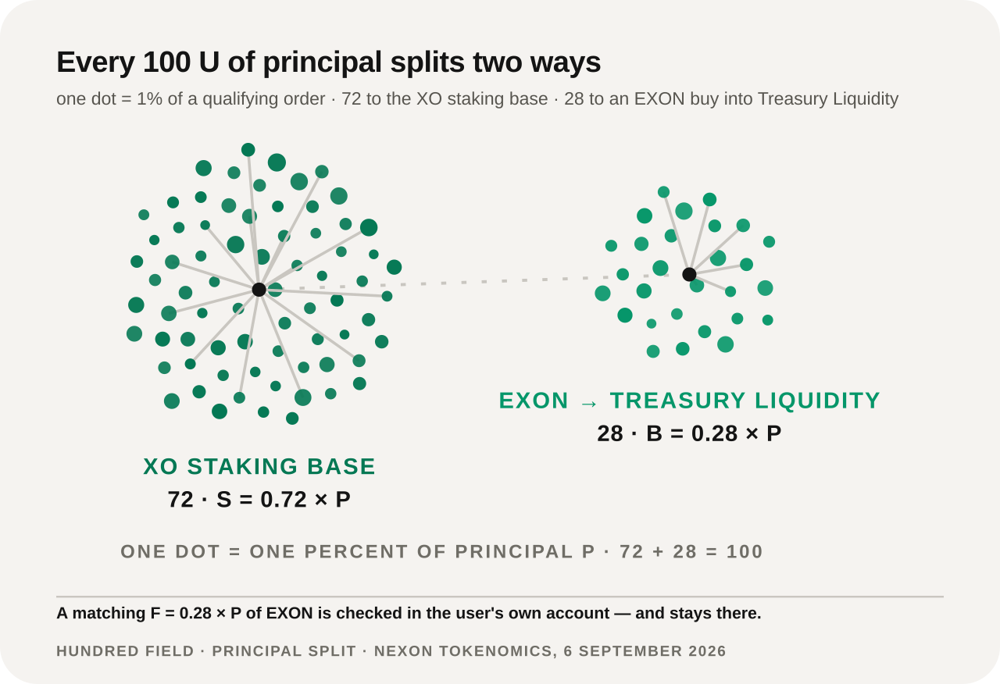
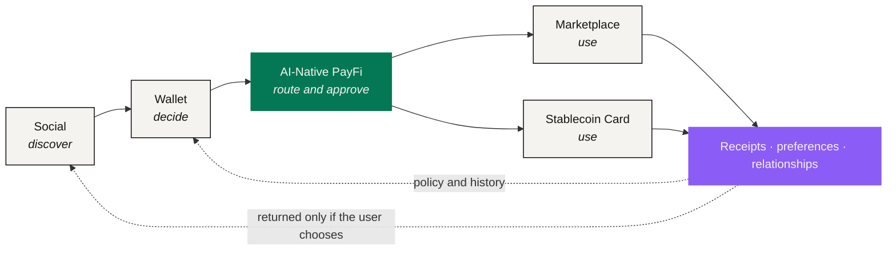

# NEXON Whitepaper

> **From Capital to Token. From Digital to Real.**

A position in a brokerage account, a token in a wallet and a real cross-border payment are all value. None of them has ever sat on the same ledger. Turning the first into the third still takes four systems, four identity checks and about a week — and at every step, a person is manually translating one language of value into another.

**NEXON = NEX (Nexus) + ON (enabled and online).** The name states the job: take that translation out of human hands and make it a product layer you can see, permission and hold to account.

As a product, NEXON is a **super financial-social ecosystem**: AI-Native PayFi, a Wallet, a Marketplace, a Stablecoin Card and a decentralized Social App — five entry points sharing one account system and one pair of assets. What binds them is a layer of AI that **reads what you mean but cannot move your assets**: you state an outcome and its boundaries, and it returns a route naming the amount, the destination, the executor and the expiry, for you to accept or decline.

To see why it has to be built this way, start with where the three markets actually break.

## Three markets, three languages

| Market | What value means here | Rhythm | Boundary |
|---|---|---|---|
| Capital markets | Ownership, and a claim on future cash flow | Quarterly cadence · T+2 settlement · trading hours | Ends at a jurisdiction |
| Digital finance | Liquidity and composability | 7×24 · finality in seconds | Borderless, but barely touches real assets |
| Real consumption | The right to use something | A given time, a given place, usable | Ends at a supplier's inventory |

Three definitions, three clocks, three borders. None is wrong, and none can be read by the other two. The markets are not split for lack of pipes — bridges, stablecoin rails and tokenization all exist, and each solved something real. What is missing is a common language in which a connection could be expressed.

**That language is what NEXON builds.**

## One ecosystem, two assets



### XO — Value Anchor

Carries staking, participation and long-term value accumulation.

In the current mechanism, XO is the U-priced **Staking Principal Token** inside the Staking Platform: 72% of every qualifying order lands here and becomes the base for static and dynamic rewards.



### EXON — Circulation Engine

Connects trading, payment, exchange and consumption.

In the current mechanism, EXON is NEXON's **Core Value Token** and spot asset: it absorbs programmatic buying, balance checks, linear release and redemption burns.



In one line: **NEXON is the ecosystem, anchored by XO and circulated through EXON.**

## The economics running today

One account, two operating layers that mind their own business. **NEX Main Exchange / CEX** carries EXON spot activity, IEO and release display. The **Staking Platform** carries single-token staking, term weighting, dynamic rewards and redemption. They share an account system and a capital backend; their ledgers, permissions and disclosures stay separate.

A qualifying order splits 72/28:

<figure><figcaption>72/28: principal establishes the XO staking base, while 28% buys EXON at the prevailing price into Treasury Liquidity</figcaption></figure>

<table><thead><tr><th width="150">Parameter</th><th width="210">Value</th><th>What it does</th></tr></thead><tbody><tr><td>Capital split</td><td><code>S = 0.72 × P</code> · <code>B = 0.28 × P</code></td><td>S is the interest base; B buys EXON into Treasury Liquidity</td></tr><tr><td>Fuel check</td><td><code>F = 0.28 × P</code></td><td>Checks the EXON balance in the user's account — not transferred, charged or burned</td></tr><tr><td>Base APY</td><td>200%</td><td>Multiplied by a term weight of 1.00 / 1.10 / 1.20 / 1.35 / 1.50</td></tr><tr><td>Epoch</td><td>12 hours</td><td>Two a day; static and dynamic rewards settle on the same clock</td></tr><tr><td>Linear release</td><td>1,095 days · 2,190 epochs</td><td><code>D = A ÷ 1,095</code>, <code>R_epoch = A ÷ 2,190</code></td></tr><tr><td>Redemption lanes</td><td>T+0 / 30D / 60D</td><td>Burns an equivalent 30% / 15% / 0% of EXON; releases 70% / 85% / 100%</td></tr></tbody></table>

This is the economic baseline. The larger product story sits on top of it and changes none of its numbers.

## The long arc: an AI-native financial-social ecosystem

Five product surfaces close one loop: **discover in Social → decide in Wallet → route through PayFi → use in Marketplace or Card → return with data and relationships.** AI-Native PayFi is the second focus of the narrative, because it is where "here is what I want" becomes a route that can be checked, approved, executed and receipted.

## Where to start

<table data-view="cards"><thead><tr><th></th><th></th><th data-hidden data-card-target data-type="content-ref"></th></tr></thead><tbody><tr><td><strong>Start with the problem</strong></td><td>Why the three markets are still disconnected, and what bridges, stablecoin rails and tokenization each leave out.</td><td><a href="01-the-split/README.md">README.md</a></td></tr><tr><td><strong>Start with the thesis</strong></td><td>Intent → Route → Policy Check → User Approval → Execution → Receipt: the six stages that replace manual translation.</td><td><a href="02-the-translator/README.md">README.md</a></td></tr><tr><td><strong>Start with the numbers</strong></td><td>72/28, the 200% Base APY, term weights, the 1,095-day release, redemption burns and full worked examples.</td><td><a href="05-tokenomics/README.md">README.md</a></td></tr></tbody></table>

If you want the arithmetic first, jump to [Worked Examples](05-tokenomics/worked-examples.md). If you want to know who is responsible for each leg and who resolves a failure, jump to [Protocol Architecture](03-architecture/README.md).

NEXON is an independent, community-initiated project built within the NEX ecosystem.

*Economic parameters and calculations in this paper come from the project's Tokenomics approved on 6 September 2026. Every return calculation states the price assumption it rests on; the full legal and risk statement is in the [Legal Disclaimer](legal-disclaimer/README.md).*
