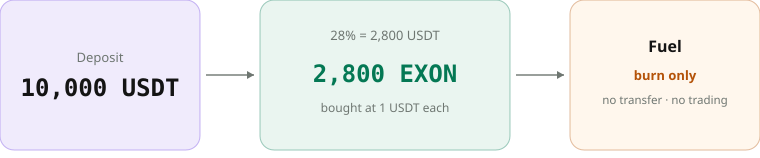
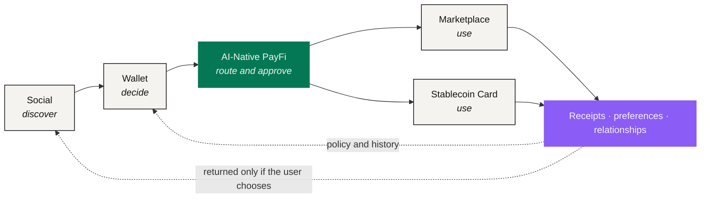

# NEXON Whitepaper

> **From Capital to Token. From Digital to Real.**

A position in a brokerage account, a token in a wallet and a real cross-border payment are all value. None of them has ever sat on the same ledger. Turning the first into the third still takes four systems, four identity checks and about a week — and at every step, a person is manually translating one language of value into another.

**NEXON = NEX (Nexus) + ON (enabled and online).** The name states the job: take that translation out of human hands and make it a product layer you can see, permission and hold to account.

As a product, NEXON is a **super financial-social ecosystem**: AI-Native PayFi, a Wallet, a Marketplace, a Stablecoin Card and a decentralized Social App — five entry points sharing one account system and one pair of assets. What binds them is a layer of AI that **reads what you mean but cannot move your assets**: you state an outcome and its boundaries, and it returns a route naming the amount, the destination, the executor and the expiry, for you to accept or decline.

To see why it has to be built this way, start with where the three markets actually break.

## Three markets, three languages

| Market | What value means here | Rhythm | Boundary |
|---|---|---|---|
| Capital markets | Ownership, and a claim on future cash flow | Quarterly cadence · T+2 settlement · trading hours | Ends at a jurisdiction |
| Digital finance | Liquidity and composability | 7×24 · finality in seconds | Borderless, but barely touches real assets |
| Real consumption | The right to use something | A given time, a given place, usable | Ends at a supplier's inventory |

Three definitions, three clocks, three borders. None is wrong, and none can be read by the other two. The markets are not split for lack of pipes — bridges, stablecoin rails and tokenization all exist, and each solved something real. What is missing is a common language in which a connection could be expressed.

**That language is what NEXON builds.**

## One ecosystem, two assets



### XO — Value Anchor

Carries staking, participation and long-term value accumulation.

In the current mechanism, XO is the **Staking Principal Token** inside the Staking Platform: a staking deposit is swapped into XO and starts earning at once, settled every 12 hours, with static rewards, referral rewards and leadership bonuses all paid in XO.



### EXON — Circulation Engine

Connects trading, payment, exchange and consumption.

In the current mechanism, EXON is NEXON's **Core Value Token**: the private sale at 0.1 USDT is the only way to acquire it, it lists at 1.0 USDT, it is sell-only, and 28% of every deposit buys EXON into the fuel wallet to be burned on withdrawal.



In one line: **NEXON is the ecosystem, anchored by XO and circulated through EXON.**

## The economics running today 

One account, two operating layers that mind their own business. The **NEX exchange** is the spot layer: XO trades freely, EXON lists sell orders only with no buy orders, and the daily release is displayed from listing day. The **Staking Platform** handles XO staking, settlement every 12 hours, term bonuses, referral rewards, leadership bonuses and reward withdrawal. Both share the account system and the back office, but ledgers, permissions and disclosures stay separate.

A staking deposit is split in two the moment the order opens:

<figure><figcaption>A 1,000 USDT deposit: 280 EXON into the fuel wallet, the rest swapped into XO and earning</figcaption></figure>

<table><thead><tr><th width="150">Parameter</th><th width="230">Value</th><th>What it does</th></tr></thead><tbody><tr><td>Deposit split</td><td>28% fuel · the rest into XO</td><td>28% buys EXON at 1 USDT each into the fuel wallet (burn only); the rest is swapped into XO and staked</td></tr><tr><td>Static settlement</td><td>0.3% – 1.0% every 12 hours</td><td>At 08:00 and 20:00 Beijing time; 1,000 USDT staked earns 6 – 20 USDT a day, paid in XO</td></tr><tr><td>Term bonus</td><td>base / +10% / +20% / +30% / +50%</td><td>30 / 90 / 180 / 360 / 540 days, set by term alone; day 31 is the 30-day term's exit window</td></tr><tr><td>Withdrawal and burn</td><td>30% / 20% / 10%</td><td>Immediate / 30-day / 60-day settlement; the equivalent EXON burns from the fuel wallet, gone for good</td></tr><tr><td>Private sale and listing</td><td><code>0.1 USDT → 1.0 USDT</code></td><td>Three tiers of 1,000 / 5,000 / 10,000 USDT, 11,500 allocations, 200 million EXON; paired with an XO stake at 3:1; sell only, never buy</td></tr><tr><td>Linear release</td><td>1,095 days · 2,190 payouts</td><td>Daily from listing day, <code>D = A ÷ 1,095</code></td></tr><tr><td>Dynamic rewards</td><td>20 generations at 76% · V1 – V12</td><td>On each downline's daily static output, paid on the level differential, settled in XO, burning on withdrawal</td></tr></tbody></table>

This mechanism is the current economic baseline. The larger product narrative sits on top of it without rewriting a single number.

## The long arc: an AI-native financial-social ecosystem

Five product surfaces close one loop: **discover in Social → decide in Wallet → route through PayFi → use in Marketplace or Card → return with data and relationships.** AI-Native PayFi is the second focus of the narrative, because it is where "here is what I want" becomes a route that can be checked, approved, executed and receipted.

## Where to start

<table data-view="cards"><thead><tr><th></th><th></th><th data-hidden data-card-target data-type="content-ref"></th></tr></thead><tbody><tr><td><strong>Start with the problem</strong></td><td>Why the three markets are still disconnected, and what bridges, stablecoin rails and tokenization each leave out.</td><td><a href="01-the-split/README.md">README.md</a></td></tr><tr><td><strong>Start with the thesis</strong></td><td>Intent → Route → Policy Check → User Approval → Execution → Receipt: the six stages that replace manual translation.</td><td><a href="02-the-translator/README.md">README.md</a></td></tr><tr><td><strong>Start with the numbers</strong></td><td>0.3% – 1.0% every 12 hours, term bonuses, the private sale at 0.1 USDT listing at 1.0 USDT, the 1,095-day release, burn on withdrawal and the worked examples.</td><td><a href="05-tokenomics/README.md">README.md</a></td></tr></tbody></table>

If you want the arithmetic first, jump to [Worked Examples](05-tokenomics/worked-examples.md). If you want to know who is responsible for each leg and who resolves a failure, jump to [Protocol Architecture](03-architecture/README.md).

NEXON is the first flagship project on the NEX exchange.

*The economic parameters and calculations in this paper follow the current mechanism finalised on 10 September 2026; the legal and risk boundaries are in the [Legal Disclaimer](legal-disclaimer/README.md).*
