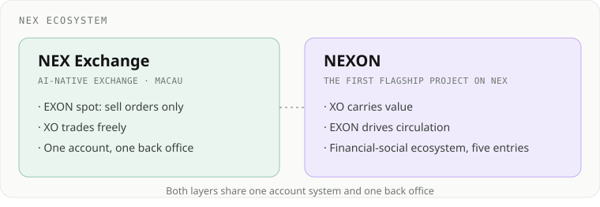
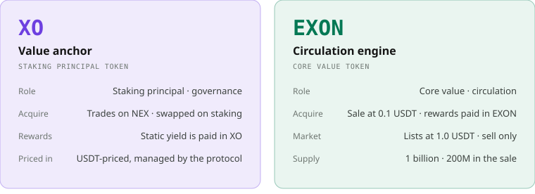
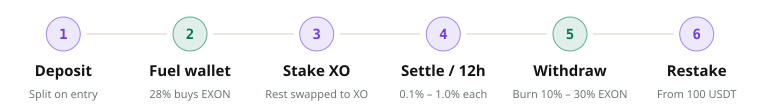
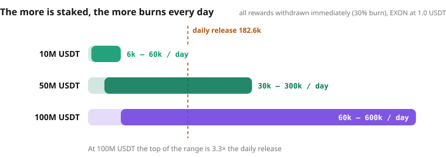
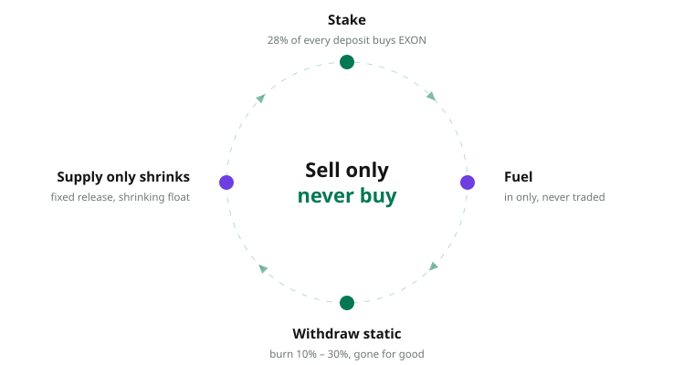
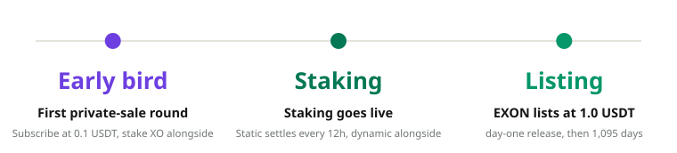

# NEXON in One Page


**The first EXON private sale opens on 15 September.** Subscription price 0.1 USDT, listing price 1.0 USDT — a 10× open. XO staking settles every 12 hours, twice a day. EXON can be sold but never bought, and every withdrawal burns it. All amounts are in **USDT**.


## 1. Start with what has already happened

NEX is an AI-native asset exchange operating out of Macau. On 17–18 June 2026 it co-hosted the 6th Digital Trade Innovation and Application Summit, with more than 400 attendees. Registrations and licences on the ecosystem side:

| Registration / licence | Authority or entity | Status |
| :-- | :-- | --: |
| Xinghuo BIF official accreditation and national node credential | China Academy of Information and Communications Technology (CAICT) | Obtained |
| Commercial registration (No. 97762) | Macau Ronguan International Brand Exchange Co., Ltd. | Completed |
| MSB money services business licence | U.S. Financial Crimes Enforcement Network (FinCEN) | Obtained |
| Virtual-asset compliance service provider onboarding | Dubai Virtual Assets Regulatory Authority (VARA) | In progress |

**NEXON is the first flagship project on the NEX exchange**, launched on NEX's account system, spot market and ecosystem resources.

The exchange is there, the licences are there, the people are there. What comes next?

An economic engine that puts money to work and only ever shrinks supply: stake XO for **time compounding**, subscribe to EXON for a 10× open, and burn on every withdrawal so that EXON moves in **one direction**. Every step below comes with a number.

## 2. NEXON is the ecosystem. XO carries value. EXON drives circulation.

|  | XO · value anchor | EXON · circulation engine |
| :-- | :-- | :-- |
| Role | Staking principal token; one of its functions is governance | Core value token; the circulation and settlement token of the whole ecosystem |
| How to acquire | Trades freely on NEX; swapped automatically when you stake | Private-sale subscription at 0.1 USDT — the only route |
| Market | Free buying and selling on NEX | Lists at 1.0 USDT; sell orders only, no buy orders |
| In the mechanism | Static rewards, referral rewards and leadership bonuses are all paid in XO | 28% of every deposit buys EXON into the fuel wallet; burned on withdrawal |
| Supply | 1 billion | 1 billion, of which only 200M enters the private sale |

On the product side NEXON is a **financial-social super ecosystem**: AI-native PayFi is live; the Wallet, the Marketplace and the decentralized Social App are in mid-development; the Stablecoin Card is on the roadmap. Five entry points share one account and this pair of assets. Running today: staking fuel, burn on withdrawal, NEX spot and PayFi settlement. Opening with each entry point: trading, payment, exchange and fees. Every unit of circulation moves through EXON.

## 3. One deposit, two income lines

Take a 1,000 USDT deposit. It is split in two the moment the order opens, automatically:

- **28% buys EXON.** 280 EXON, bought at 1 USDT each, go into the fuel wallet. The fuel wallet only fills: no transfers, no trading, burned only when rewards are withdrawn.
- **The rest is swapped into XO and staked.** It settles every 12 hours — 6 – 20 USDT a day — and the rewards land in XO, withdrawable at any time.

Both lines run at once: the staking line pays XO every 12 hours; the fuel line burns EXON on every withdrawal. The more is staked, the more is bought; the more is withdrawn, the more is burned.

## 4. Time compounding: settlement every 12 hours

Each settlement pays 0.3% – 1.0%, at 08:00 / 20:00 Beijing time, twice a day. **Stake 1,000 USDT and earn 6 – 20 USDT a day.**

The longer the term, the higher the bonus — set by term alone, never by amount. The 540-day term carries a flat +50%: 1,000 USDT staked earns 9 – 30 USDT a day.

| Term | Bonus | 1,000 USDT staked · per day | 10,000 USDT staked · per month | Cumulative lock |
| :-- | --: | --: | --: | --: |
| 30 days | base | 6 – 20 USDT | 1,800 – 6,000 USDT | 1,200 days |
| 90 days | +10% | 6.6 – 22 USDT | 1,980 – 6,600 USDT | 1,170 days |
| 180 days | +20% | 7.2 – 24 USDT | 2,160 – 7,200 USDT | 1,080 days |
| 360 days | +30% | 7.8 – 26 USDT | 2,340 – 7,800 USDT | 900 days |
| 540 days | +50% | 9 – 30 USDT | 2,700 – 9,000 USDT | 540 days |

Rewards arrive in XO and can be withdrawn at any time; once 100 USDT has accrued, it can open a new order, and the principal keeps growing — time works for the staker.

The exit is your choice:

- **30-day term**: day 31 is the exit window — principal plus 30 days of rewards, no penalty. Miss the window and the order renews automatically, 90 → 180 → 360 → 540 days, for a cumulative lock of 1,200 days.
- **540-day term**: one step, +50% bonus, and a cumulative lock of only 540 days — the shortest lock and the largest bonus.
- Minimum order 100 USDT.

## 5. Yield projection: subscribe at 0.1 USDT, list at 1.0 USDT

EXON supply is 1 billion. The private sale releases only 200M — 20% of supply — in 11,500 allocations, closed when sold out. Subscription and staking are paired 3:1: **the subscription earns the release, the stake earns the settlement, and both income lines start together.**

| Tier | XO stake alongside | Total in | EXON received | Released per day | Per month at 1.0 USDT | Allocations |
| :-- | --: | --: | --: | --: | --: | --: |
| 1,000 USDT | 333 USDT | 1,333 USDT | 10,000 | 9.13 | 273.97 USDT | 10,000 |
| 5,000 USDT | 1,666 USDT | 6,666 USDT | 50,000 | 45.66 | 1,369.86 USDT | 1,000 |
| 10,000 USDT | 3,333 USDT | 13,333 USDT | 100,000 | 91.32 | 2,739.73 USDT | 500 |
| **Total** |  |  | **200M** |  |  | **11,500** |

From listing day EXON is released daily for 1,095 days, one payout every 12 hours, 2,190 payouts in total. Every day pays, and every payout can be sold on NEX.

**Subscribe 30,000 USDT → 300,000 EXON → 273.97 EXON a day.** At 1.0 USDT that is 8,219.18 USDT a month, and the subscription is recovered in 3.7 months; at 2.0 USDT it is 16,438.36 USDT a month. The release schedule is fixed: every doubling of the price doubles the monthly payout.

## 6. One direction: the private sale is the only way in — sell only, never buy


**The private sale is the only way to acquire EXON. No hot money in and out, no round-tripping — one direction only.**


- The NEX secondary market lists sell orders only, never buy orders, and EXON is not listed on decentralized exchanges — there is no "buy EXON" route anywhere in the market.
- EXON sits in only two places: the accounts of private-sale participants, and the fuel wallets of stakers. Fuel-wallet EXON can only be burned.
- The sale releases only 200M, paid out daily over 1,095 days after listing — 182.6k a day, a supply schedule that is fully predictable.
- Sell fee 2%.

## 7. The burn-and-appreciate flywheel

Every deposit buys. Every withdrawal burns.

Withdraw rewards through one of three settlement speeds — the faster the settlement, the larger the burn:

| Settlement | Burn share | EXON burned on a 1,000 USDT withdrawal (at 1.0 USDT) |
| :-- | --: | --: |
| Immediate | 30% | 300 |
| 30-day | 20% | 200 |
| 60-day | 10% | 100 |

If the fuel wallet holds enough, settle immediately; if not, pick a slower settlement or top up fuel through the private sale. Static rewards, referral rewards and leadership bonuses all burn on every withdrawal, and what is burned leaves circulation for good.

**How much burns per day?** With all rewards withdrawn and settled immediately, EXON at 1.0 USDT:

| Total staked | Daily output | Daily burn (immediate settlement) | Annual burn |
| :-- | --: | --: | --: |
| 10M USDT | 60k – 200k USDT | 18k – 60k EXON | 6.57M – 21.9M EXON |
| 50M USDT | 300k – 1M USDT | 90k – 300k EXON | 32.85M – 109.5M EXON |
| 100M USDT | 600k – 2M USDT | 180k – 600k EXON | 65.7M – 219M EXON |
| **Reference: early-bird release** |  | **182.6k EXON** | **66.67M EXON** |

From 50M USDT staked, a year burns more than a year releases; at 100M USDT, a single day burns up to 600k EXON — 3.3× the daily release. Referral rewards and leadership bonuses burn on withdrawal too, and the table above does not yet count them.

Buying never stops, burning never stops, the release schedule is fixed, and the float only gets smaller — this is the engine behind EXON.

## 8. Exponential reach: 20 generations of referral rewards, V1 – V12 leadership bonuses

Referral rewards are calculated on each downline's daily static output, across up to 20 generations and 76% in total, settled in the same cycle as static rewards and always paid in XO.

| Generation | Rate |
| :-- | --: |
| Gen 1 | 15% |
| Gen 2–3 | 10% |
| Gen 4–8 | 5% |
| Gen 9–12 | 2% |
| Gen 13–20 | 1% |

Unlocking takes two numbers: how much you stake yourself, and how many people you refer directly.

| Generations unlocked | Own stake | Direct referrals (cumulative) | Each referral's order |
| :-- | --: | --: | --: |
| 1 – 4 | 100 USDT | 4 | ≥ 100 USDT |
| 5 – 8 | 500 USDT | 8 | ≥ 500 USDT |
| 9 – 12 | 1,000 USDT | 12 | ≥ 1,000 USDT |
| 13 – 16 | 2,000 USDT | 16 | ≥ 1,000 USDT |
| 17 – 20 | 5,000 USDT | 20 | ≥ 1,000 USDT |

**Worked example:** refer 5 people who each stake 10,000 USDT, each of whom refers 5 more — 5 / 25 / 125 people across three generations. Generation 1 pays 45 – 150 USDT a day, generation 2 150 – 500 USDT, generation 3 750 – 2,500 USDT: **945 – 3,150 USDT a day across three generations**, unlocked with an own stake of 100 USDT and four direct referrals.

Leadership bonuses V1 – V12 are paid on the differential (your rate minus your downline's rate). Assessment is cumulative on deposits, and a level once reached is never lost:

| Level | Own stake | Largest leg | Other legs combined | Rate |
| :-- | --: | --: | --: | --: |
| V1 | 500 USDT | 20,000 USDT | 10,000 USDT | 1% – 15% |
| V2 | 1,000 USDT | 30,000 USDT | 20,000 USDT | 16% – 25% |
| V3 | 2,000 USDT | 100,000 USDT | 50,000 USDT | 26% – 35% |
| V4 | 3,000 USDT | 200,000 USDT | 100,000 USDT | 36% – 45% |
| V5 | 5,000 USDT | 500,000 USDT | 200,000 USDT | 46% – 55% |
| V6 | 6,000 USDT | 2,000,000 USDT | 2 × V5 teams | 56% – 65% |
| V7 | 7,000 USDT | 5,000,000 USDT | 2 × V6 teams | 66% – 75% |
| V8 | 8,000 USDT | 8,000,000 USDT | 2 × V7 teams | 76% – 85% |
| V9 | 9,000 USDT | 10,000,000 USDT | 2 × V8 teams | 86% – 100% |
| V10 | 13,000 USDT | 20,000,000 USDT | 2 × V9 teams | global pool 20% |
| V11 | 17,000 USDT | 30,000,000 USDT | 2 × V10 teams | global pool 30% |
| V12 | 20,000 USDT | 50,000,000 USDT | 2 × V11 teams | global pool 50% |

V10 – V12 share a global pool of 3% of all XO deposits, weighted 20 / 30 / 50 and split equally within each level.

## 9. Two months, three dates

- **15 September**　First private-sale round opens: subscribe at 0.1 USDT in three tiers — 1,000 / 5,000 / 10,000 USDT — with the XO stake paired alongside.
- **14 October**　Studio City, Macau: XO staking goes live — static rewards settle every 12 hours, referral rewards and leadership bonuses settle alongside, and every withdrawal burns EXON.
- **14 November**　EXON lists at 1.0 USDT with the first day's release, then 1,095 consecutive days of daily payouts, to hold or to sell on NEX.

## 10. Parameters at a glance

| Parameter | Value |
| :-- | :-- |
| Sale price → listing price | 0.1 USDT → 1.0 USDT (10×) |
| Tiers / allocations | 1,000 / 5,000 / 10,000 USDT; 10,000 / 1,000 / 500 allocations, 11,500 in total |
| Subscription : stake | 3:1 (stake rounded down to the integer); 1:1 after listing |
| EXON supply / sale allocation | 1 billion / 200M (20%) |
| Linear release | 1,095 days from listing day, one release every 12 hours, 2,190 in total |
| EXON secondary market | Sell only, never buy; 2% sell fee |
| Static settlement | 0.3% – 1.0% every 12 hours, at 08:00 / 20:00 Beijing time |
| Term bonus | base / +10% / +20% / +30% / +50% |
| Minimum order / restake | 100 USDT / from 100 USDT of rewards |
| Fuel wallet | 28% of every deposit buys EXON at 1 USDT; burn only |
| Burn on withdrawal | Immediate 30% / 30-day 20% / 60-day 10% |
| Referral rewards | 20 generations, 76% in total, on each downline's daily static output |
| Leadership bonuses | V1 – V12 differential; V10 – V12 share a global pool of 3% of XO deposits |
| Dynamic payout | All paid in XO, settled in the same 12-hour cycle as static rewards |

What NEXON builds is one account that connects capital, digital assets and real-world consumption; XO carries the value in that account, and EXON drives every unit of circulation through it.

**Join the private sale in three steps:** open a NEX account through your referrer, choose a tier, and complete the subscription with its paired stake.
