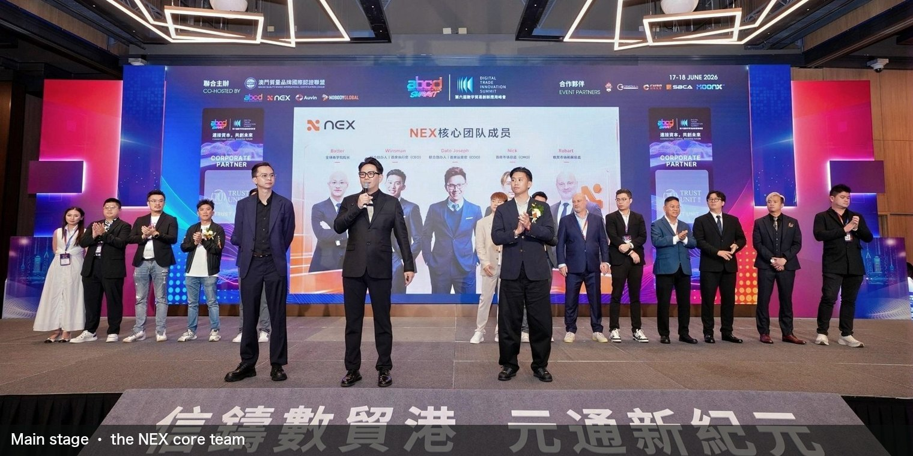
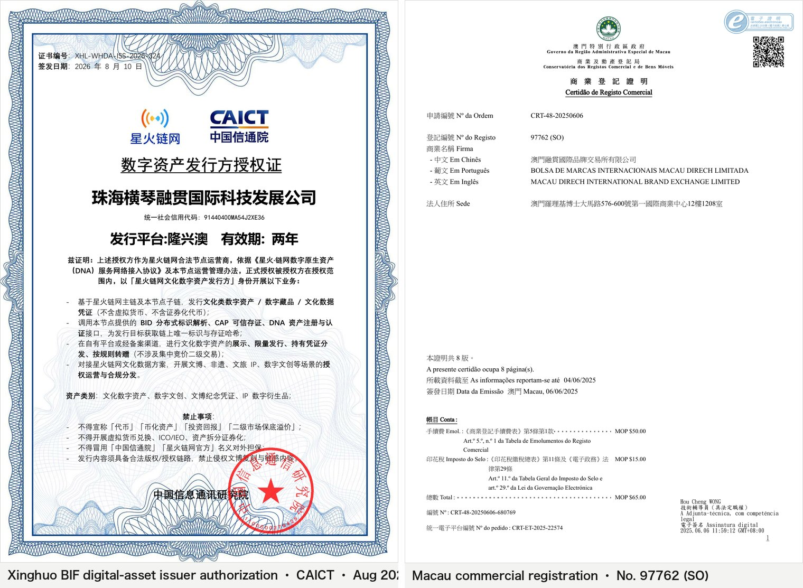

# NEXON in One Page


**The first EXON early-bird private sale:** subscription price 0.1 USDT, listing price 1.0 USDT — a 10× open. XO staking settles every 12 hours, twice a day. EXON can be sold on NEX but never bought there, and every reward withdrawal burns it. All amounts are in **USDT**.


## 1. The first flagship project on the NEX exchange

NEX is an AI-native asset exchange operating out of Macau, with seven strategic hubs: Macau as the Asia-Pacific operations and compliance centre, mainland China for domestic business, Australia for global capital markets, Malaysia for national-grade AI compute, Dubai for Gulf capital, Africa for emerging markets, and Europe and the Americas for FX clearing and derivatives.

One exchange, two layers: the spot layer trades XO and EXON, and the staking platform carries NEXON's reward model. Both share one account system and one back office — open one account, move between the two.

### The summit: co-hosted by NEX

17–18 June 2026, Macau. The 6th Digital Trade Innovation and Application Summit was organised by abcd Summit (APAC Blockchain Day) together with the Macau Quality Brand International Certification League, with NEX on stage as co-host and more than 400 attendees.

### Core team

The NEX core team:

|  | Role |
| :-- | :-- |
| Winsman | Chief Executive Officer, NEX |
| Timson | Chief Marketing Officer |
| Batter | Dean, Global Business School |
| Robart | Director of Market Expansion, Europe and the Americas |

### Two awards

The Macau Quality Brand International Certification League (MQBICL) presented NEXON with the Most Innovative Potential Award and the Best Design of the Year Award.

### Licences and registrations

Four credentials across mainland China, Macau, the United States and Dubai:

| Registration / licence | Issuing or registering authority | Status |
| :-- | :-- | --: |
| Digital-asset issuer authorization (Xinghuo BIF) | China Academy of Information and Communications Technology (CAICT) | Issued Aug 2026 · valid two years |
| Commercial registration (No. 97762) | Macau Direch International Brand Exchange Limited | Completed |
| Money Services Business (MSB) licence | U.S. Financial Crimes Enforcement Network (FinCEN) | Obtained |
| Virtual-asset compliance service provider onboarding | Dubai Virtual Assets Regulatory Authority (VARA) | In progress |

**NEXON is the first flagship project on the NEX exchange**, launched on NEX's account system, spot market and ecosystem resources. Exchange, licences and team are all in place. On top of them sits an economic engine that puts money to work and only ever shrinks supply: stake XO for **time compounding**, subscribe to EXON for a 10× open, and burn on every withdrawal so that EXON moves in **one direction**.

## 2. NEXON is the ecosystem. XO carries value. EXON drives circulation.

|  | XO · value anchor | EXON · circulation engine |
| :-- | :-- | :-- |
| Role | Staking principal token; one of its functions is governance | Core value token; the circulation and settlement token of the whole ecosystem |
| How to acquire | Trades freely on NEX; swapped automatically when you stake | Private-sale subscription at 0.1 USDT, or earned: dynamic rewards pay in EXON |
| Market | Free buying and selling on NEX | Lists at 1.0 USDT; sell orders only, no buy orders |
| In the mechanism | Static yield is paid in XO | Dynamic rewards pay in EXON; 28% of every deposit buys EXON as fuel, burned on static withdrawal; X Points bought with EXON from V3 up |
| Supply | — | 1 billion, of which only 200M enters the private sale |

On the product side NEXON is a **super financial-social ecosystem**: AI-native PayFi is live; the Wallet, the Marketplace and the decentralized Social App are in mid-development; the Stablecoin Card is on the roadmap. Five entry points share one account and this pair of assets. Running today: staking fuel, burn on withdrawal, NEX spot and PayFi settlement. Opening with each entry point: trading, payment and exchange. Every unit of circulation moves through EXON.

## 3. One deposit, two income lines

Take a 10,000 USDT deposit. It is split in two the moment the order opens, automatically:

- **28% buys EXON.** 2,800 EXON, bought at 1 USDT each, are held as fuel. Fuel only ever fills: nothing in it can be withdrawn or transferred, and it is spent in one way only — burned when static yield is withdrawn.
- **The rest is swapped into XO and staked.** It settles every 12 hours — 40 – 120 USDT a day — and the static yield lands in XO, withdrawable at any time.

Both lines run at once: the staking line pays XO every 12 hours; the fuel line burns EXON on every withdrawal. The more is staked, the more is bought; the more is withdrawn, the more is burned.

## 4. Time compounding: settlement every 12 hours

Each settlement pays 0.2% – 0.6%, every 12 hours, twice a day. **Stake 10,000 USDT and earn 40 – 120 USDT a day.**

The longer the term, the higher the bonus — set by term alone, never by amount. The 540-day term carries a flat +50%: 10,000 USDT staked earns 60 – 180 USDT a day.

| Term | Bonus | 10,000 USDT staked · per day | 10,000 USDT staked · per month |
| :-- | --: | --: | --: |
| 30 days | base | 40 – 120 USDT | 1,200 – 3,600 USDT |
| 90 days | +10% | 44 – 132 USDT | 1,320 – 3,960 USDT |
| 180 days | +20% | 48 – 144 USDT | 1,440 – 4,320 USDT |
| 360 days | +30% | 52 – 156 USDT | 1,560 – 4,680 USDT |
| 540 days | +50% | 60 – 180 USDT | 1,800 – 5,400 USDT |

Static yield arrives in XO and can be withdrawn at any time; rewards can be reinvested as they land, so the principal keeps compounding — time works for the staker.

The exit is your choice:

- **30-day term**: principal plus 30 days of rewards come back at maturity, no penalty. Left in place, the order renews automatically, 90 → 180 → 360 → 540 days.
- **540-day term**: one step, +50% bonus — the highest of the five tiers, with principal and rewards returned together at maturity.
- Minimum order 100 USDT.

### 10,000 USDT staked: what maturity pays

Rewards on the original order only:

| Term | Term bonus | Daily output with bonus | Rewards at maturity | Principal + rewards at maturity | Multiple of principal |
| :-- | --: | --: | --: | --: | --: |
| 30 days | none | 40 – 120 USDT | 1,200 – 3,600 USDT | 11,200 – 13,600 USDT | 1.1× – 1.4× |
| 90 days | +10% | 44 – 132 USDT | 3,960 – 11,880 USDT | 13,960 – 21,880 USDT | 1.4× – 2.2× |
| 360 days | +30% | 52 – 156 USDT | 18,720 – 56,160 USDT | 28,720 – 66,160 USDT | 2.9× – 6.6× |
| 540 days | +50% | 60 – 180 USDT | 32,400 – 97,200 USDT | 42,400 – 107,200 USDT | 4.2× – 10.7× |

### Reinvest and compound

Rewards are reinvested as they land: a reinvested order carries the same term bonus as the original, settles every 12 hours, and its own rewards keep compounding — all the way to the original order's maturity. Total at maturity = principal + original order rewards + reinvested rewards. At 0.2% per settlement:

| Term | Original order rewards | New order rewards | Principal + all rewards at maturity | Multiple of principal | Original order only |
| :-- | --: | --: | --: | --: | --: |
| 30 days | 1,200 USDT | 68.2 USDT | **11,268 USDT** | **1.1×** | 1.1× |
| 90 days | 3,960 USDT | 871 USDT | **14,831 USDT** | **1.5×** | 1.4× |
| 360 days | 18,720 USDT | 35,945 USDT | **64,665 USDT** | **6.5×** | 2.9× |
| 540 days | 32,400 USDT | 211,006 USDT | **253,406 USDT** | **25.3×** | 4.2× |

The longer the term, the more it rolls: the 540-day term matures at **253,406 USDT, 25.3× the principal**, against 4.2× on the original order alone.

## 5. Yield projection: subscribe at 0.1 USDT, list at 1.0 USDT

EXON supply is 1 billion. The private sale offers only 200 million — 20% of supply — in 11,500 allocations, closed once sold out. Each subscription is paired with an XO stake at 3:1: **the subscription earns the release, the stake earns the settlement, and both income lines start together.**

| Tier | XO stake alongside | Total in | EXON received | Released per day | Per month at 1.0 USDT | Allocations |
| :-- | --: | --: | --: | --: | --: | --: |
| 1,000 USDT | 333 USDT | 1,333 USDT | 10,000 | 9.13 | 273.97 USDT | 10,000 |
| 5,000 USDT | 1,666 USDT | 6,666 USDT | 50,000 | 45.66 | 1,369.86 USDT | 1,000 |
| 10,000 USDT | 3,333 USDT | 13,333 USDT | 100,000 | 91.32 | 2,739.73 USDT | 500 |
| **Total** |  |  | **200M** |  |  | **11,500** |

From listing day EXON is released daily for 1,095 days, one payout every 12 hours, 2,190 payouts in total. Every day pays, and every payout can be sold on NEX.

**Subscribe 30,000 USDT → 300,000 EXON → 273.97 EXON a day.** At 1.0 USDT that is 8,219.18 USDT a month, and the subscription is recovered in 3.7 months; at 2.0 USDT it is 16,438.36 USDT a month. The release schedule is fixed: every doubling of the price doubles the monthly payout.

## 6. One direction: nobody can buy it — you subscribe or you earn it


**Two ways to hold EXON: subscribe in the private sale, or earn it through referrals. No hot money in and out, no round-tripping — one direction only.**


- The NEX secondary market lists sell orders only, never buy orders, and EXON is not listed on decentralized exchanges — there is no "buy EXON" route anywhere in the market.
- EXON sits in three places: the accounts of private-sale participants, the accounts of leaders earning dynamic rewards, and the fuel of stakers. Fuel EXON can only be burned.
- Sell fee 5%.
- The sale offers only 200 million EXON, paid out daily over 1,095 days after listing — 182.6k a day, a supply schedule that is fully predictable.

## 7. The burn-and-appreciate flywheel

Every deposit buys. Every withdrawal burns.

Withdraw rewards through one of three settlement speeds — the faster the settlement, the larger the burn:

| Settlement | Burned | EXON burned on a 10,000 USDT withdrawal (at 1.0 USDT) |
| :-- | --: | --: |
| Immediate | 30% | 3,000 |
| 30-day | 20% | 2,000 |
| 60-day | 10% | 1,000 |

If the fuel holds enough, settle immediately; if not, pick a slower settlement. Static yield burns on every withdrawal, and what is burned leaves circulation for good; referral and leadership rewards are paid in EXON and burn nothing.

**How much burns per day?** With all static yield withdrawn and settled immediately, EXON at 1.0 USDT:

| Total staked | Daily output | Daily burn (immediate settlement) | Annual burn |
| :-- | --: | --: | --: |
| 10M USDT | 40k – 120k USDT | 12k – 36k EXON | 4.38M – 13.14M EXON |
| 50M USDT | 200k – 600k USDT | 60k – 180k EXON | 21.9M – 65.7M EXON |
| 100M USDT | 400k – 1.2M USDT | 120k – 360k EXON | 43.8M – 131.4M EXON |
| **Reference: early-bird release** |  | **182.6k EXON** | **66.67M EXON** |

At 100 million USDT staked, a year's burn approaches two years of release, and a single day burns up to 360k EXON — 2.0× the daily release.

Buying never stops, burning never stops, the release schedule is fixed, and the float only gets smaller — this is the engine behind EXON.

## 8. Exponential reach: 20 generations of referral rewards, V1 – V12 leadership bonuses

Referral rewards are calculated on each downline's daily static output, across up to 20 generations and 76% in total, settled in the same cycle as static rewards and always paid in EXON — the coin that appreciates.

Each generation's rate, and what it takes to collect it, generation by generation:

| Generation you collect | Rate for that generation | Own stake | Qualified direct referrals (cumulative) | Minimum stake of each added referral |
| :-- | --: | --: | --: | --: |
| Gen 1 | 15% | 100 USDT | 1 | ≥ 100 USDT |
| Gen 2 | 10% | 100 USDT | 2 | ≥ 100 USDT |
| Gen 3 | 10% | 100 USDT | 3 | ≥ 100 USDT |
| Gen 4 | 5% | 100 USDT | 4 | ≥ 100 USDT |
| Gen 5 | 5% | 500 USDT | 5 | ≥ 500 USDT |
| Gen 6 | 5% | 500 USDT | 6 | ≥ 500 USDT |
| Gen 7 | 5% | 500 USDT | 7 | ≥ 500 USDT |
| Gen 8 | 5% | 500 USDT | 8 | ≥ 500 USDT |
| Gen 9 | 2% | 1,000 USDT | 9 | ≥ 1,000 USDT |
| Gen 10 | 2% | 1,000 USDT | 10 | ≥ 1,000 USDT |
| Gen 11 | 2% | 1,000 USDT | 11 | ≥ 1,000 USDT |
| Gen 12 | 2% | 1,000 USDT | 12 | ≥ 1,000 USDT |
| Gen 13 | 1% | 2,000 USDT | 13 | ≥ 1,000 USDT |
| Gen 14 | 1% | 2,000 USDT | 14 | ≥ 1,000 USDT |
| Gen 15 | 1% | 2,000 USDT | 15 | ≥ 1,000 USDT |
| Gen 16 | 1% | 2,000 USDT | 16 | ≥ 1,000 USDT |
| Gen 17 | 1% | 5,000 USDT | 17 | ≥ 1,000 USDT |
| Gen 18 | 1% | 5,000 USDT | 18 | ≥ 1,000 USDT |
| Gen 19 | 1% | 5,000 USDT | 19 | ≥ 1,000 USDT |
| Gen 20 | 1% | 5,000 USDT | 20 | ≥ 1,000 USDT |

Every condition in the table applies to **the person collecting the reward**: an own stake at the tier, enough qualified direct referrals, and each added referral staking at least the minimum. Downline members have no conditions to meet, and their own static yield is never reduced. Each rate applies only to the people in that generation: direct referrals are generation 1 and pay 15%; the people they refer are generation 2 and pay 10%; and so on down to 1% on generation 20.

**Unlocking, by example:** with an own stake of 500 USDT and 6 qualified direct referrals — 4 staking 100 USDT or more and 2 staking 500 USDT or more — generations 1 – 6 are open; add 2 more referrals staking 500 USDT or more and generations 7 and 8 open too.

**Reward, worked through:** refer 5 people, each of whom refers 5 more; everyone stakes 10,000 USDT and produces 40 – 120 USDT of static yield a day:

| Generation | People in it | Their combined daily static output | Rate | Your daily referral reward |
| :-- | --: | --: | --: | --: |
| Gen 1 | 5 | 200 – 600 USDT | 15% | 30 – 90 USDT |
| Gen 2 | 25 | 1,000 – 3,000 USDT | 10% | 100 – 300 USDT |
| Gen 3 | 125 | 5,000 – 15,000 USDT | 10% | 500 – 1,500 USDT |
| **Three generations** |  |  |  | **630 – 1,890 USDT** |

An own stake of 100 USDT and 4 qualified direct referrals already open generations 1 – 4. Rewards are paid in EXON; USDT in the table is the unit of account.

Leadership bonuses V1 – V12 are paid on the differential (your rate minus your downline's rate). Assessment is cumulative on deposits, and a level once reached is never lost:

| Level | Own stake | Largest leg | Other legs combined | Rate |
| :-- | --: | --: | --: | --: |
| V1 | 500 USDT | 20,000 USDT | 10,000 USDT | 1% – 15% |
| V2 | 1,000 USDT | 30,000 USDT | 20,000 USDT | 16% – 25% |
| V3 | 2,000 USDT | 100,000 USDT | 50,000 USDT | 26% – 35% |
| V4 | 3,000 USDT | 200,000 USDT | 100,000 USDT | 36% – 45% |
| V5 | 5,000 USDT | 500,000 USDT | 200,000 USDT | 46% – 55% |
| V6 | 6,000 USDT | 2,000,000 USDT | 2 × V5 teams | 56% – 65% |
| V7 | 7,000 USDT | 5,000,000 USDT | 2 × V6 teams | 66% – 75% |
| V8 | 8,000 USDT | 8,000,000 USDT | 2 × V7 teams | 76% – 85% |
| V9 | 9,000 USDT | 10,000,000 USDT | 2 × V8 teams | 86% – 100% |
| V10 | 13,000 USDT | 20,000,000 USDT | 2 × V9 teams | global pool 20% |
| V11 | 17,000 USDT | 30,000,000 USDT | 2 × V10 teams | global pool 30% |
| V12 | 20,000 USDT | 50,000,000 USDT | 2 × V11 teams | global pool 50% |

V10 – V12 share a global pool of 3% of all XO deposits, weighted 20 / 30 / 50 and split equally within each level.

### X Points: meet the day's spend, claim the day's rewards

From V3, each level must meet its daily X Points spend to claim that day's platform rewards. X Points are bought with EXON: **1 point = 10 USD worth of EXON** at the price at purchase, fixed pricing. X Points only concern dynamic rewards; static yield and principal follow their own rules.

| Level | V1 | V2 | V3 | V4 | V5 | V6 | V7 | V8 | V9 | V10 | V11 | V12 |
| :-- | --: | --: | --: | --: | --: | --: | --: | --: | --: | --: | --: | --: |
| Daily spend (points) | 0 | 0 | 1 | 2 | 3 | 5 | 7 | 10 | 15 | 20 | 25 | 30 |

**How X Points are spent**

- The system refreshes the X Points spend parameters every 24 hours
- Meet your level's daily X Points spend to claim that day's platform rewards
- Miss the day's spend and that day's rewards cannot be claimed

**Level-up bonus**

- Every level up grants 30 X Points automatically
- Newly promoted members get a 3-month relief period
- During relief, the spend is 50% of the level's standard
- After 3 months, the level's full 100% standard applies

**Example: V8 → V9.** Promotion grants 30 points, and the X Points balance is capped at 30; for the first 3 months V9 spends 7.5 points a day (50% of the V9 standard), then 15 points a day.

## 9. Three milestones

- **Early bird**　First private-sale round: subscribe at 0.1 USDT in three tiers — 1,000 / 5,000 / 10,000 USDT — with the XO stake paired alongside.
- **Staking**　The summit: XO staking goes live — static rewards settle every 12 hours, referral rewards and leadership bonuses settle alongside, and static withdrawals burn fuel EXON.
- **Listing**　EXON lists at 1.0 USDT with the first day's release; from listing day, 1,095 consecutive days of daily payouts, to hold or to sell on NEX.

## 10. Parameters at a glance

| Parameter | Value |
| :-- | :-- |
| Sale price → listing price | 0.1 USDT → 1.0 USDT (10×) |
| Tiers / allocations | 1,000 / 5,000 / 10,000 USDT; 10,000 / 1,000 / 500 allocations, 11,500 in total |
| Subscription : stake | 3:1 (stake rounded down to the integer); 1:1 after listing |
| EXON supply / sale allocation | 1 billion / 200M (20%) |
| Linear release | 1,095 days from listing day, one release every 12 hours, 2,190 in total |
| EXON secondary market | Sell only, never buy |
| Static settlement | 0.2% – 0.6% every 12 hours |
| Term bonus | base / +10% / +20% / +30% / +50% |
| Minimum order / restake | 100 USDT / from 100 USDT of rewards |
| Fuel wallet | 28% of every deposit buys EXON at 1 USDT; burn only |
| Burn on withdrawal | Immediate 30% / 30-day 20% / 60-day 10% |
| Referral rewards | 20 generations, 76% in total, on each downline's daily static output |
| Leadership bonuses | V1 – V12 differential; V10 – V12 share a global pool of 3% of XO deposits |
| Dynamic payout | All paid in EXON, settled in the same 12-hour cycle as static rewards; withdrawal burns no fuel |
| X Points | Daily use by level (V1 and V2 use 0); meet the day's quota to claim the day's rewards; 1 point = 10 USD of EXON, 30 granted per promotion, 3-month relief at 50% |

What NEXON builds is one account that connects capital, digital assets and real-world consumption; XO carries the value in that account, and EXON drives every unit of circulation through it.

**Join the private sale in three steps:** open a NEX account through your referrer, choose a tier, and complete the subscription with its paired stake.

**Posters, one-pagers, PDFs and logos:** [Project Materials](https://docbay.nexon.markets/)

**Official channels:** [Website](https://nexon.markets/) · [X / Twitter](https://x.com/NexonMarkets) · [Telegram community](https://t.me/NexonMarkets) · [Telegram announcements](https://t.me/NexonMarketsAnn) · [YouTube](https://www.youtube.com/@NEXONMarkets) · [Whitepaper](https://nexon-3.gitbook.io/nexon-docs/) · [All links](https://linktr.ee/NEXONMarkets)
