# NEXON —— 新一代价值连接网络

> **From Capital to Token. From Digital to Real.** 连接资本与通证，连接数字与现实。


**一句话看懂 NEXON**：把长期割裂的三个市场——资本、数字资产、真实消费——接进同一套账户体系，用一组双资产把它们串起来（NEXON 是生态，XO 承载价值，EXON 驱动流通），并以一个超级金融社交综合体作为用户入口：AI 原生 PayFi App、钱包、商城、Stablecoin Card、去中心化社交。把这些串起来的，是一层**读得懂意图、但动不了资产**的 AI 编排。


**NEXON = NEX（Nexus，连接）+ ON（开启、在线）。** 名字就是要解决的事：把原本不通的几套价值体系连起来，并且让这条连接**真的能跑起来**。

---

## 一、三个各自成立、彼此不通的世界 

券商账户里的一笔仓位、钱包里的一枚代币、十月东京的四晚酒店，都是价值。这一点没人会争。不容易看见的是另一件事：**它们从来没有在同一本账上出现过。**

- **股票**承载企业与资本价值；
- **数字资产**提供全球化的价值流动；
- **旅游、酒店及消费产业**拥有庞大的真实用户与商业需求。

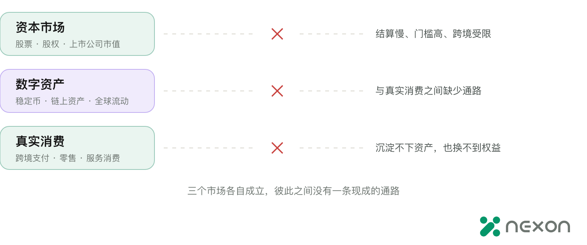

问题不在于某一个市场不够大，而在于**它们之间的断口**：

| 市场 | 已经很成熟的部分 | 缺的那一段 |
| :-- | :-- | :-- |
| 资本市场 | 定价、托管、退出机制完整 | 结算慢、门槛高、跨境受限，散户很难参与一级 |
| 数字资产 | 7×24 全球流动，结算以秒计 | 与真实消费之间缺少通路，涨跌之外没有落点 |
| 真实消费 | 真实用户、真实现金流、真实履约 | 沉淀不下资产，消费换不来长期权益 |

同一块材料，被切成彼此对不上的几段。

### 一笔仓位，一间酒店房 

抽象的「断口」听起来还好。把它换成一件具体的事，就不太好了——你在证券账户里持有一笔仓位，想把其中一部分变成十月的东京酒店。今天这条路是这么走的：

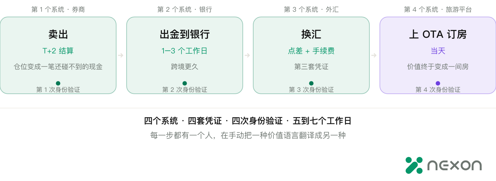

四个系统、四套凭证、四次身份验证、五到七个工作日。中间任何一环出问题，都要人工介入重来。

这里没有一步在技术上是难的。只不过在每一步，都有一个人在做翻译。


**为什么修桥修不好这件事。** 跨链桥、稳定币支付、资产代币化都已经存在，而且各自解决了真问题——但三个市场照旧各在各处。原因是它们**对「价值」的定义就不一样**：资本市场说的是所有权，数字资产说的是流动性，消费市场说的是使用权。三种定义、三种时钟、三种边界，没有一种能被另外两种读懂。缺的不是管道，是一种能把「连接」表达出来的**共同语言**。


管道的契约是**保真**：到达的必须等于送出的。翻译的契约正好相反：到达的必须是**另一样东西**，但含义相同。再多保真的步骤叠在一起，也拼不出一个保义的步骤。凡是路上必须换一种东西的——一份权利变成现金、现金变成一间房——都得在管道之外由人重新做一遍。**这就是 NEXON 要处理的问题。**

---

## 二、NEXON 要做的：把转换本身做成产品 

NEXON 不打算再做一个交易所，也不打算再发一个用途单一的代币。它要做的是一个**超级金融社交综合体**——把资金进出、资产增值、消费落地、关系沉淀这四件事，放进同一套账户体系里。


**一套账户，五个入口。**用户不需要在五个 App、五个账户、五种资产之间搬来搬去；五个入口面向五种行为，共用同一套账户与同一组资产。


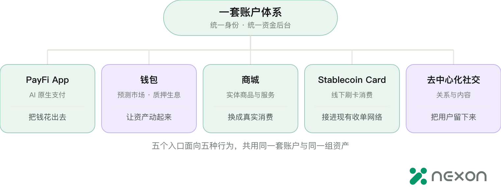

五个入口不是五张互不相干的功能清单，每一个占据用户价值闭环里的**一个特定时刻**：

> 在 Social 发现 → 在 Wallet 决策 → 经 PayFi 编排 → 在 Marketplace 或 Card 使用 → 以数据、关系和活动回流生态。

### 每一次动钱，都走同一条路径 

闭环听起来顺，但真正决定它靠不靠谱的，是**每一次动钱时到底经过了什么**。NEXON 把这件事固定成六段：

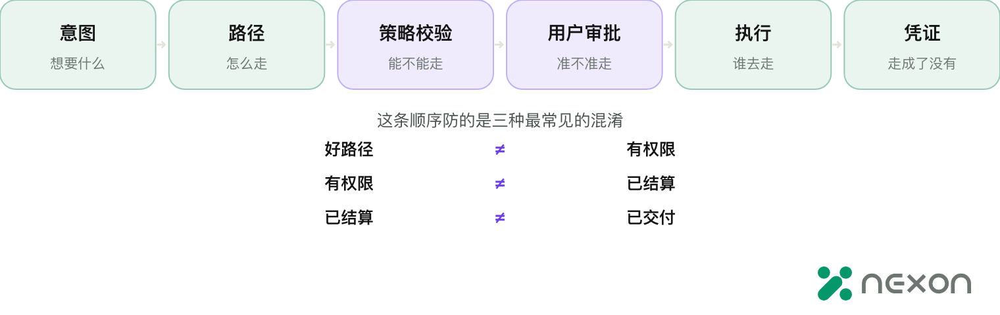

前三段不动任何资产：**意图**记下你想要什么和不能碰什么，**路径**排出候选步骤和成本，**策略校验**逐条过身份、辖区、余额、限额和产品规则。到**用户审批**才第一次要你点头，而且点头的对象是一条写明了金额、去向、执行方和有效期的指令。**执行**只把已批准的那条指令发给真正负责结算或交付的系统。**凭证**把「钱结算了」和「东西交付了」分成两件事记。

这条顺序防的是三种最常见的混淆：**好路径不等于有权限，有权限不等于已结算，已结算不等于已交付。**你可以批准一笔兑换，而完全没有批准酒店订单；支付可能成功，商户仍未履约。把这三件事分开记，是这套结构最实际的一处收益。


以下五个产品是 NEXON 的**产品规划**，用于说明生态形态与各模块的关系；上线节奏与功能范围以正式公告为准。


---

## 三、五个入口，分别解决什么 

先一眼扫完，再逐个展开：

| 入口 | 在闭环里的位置 | 它不会变成 |
| :-- | :-- | :-- |
| AI 原生 PayFi | 把目标翻译成一条可审批的路径 | 托管人、商户或收益来源 |
| 钱包 | 看清资产、权限与仓位，做决定 | 第二个收益来源 |
| 商城 | 把已批准的路径落成商品与服务 | 对每一家供应商履约的担保 |
| Stablecoin Card | 延伸到生态外的日常受理 | 一张已经发出的卡 |
| 去中心化社交 | 发现、社区与关系语境 | 自动的金融权限 |

### 1. AI 原生 PayFi App —— 价值路由器 

支付只回答一个动作：把钱转过去。NEXON 的问题**开始得更早、结束得更晚**——更早：用户到底想要什么、哪些钱可以动、有哪些不能碰的底线；更晚：钱结算了，和东西真的交付了，是两件事。

PayFi 干的就是中间这一段：把一句「我想干什么」拆成一条能看懂的路径，每一段标出用哪笔资产、谁负责执行、要满足什么条件、拿到什么凭证，然后交给用户按一次确认。

AI 原生的意思是**含义先于菜单**：你说结果，不是找菜单。额度、时限、白名单、可撤销授权做进产品底层，让自动化的行为始终在用户设定的边界内发生——**能替你跑腿，但不会替你做主**。

模糊不是权限。关键条件缺了，正确的动作是追问、收窄，或者停下来，而不是挑一个看起来合理的默认值继续跑。

#### 「AI 原生」和「聊天窗口套壳」的分界 

在支付按钮上加一个对话框，操作体验会变好，但那不是价值连接网络。真正的区别在于**权力怎么分**：

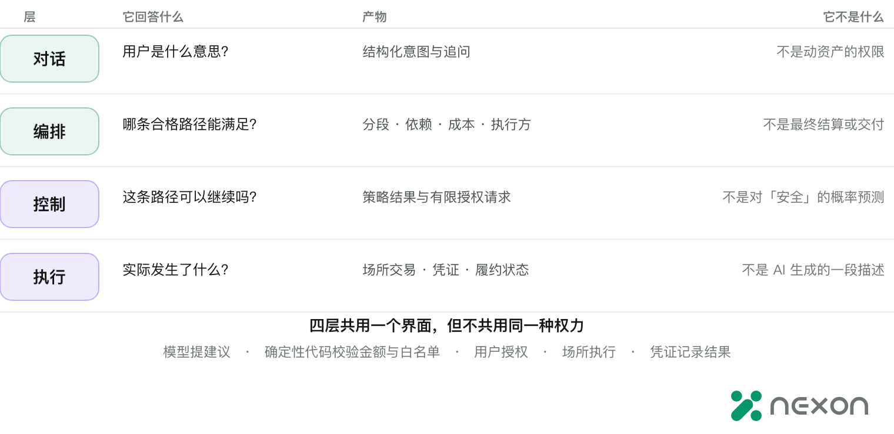

四层可以共用一个界面，但**不能共用同一种权力**。模型负责提建议；确定性代码校验金额、白名单和资格；用户（或一条他自己批准过的窄规则）授权；交易所、合约、托管人或供应商执行；凭证记录观察到的结果。

这层分离正是系统能扛住模型犯错的地方——模型虚构一个不存在的资产，路径构造器直接拒绝；模型看错预算，结构化预览在授权之前把金额摆出来；库存变了，执行停下或重新报价；**模型的解释和经济公式冲突时，公式说了算**。

也正因为这样，AI 在这套体系里不是收益来源。7228、基础年化、期限权重、释放、赎回销毁，全部来自经济机制本身，一个参数都不来自模型。**AI 省掉的是人工翻译，不是用户的决定权。**

### 2. 钱包 —— 金融主页 

钱包不只是存放地址，它是用户从「发现」走到「决定」的那个地方：

- **去中心化预测市场**：把对世界的判断变成可交易的头寸，由第三方协议负责，受其自身托管、结算与辖区规则约束；
- **质押生息**：期限加权的单币质押，每 12 小时结算一次；
- **权限中心**：哪个应用能读什么、能动哪笔资产、最多多少、什么时候过期、还剩多少没用掉——都在同一个界面里看得见、收得回。

撤销停的是**未来的使用**，倒不回一次已完成的转账。这两件事在界面上必须是两句话。

### 3. 商城 —— 换成真实消费 

链上资产最缺的一环是**落点**。商城把旅游、酒店、定制路线与实体商品接进来，让代币不止于交易对，而能直接兑换成真实的商品与服务。

这一环的完成标志不是付款成功，而是**供应商确认交付**——付款与履约分开记两笔账。一笔已结算但没交付的支付，不是一段成功的现实分段。

### 4. Stablecoin Card —— 接进现有收单网络 

商城解决「生态内买什么」，卡解决「生态外怎么花」。稳定币卡把合资格余额接进已经存在的线下收单网络，不需要商户改造任何东西。

卡由持牌发卡方发行与运营，资格、地区、资产、费用与额度以其条款为准。离线授权、周期扣款、小费、冲正和拒付，各有各的处理方式，塞不进一个通用的链上最终性模型。

### 5. 去中心化社交 —— 把用户留下来 

前四个入口解决「钱怎么动」，社交解决「人为什么留下」。关系、内容与信誉沉淀在链上，成为整个综合体的用户底座，也是预测市场与商城的天然流量来源。

社交提供的是**语境**：它能帮你形成一个想法，但不会替你的账户批准任何一条路径。一份被广泛转发的策略不会因此就适合你；导入别人的模板，只会在你自己的策略下生成一份新草稿。

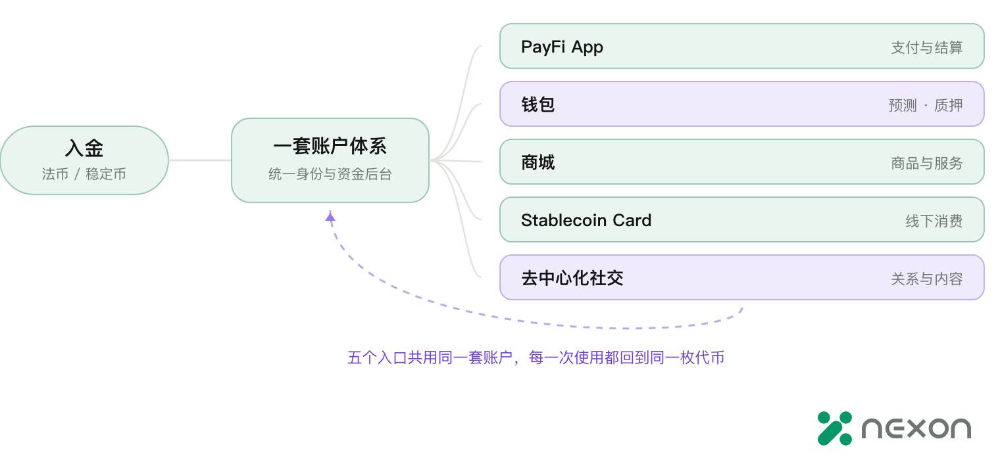

---

## 四、双资产体系：一个承载价值，一个驱动流通 

一个代币同时承担「长期价值沉淀」和「高频流通媒介」两件事，必然互相拖累：沉淀要求少动，流通要求多动。NEXON 把这两件事拆开。

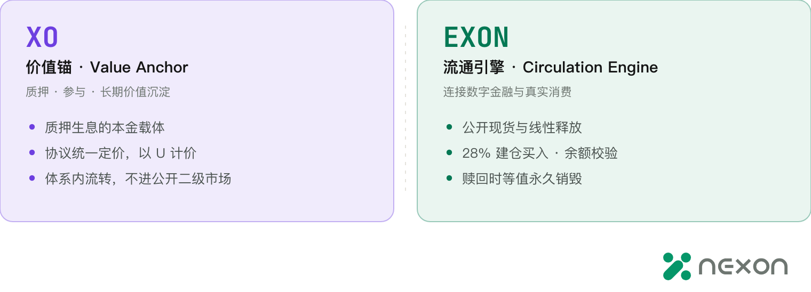

|  | XO · 价值锚 | EXON · 流通引擎 |
| :-- | :-- | :-- |
| 定位 | 承载质押、参与、权益与长期价值沉淀 | 连接数字金融与真实消费 |
| 当前机制 | 质押本金载体，承载 72% 计息基数 | 核心价值代币与公开现货标的 |
| 定价 | 协议统一管理，以 U 计价 | 早期轮 0.1 U，TGE 指导价 1.0 U |
| 流通 | 体系内流转，不进公开二级市场 | TGE 起在主交易所现货流通 |
| 供给 | 协议统一定价与释放 | 固定总量，按计划逐步释放 |

EXON 在当前机制里承担三件已经确认的事，另有一组产品用途仍在规划中：

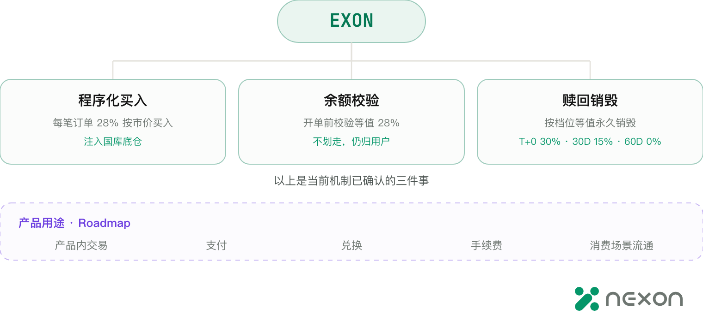

| EXON 当前做什么 | 怎么发生 |
| :-- | :-- |
| 程序化买入 | 每笔订单 28% 按市价买入，注入国库底仓 |
| 余额校验 | 开单前校验账户内等值 28% 的 EXON，不划走、不收费、不销毁 |
| 赎回销毁 | 收益赎回时按所选档位，等值 EXON 永久销毁 |

### 一笔本金进来，分成几份 

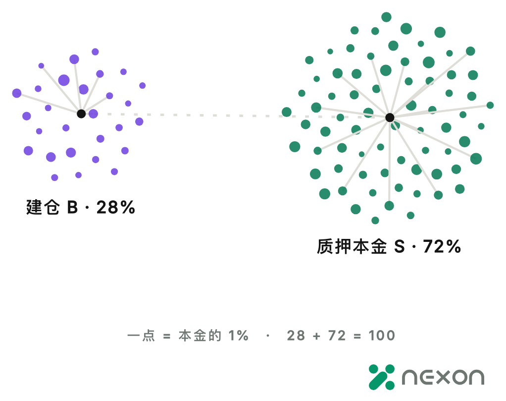

每一笔合格订单按固定系数拆开：72% 成为 XO 的质押 / PV 基数，28% 按市价买入 EXON 注入国库底仓。两份加起来正好是本金。


**最容易读错的一处。** 除了上面这两份，开单还要求你账户里另有等值28% 的 EXON——**这一笔只是被校验，不划走、不收费、不销毁，仍归你**。

它和进国库的那 28% 的 U 价值相同，但归属完全不同：一个买进了国库，一个留在你自己账上。把这两笔混为一谈，是读这套机制最常见的错。



**为什么这个结构成立**：XO 不进二级市场，所以它的价格不由短期情绪决定；EXON 承担全部高频场景，所以生态每一次真实使用，都会回到同一枚代币上。两者职责不重叠，也就不会互相消耗。

**一句话**：NEXON 是生态，XO 承载价值，EXON 驱动流通。


---

## 五、为什么是现在 

四条趋势各自独立发生，但都指向同一个方向。前三条说的是**需求已经在那里**，最后一条说的是**为什么到今天才做得成**。

### 软件第一次能读懂「你想要什么」 

这是最容易被跳过、但最关键的一条。

前面那条「一笔仓位换一间酒店房」的路，之所以这么多年没被真正解决，不是因为管道难修，而是因为**每一步之间的翻译只有人能做**：读懂请求的意思、判断哪些钱可以动、把一种价值语言换成另一种、出错时决定停还是改。

软件只会**搬运**价值的时候，这套安排还能忍——搬运本身就是难点，两头的翻译是一笔人人都在付、却没人给它起名的成本。**从软件能读懂一个请求的含义那一刻起，这笔成本就不再隐形。**

这不是「AI 让金融更聪明」那种说法。它更具体：一件原本必须由人来做、因而无法规模化的工作，第一次有了可以规模化的做法。断裂也就从一种生活常态，变成了一个有形状、可以被产品解决的问题。

### 钱已经在上链 

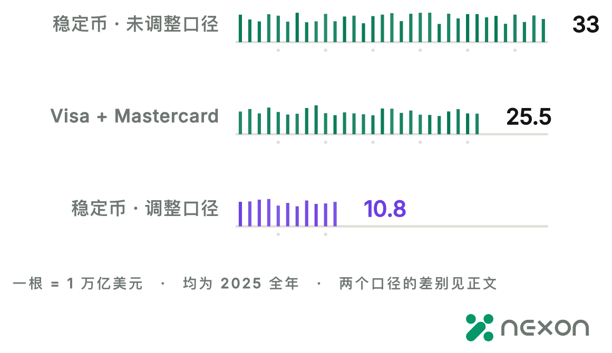

2025 年稳定币链上结算规模约 **33 万亿美元**，超过 Visa 与 Mastercard 合计的约 25.5 万亿美元。这个数字有争议：分析机构按「真实经济活动」过滤掉套利、做市与合约循环后，口径会降到约 **10.8 万亿美元**。


**两个口径都值得看。** 未调整口径说明链上通道的**承载能力**已经就位；调整口径说明**真实支付需求**也已是万亿美元量级。无论用哪个口径，结论都一样：钱正在上链，而承接它的应用层还很薄。


### 新的金融行为正在成形 

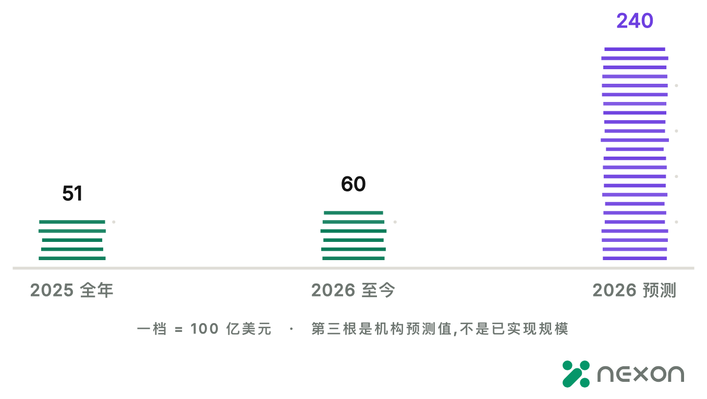

预测市场从一个小众品类变成了主流金融行为：两大平台 2025 年全年成交约 510 亿美元，2026 年至今已超过 600 亿美元，机构对 2026 全年的预测是约 2,400 亿美元。这说明用户要的不只是「买入并持有」，而是**能表达判断的产品**。

### 真实世界的资金流量级更大 

个人跨境汇款 2026 年约 8,790 亿美元；而 B2B 跨境支付到 2030 年预计约 56 万亿美元。这是数字资产尚未真正进入的领域，也是「从数字到现实」这句话真正的空间。

---

## 六、价值怎么闭环 

这套设计要成立，最后要回到一个问题：**这些行为，如何让生态本身变得更结实。**

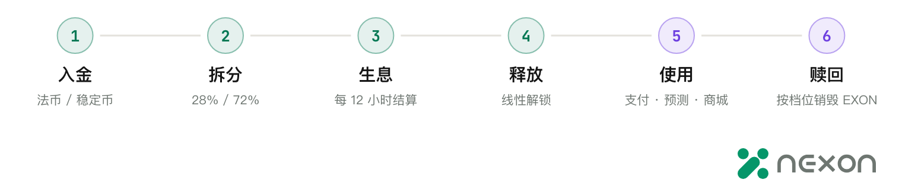

### 一笔 30,000 U 的订单，具体会发生什么 

用一笔 30,000 U 的订单走一遍——**下面每个数字都是协议参数下的算术，不是收益预期**：

| 步骤 | 发生了什么 |
| :-- | :-- |
| ① 入金 | 30,000 U |
| ② 拆分 | 21,600 U 成为 XO 质押基数，8,400 U 买入 EXON 注入国库底仓 |
| ③ 校验 | 账户里另需等值 8,400 U 的 EXON —— 只校验，仍归你 |
| ④ 计息 | 按 200% 基础年化 × 期限权重，每 12 小时结算一次 |
| ⑤ 赎回 | T+0 / 30 天 / 60 天三档，等值 EXON 分别销毁 30% / 15% / 0% |

同一个 21,600 U 的基数，选不同期限，期限总收益参数差得很远：

| 期限 | 每日 | 每 Epoch | 期限总计 |
| :-- | --: | --: | --: |
| 30 天 | 118.36 U | 59.18 U | 3,550.68 U |
| 90 天 | 130.19 U | 65.10 U | 11,717.26 U |
| 180 天 | 142.03 U | 71.01 U | 25,564.93 U |
| 360 天 | 159.78 U | 79.89 U | 57,521.10 U |
| 540 天 | 177.53 U | 88.77 U | 95,868.49 U |

**注意每日那一列**：从 118.36 到 177.53，只差 1.5 倍——那正是权重的差。期限总计之所以拉开这么多，主要来自时间，不是来自权重。

### 时间是收益的变量 

质押基数进入选定的期限，期限越长权重越重。基础年化参数 200% 乘以权重，每 12 小时结算一次：

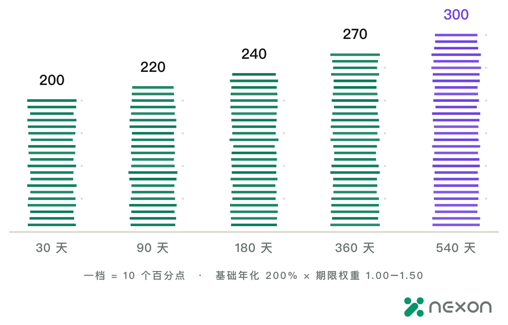

| 期限 | 权重 | 有效年化参数 | 流动性 |
| :-- | --: | --: | :-- |
| 30 天 | ×1.00 | 200% | 灵活；提前退出扣本金基数 10% – 15% |
| 90 天 | ×1.10 | 220% | 到期解锁 |
| 180 天 | ×1.20 | 240% | 到期解锁 |
| 360 天 | ×1.35 | 270% | 到期解锁 |
| 540 天 | ×1.50 | 300% | 到期解锁 |

续期路径是 30 → 90 → 180 → 360 → 540 天，逐级续下来累计锁定约 1,200 – 1,400 天。也可以到期赎回，再直接开一笔新的 540 天订单——**两条路的权重终点相同，中间的流动性完全不同**。

### 时间也是供给的变量 

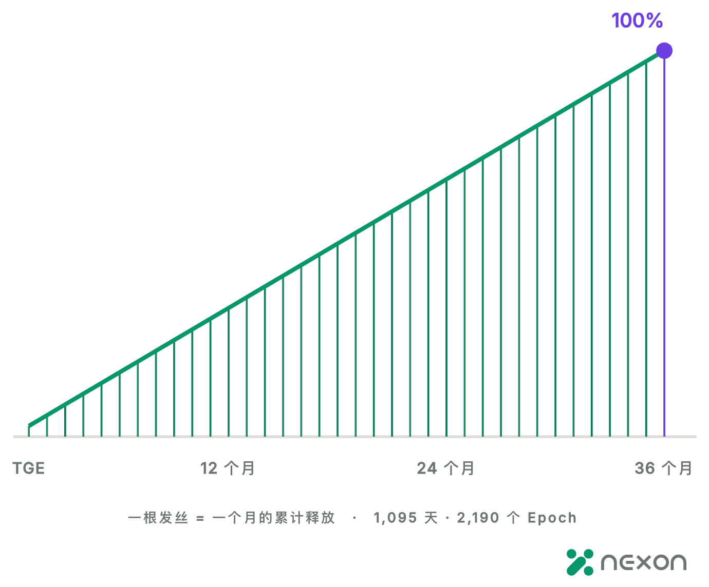

代币按 1,095 天线性释放，分 2,190 个12 小时 Epoch 完成。**这是一条直线，不是台阶**——没有悬崖式解锁，也没有加速段；任何时点的已释放比例，就是已过天数除以 1,095。

### 速度决定销毁 

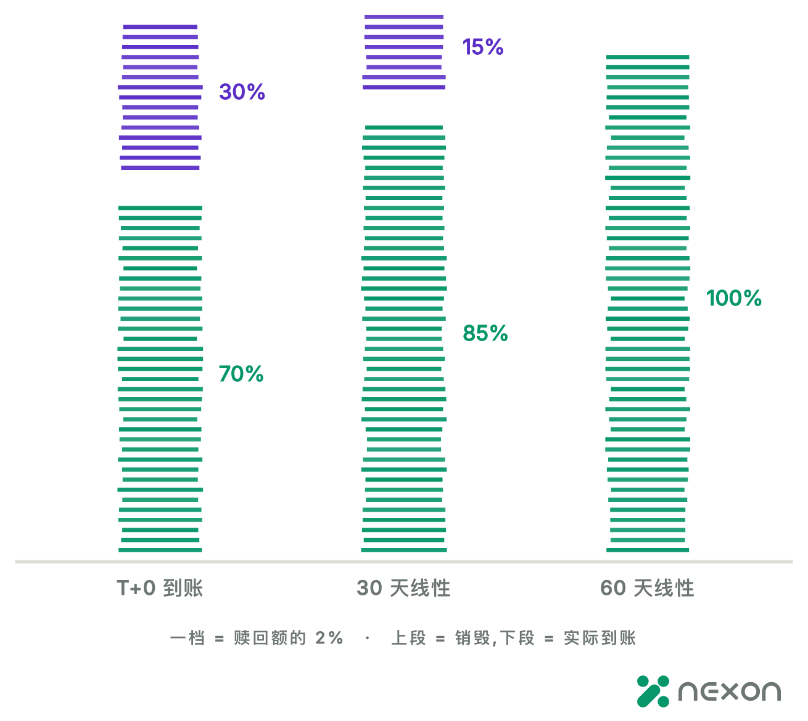

收益赎回有三档，三档之间唯一变化的变量是**你愿意等多久**：

| 档位 | 等值 EXON 销毁 | 净到账 |
| :-- | --: | --: |
| T+0 | 30% | 70% |
| 30D linear | 15% | 85% |
| 60D linear | 0% | 100% |

销毁是永久的，而且**只挂在赎回选择上**——它不代表一个持续的市场回购计划。

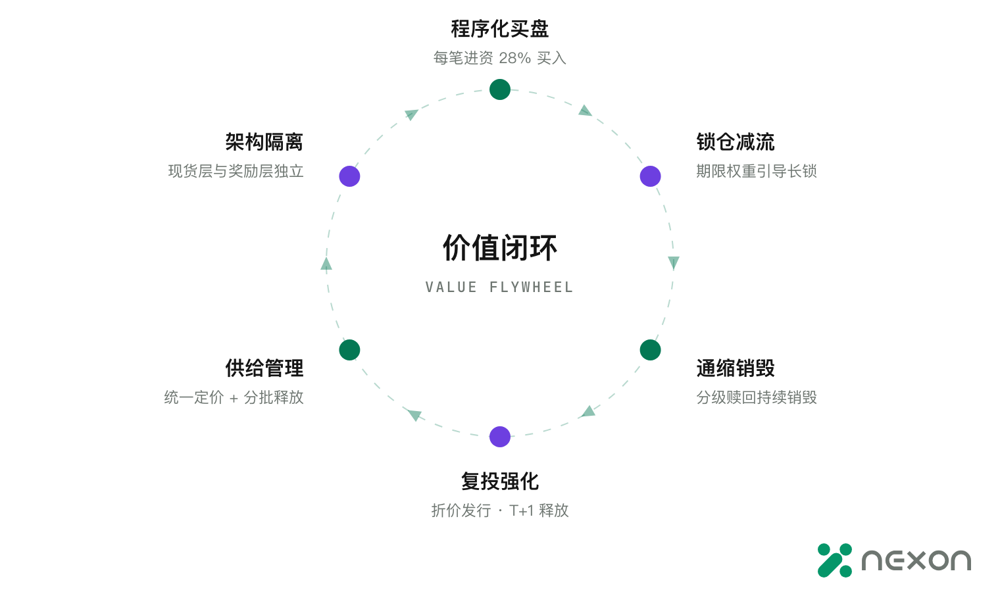

程序化买盘、锁仓减流、通缩销毁、复投强化、供给管理、架构隔离——六个环节互为因果。


完整的参数、公式与逐档演算见 NEXON 白皮书的经济模型部分。这里只讲这些机制**为什么这样设计**，不重复参数表。


---

## 七、底座：资质与登记 

一切最终要落在可核查的东西上。生态侧已取得或正在推进的资质与登记：

| 资质 / 登记 | 机构或主体 | 状态 |
| :-- | :-- | --: |
| 「星火·链网」官方授牌与国家级节点凭证 | 中国信息通信研究院（CAICT） | 已获得 |
| 商业登记（注册编号 97762） | 澳门融贯国际品牌交易所有限公司 | 已完成 |
| MSB 货币服务业务牌照 | 美国金融犯罪执法局（FinCEN） | 已获得 |
| 虚拟资产合规服务商资质对接 | 阿联酋迪拜虚拟资产监管局（VARA） | 推进中 |

NEXON 是基于 NEX 生态、由社区发起并推进的独立项目，不是 NEX 官方发行的产品，上表为生态体系侧的资质与登记。

---

## 八、已经确认的，和还没公布的 

一份可信的说明，要能说清自己站在哪条线上。

|  | 内容 |
| :-- | :-- |
| **已确认** | 双层架构与统一账户 · 7228 资金拆分 · 等值 28% 燃料校验 · 200% 基础年化与期限权重 · 12 小时结算 · 1,095 天线性释放 · T+0/30D/60D 三档赎回与等值销毁 |
| **产品规划** | AI 原生 PayFi、钱包、商城、Stablecoin Card、去中心化社交五个入口，以及 XO 的治理与更广泛权益、EXON 的支付/兑换/手续费/消费用途 |
| **尚未公布** | 代币总量 · 完整分配表与初始流通 · 后续轮规模与折扣 · 动态奖励等级表 · 最终日期 |

所有机制数字都是**协议参数**，收益演算是**条件化演算**——每一处结果都依赖它写明的价格假设，假设变了结果也会变。市场数据来自公开研究，各家口径与统计方法不同，差异已在正文标明、不做择优取用；尚未公布的部分以正式公告为准，不做推测。

---

**数据来源**

- 稳定币结算规模与口径差异：Chainalysis、Allium Labs（经 The Block、Visual Capitalist 等转述）
- 预测市场成交规模与预测：Bernstein、TRM Labs、Dealroom、Pew Research Center
- 跨境支付与汇款流量：Juniper Research、Fortune Business Insights、xFlow 等公开研究

参数如经修订，以最新公告为准。
