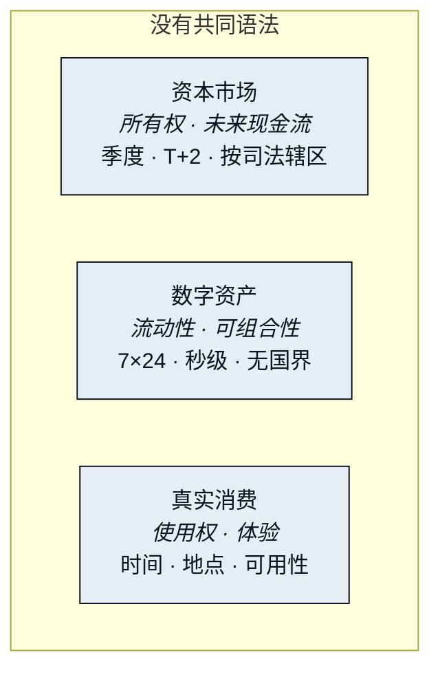

# 三种价值语言

上一节提出了一个判断：三个市场缺的是语言，不是管道。这一节把三种语言并排摆开，再跟着一个再普通不过的请求走完全部三个市场——按它今天不得不走的那条路。

## 三个市场，三套语法 

| 市场 | 它的价值语言 | 节拍 | 边界 |
|---|---|---|---|
| 资本市场（股票） | 所有权与未来现金流 | 以季度为节拍，T+2 结算，交易时段有限 | 以司法辖区为边界 |
| 数字资产 | 流动性与可组合性 | 7×24，秒级最终性 | 无国界，但与现实资产几乎没有可执行接口 |
| 真实消费（旅游 / 酒店 / 零售） | 使用权与体验 | 以「某个时间、某个地点、能用」为单位 | 以供应商与库存为边界 |

三种语言的结算周期、计价单位、边界定义、可组合性全部不同。它们不是缺连接——它们缺的是共同语言。



这里的价值是一份权利：对一份所有权的权利，以及对这份所有权预期能产生的现金的权利。这份权利是真实的、持久的，也是慢的。价格每秒都在更新，但仓位要延迟才能结算，市场夜里和周末关门，而权利本身只在承认它的那个司法辖区内才可执行。这套语法里没有一个词能表达「今晚能用」。



这里的价值是流动性：一个仓位能多快、多便宜地变成另一个仓位，又能多自由地与其他仓位组合。这套语法快而无国界，同时也是封闭的。它所有的动词都只作用于别的数字资产。它能用一千种方式说「换」和「转」，却几乎没有办法说「订」「送到」或「持有一份所有权」。



这里的价值是使用某样东西的权利：你到达那晚的一间房，八点的一张桌，门口的一个包裹。它以时间、地点和可用性来计量，住在供应商的库存系统里——那是唯一能确认它的地方。这套语法里没有「仓位」或「代币」这样的词。它只认已经换成它所接受的那种钱的钱，以及一个已经证明了自己是谁的人。



把三个标签页再读一遍，你会发现它们说的根本不是同一样东西。一份权利、一种兑换率、一项使用权，不是同一个对象的三个价格。它们是三个对象，而其中任何一个，另外两套语法连名字都叫不出来。

## 一笔仓位，一间酒店房 

你在证券账户里持有一笔仓位，想把其中一部分收益变成十月的东京酒店。今天你要走完这条路：卖出（T+2 结算）→ 出金到银行（1–3 个工作日，跨境更久）→ 换汇（点差 + 手续费）→ 上 OTA 订房（第四次身份验证）。



### 卖出 
T+2 结算。仓位变成了现金——一笔你还碰不到的现金。



### 出金到银行 
1–3 个工作日，跨境更久。第二个系统，第二次身份验证。



### 换汇 
点差 + 手续费。第三个系统，第三套凭证。



### 上 OTA 订房 
第四次身份验证。到这里，价值才终于变成了一间房。



四个系统、四种凭证、四次身份验证、五到七个工作日。中间任何一环出问题，都要人工介入重来。

卖出。等结算。汇出去。换成外币。然后到旅游网站上从头再来一遍。这里没有一步在技术上是难的。只不过在每一步，都有一个人在做翻译。

而这条路上真正被消耗的东西，不是手续费，是你自己——每一步都是你在手动把一种价值语言翻译成另一种。这不是技术问题，是翻译问题。

> 把一笔仓位变成一间酒店房，至今仍要经过四个系统、四次身份验证和一个星期。每一步都是一个人在手动把一种语言翻译成另一种。软件只会搬运价值的时候，这还可以忍受。从软件能读懂价值的那一刻起，就不再可以了。

下一节看的是这条路上已经存在的那些解法，并对每一种问同一个问题：这场翻译里，它究竟做了哪一部分。


**本节口径。** 本节承诺：三个市场对「价值」的定义、节拍与边界各不相同；今天把一笔仓位变成一间房，要付出四个系统、四次身份验证和约一个星期的人工翻译。本节不承诺：任何弥合这道缝隙的机制；本节只陈述问题。待定项：无（[待定参数汇总](../open-parameters/README.md) 自第三部分起）。


*主轴：[译者](../02-the-translator/README.md) · 下一节：[为什么桥没有解决问题](why-bridges-failed.md)*
