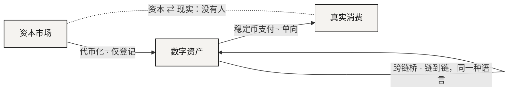

# 为什么桥没有解决问题

> 它们都是管道。而管道，不理解流过它的东西。

沿着上一节那条路，已经长出了三类解法。每一类都在攻问题的某个真实部分。这里不评判任何一家具体的项目，因为重点不在于它们中的哪一个做得不好。重点是，它们每一个都漏掉了什么。

| 已有解法 | 它解决了什么 | 它没解决什么 |
|---|---|---|
| 跨链桥 | 同一种语言在不同方言之间的搬运（链 A 的 USDC → 链 B 的 USDC） | 它从不处理「股权 → 使用权」这类跨语言问题。而且桥是加密史上被攻击最惨的一类基建 |
| 稳定币支付 | 最后一公里——把链上价值变成能花的钱 | 只覆盖三个市场里的一个方向（数字 → 消费），而且是单向的。它不管钱从哪来，也不回头 |
| RWA / 资产代币化 | 把现实资产搬上链的登记问题 | 代币化一只股票，不等于你能用它订酒店。它把资产搬上来了，没把语言翻过来 |



桥把一项资产从一条链搬到另一条链。有用，也是连接所能有的最窄的形态：到达的东西就是出发的东西，只不过换成了同一种语言的另一种方言。所有权在过桥的路上不会变成使用权，因为路上没有任何东西知道这两个词是什么意思。桥还是价值短暂地不属于任何一本账的唯一地方——这就是为什么在这个领域里，桥比任何一类基建都挨过更多攻击。



稳定币支付解决的是最后一公里：链上价值变成商家肯收的钱。三者之中，只有它真正碰到了真实消费，而且它只走一个方向——从数字资产向外。它不问价值从哪里来，够不回资本市场里的一笔仓位，也不会回头。三个市场之间有三条边，它覆盖的是其中一条边的一半。



把一项现实资产代币化，解决的是一个登记问题：原本活在一个系统里的权利，现在在另一个系统里有了一个表示。资产被搬上链了；它的语言没有被翻译。一只代币化的股票，仍然是对所有权和未来现金流的一份权利，仍然受发行它的那个司法辖区管辖——一个新地址，不是一套新语法。代币化一只股票，不等于你能用它订酒店。



## 边在哪里 

把三者摆到地图上，规律很难看不见。桥沿着一个市场跑，而不是在市场之间跑。稳定币支付覆盖一条边的一个方向。代币化把一份资本市场的权利登记进数字资产，然后就停了。上一节那个请求真正需要的那条边——从资本市场到真实消费，再回来——没有人在服务。

## 共同的缺陷 

三者有一个共同的缺陷，而且不是执行层面的缺陷：它们都是管道。而管道只负责搬运，不负责理解。进去的是什么，出来的就是什么；任何在途中必须改变种类的东西——一份权利变成现金，现金变成一间房——都得在管道之外，由一个人在两头分别去做。那才是真正的活。管道两端的语义转换，到今天仍然由人来做。

为什么加更多管道治不了管道的病

管道的契约是保真：到达的必须等于送出的。翻译的契约正好相反：到达的必须是另一样东西，但含义相同。无论多少个保真的步骤叠在一起，都拼不出一个保义的步骤——所以加管道只会让路线变多，却加不出那个改变「一样东西是什么」的步骤。它还会增加接头，而每一个接头，都是一个人必须重新补上含义的地方，也是攻击者可以站的地方。

这就是第一部分要抵达的诊断。三个市场由搬运者连着，却没有任何会读的东西连着。无论什么东西最终弥合这道断裂，它都得自己去读——读全部三种语言，并且以三者中最快的那一种的速度。下一部分讲的，就是什么东西能做到。

**桥搬运价值，Agent 理解价值。**

*主轴：[译者](../02-the-translator/README.md) · 下一节：[译者](../02-the-translator/README.md)*
