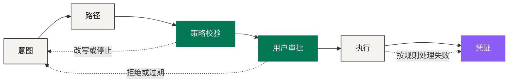

# 价值翻译器

> 连接真正起作用的标志很简单：用户能说清结果，能看懂路径，并且始终握着执行的开关。

第一部分的结论是：三个市场缺的是语言，不是管道。资本市场说所有权，数字金融说余额与可编程结算，消费市场说库存、交付与使用权。NEXON 的主张不是把三者压成一种资产，而是把它们之间的**转换**本身做成产品——显式、可复核、可以一步步交给软件。

这就是「价值翻译器」。用户从一个结果出发——留住某笔储备、安排一次金融动作、订一趟行程。系统把它整理成候选路径，每一段都写清楚：用哪笔资产、谁负责执行、要满足什么条件、需要什么权限、做完之后拿到什么凭证。

## 六段控制路径 

同一个请求，今天要走四个系统、一个星期；在这套结构里，它走六段：



### 意图 · Intent

记下目标、金额、截止时间、硬约束和审批方式。到这里为止，没有任何资产被动过，也没有任何权限被授出。



### 路径 · Route

在合格的产品、场所和供应商里排出候选步骤，标出成本、报价有效期和依赖关系。**这一步仍然不动资产。**



### 策略校验 · Policy Check

身份与辖区、余额、限额、流动性、产品规则、用户自己设的限制——逐条过。这一层是确定性的，模型的自信度不能替代它。



### 用户审批 · User Approval

把各段的成本、报价、有效期、权限、责任执行方和不可逆步骤摆出来，由用户批准一条**有边界**的指令。



### 执行 · Execution

只把已批准的指令发给真正负责结算、托管、兑换或交付的系统。翻译器不会因此变成交易所、托管人或商户。



### 凭证 · Receipt

记录完成了什么、失败了什么、还挂着什么，以及各自的责任方——并且把「钱结算了」和「东西交付了」分成两件事记。



这个顺序防的是三种最常见的混淆：

* **好路径 ≠ 有权限。** 系统算出一条最优路，不等于它被允许走。
* **有权限 ≠ 已结算。** 指令发出去了，不等于对面已经成交。
* **已结算 ≠ 已交付。** 钱到了商户账上，东西不一定交付了。

用户可以批准一笔 EXON 现货操作，而完全没有批准那一笔消费；数字支付可能成功，商户仍未履约。把这三件事分开记，是这套结构最实际的一处收益。

## 连接不等于抹平边界 

翻译器协调责任，不吸收责任。

| 领域 | 翻译层能做的 | 仍然归原系统的 |
|---|---|---|
| 资本市场 | 说清仓位、可用资金与后续用途之间隔着哪几步 | 交易时段、结算周期、券商控制与证券规则 |
| 数字金融 | 比较路径、准备交易、把链上或场所证据摆出来 | 流动性、最终性、预言机与资产价格 |
| 真实消费 | 把已批准的预算与合格库存匹配上 | 库存本身、商户身份、履约 |
| NEXON 经济机制 | 解释 7228、资格校验、收益与赎回选择 | 定稿公式本身 |

交易所负责交易所那一段，Staking Platform 执行已发布的质押与赎回规则，钱包按自己的设计管理或委托密钥，发卡机构、商户和旅行供应商各自对自己受监管的那一环负责。路径要做的是**把这些边界摆到明面上**，不是把它们藏进一个对话框后面。

## 当前机制在这套结构里的位置 

已经在跑的经济基础很具体：一套统一账户连着 NEX Main Exchange / CEX 与 Staking Platform。前者管 EXON 现货、IEO 和释放呈现，后者管 XO 本金、期限加权收益与赎回。这是**当前机制**；「XO 价值锚、EXON 流通引擎」是覆盖在它上面的长期定位。

两者之间的关系是架构性的，不是权限性的：Agent 理解意图不需要用户先有质押仓位；持有 XO 不会给 Agent 任何执行权限；EXON 目前也不是通用的路径手续费。应用层帮用户理解和导航，经济层按自己发布的参数继续运行。

为什么不干脆做成一个全能 App

因为责任无法被界面吸收。一个 App 可以把四个系统的界面合成一个，但它合并不了四份法律义务。当供应商没有履约时，能解决问题的仍然是供应商；当链上转账不可逆时，没有任何界面能把它撤回。

统一体验和统一责任是两件事。把它们混为一谈的产品，会在第一次失败时把用户扔进一个没人负责的空档里。所以 NEXON 描述的是「连接网络」而不是「全能 App」——**体验可以统一，责任必须留在原处并且写清楚是谁。**

*上一节：[为什么桥没有解决问题](../01-the-split/why-bridges-failed.md) · 下一节：[表达意图，而非操作产品](intent-over-operation.md)*
