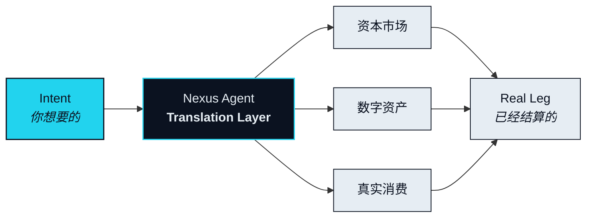

# 译者

> 桥搬运价值，Agent 理解价值。

第一部分停在一个诊断上：资本市场、数字资产与真实消费之间，缺的不是管道，而是任何能读懂管道里流过什么的东西。桥可以把一枚代币从一条链搬到另一条链，却不能把所有权变成使用权，不能把一笔仓位变成一张订单。迄今为止的每一种方案都在搬运价值，而把价值的含义留给人手工处理。

那份手工处理，才是真正的活。这一章讲的是谁来干。

## 为什么人做不了这件事 

> 在三个市场之间做实时翻译，需要同时做到五件事：读懂意图、找出路径、在四个系统上执行、以毫秒为单位盯住每一段、任何一段出错都要干净地退回来。

拆开看，每一件都不稀奇。交易员会选路，支付系统会结算分段，风控台会盯滑点。没有人做的，是在一次请求里、在一个报价失效之前，同时把五件事做完。一段落了、下一段还没落的那一刻，人已经来不及保护整体了。结果就是第一部分描述的那样：一周的手工翻译、四次身份验证，以及任何一步需要人介入就会散架的路径。

没有人能做好这件事。Agent 可以。

这不是在说智力，是在说形状。这项任务是并行的、连续的、对延迟毫不宽容的，而 Agent 恰好就是为这种形状造的。它能把整条路径攥在视野里，同时盯住每一段，在价格变动之前动手。瓶颈从来不是管道，是译者。

## NEXON 是什么 

NEXON 的连接不是靠桥，是靠 Agent。

NEXON 是一个 **Translation Layer（翻译层）**：一个位于链、交易场所与供应商之上的应用层协议，赋予 Agent 代表你在三个市场里同时行动的资格。它不发链，不取代资产已经存在的地方。它读懂你的意思，在三个市场之间找出一条路径，再把这条路径的每一段结算在它本该结算的地方——数字资产在持有它的那条链上，资本市场的仓位经由持牌场所，一间酒店房间在供应商自己的系统里。

最后这一点值得当成设计原则单独说：NEXON 是链无关的。一条 Route（路径）是一串分段，每一段都在其资产原生的地方结算。协议自己的合约——记录什么已被押住、什么正在托管的那几份——部署在 BNB Smart Chain（BSC）上，但翻译这件事本身不依赖这个选择。Agent 的工作是把含义在市场之间搬过去，不是把所有资产搬到同一个账本上。

干这份活的 Agent 叫 **Nexus Agent（连接体）**。它不是挂在钱包上的助手，也不是带着消费限额的脚本。它是让连接得以存在的那个部件。

## 从意图到结算的五步 

NEXON 上的每一个 Intent（意图）都经过同样的五步。它们的名字是固定的，全书通用。

1. **Parse（解析）**—— 把一句话变成结构化的 Intent。
2. **Route（选路）**—— 在三个市场里找出一条路径。
3. **Bond Check（额度校验）**—— 确认 Agent 有执行它的资格。
4. **Execute（执行）**—— 逐段运行，整条路径始终在视野之内。
5. **Land the Real Leg（落地）**—— 在现实世界里收尾：一张确认单、一笔卡额度、一件送到手上的东西。

接下来的两节先用一个完整实例把这五步走一遍，再划清这套设计与那些共享词汇却不共享工作的「AI + 支付」产品之间的界线。

<table data-view="cards"><thead><tr><th></th><th></th><th data-hidden data-card-target data-type="content-ref"></th></tr></thead><tbody><tr><td><strong>表达意图，而非操作产品</strong></td><td>一句话、五步、一个现实世界的结果——从头到尾跟完。</td><td><a href="intent-over-operation.md">intent-over-operation.md</a></td></tr><tr><td><strong>这不是「AI + 支付」</strong></td><td>关在笼子里的 Agent 仍然只是一只手。界线在哪里，为什么重要。</td><td><a href="not-ai-plus-payments.md">not-ai-plus-payments.md</a></td></tr></tbody></table>


**这一章怎么用。** 本文后面的每一节——架构、产品、经济——都是在展开上面五步中的某一步。当某一节看起来引入了新东西时，它几乎总是在回答同一个问题：这一步服务于哪一步，它需要什么才能做好自己那一份？


先讲连接。让这个网络运转起来的两种资产——押住什么 Agent 才能行动，行动时花掉什么——是第五部分的内容。理解这个命题不需要它们，而其余一切都立在这个命题上。


**本节口径。** 本节承诺：NEXON 是应用层的翻译层，其连接由 Agent 而非桥来完成，分为五个固定命名的步骤。本节不承诺：任何具体的交易场所、供应商或执行伙伴。待定项：[OP-15](../open-parameters/README.md)。


*下一节：[表达意图，而非操作产品](intent-over-operation.md)*

*把你想要的，变成已经结算的。*
