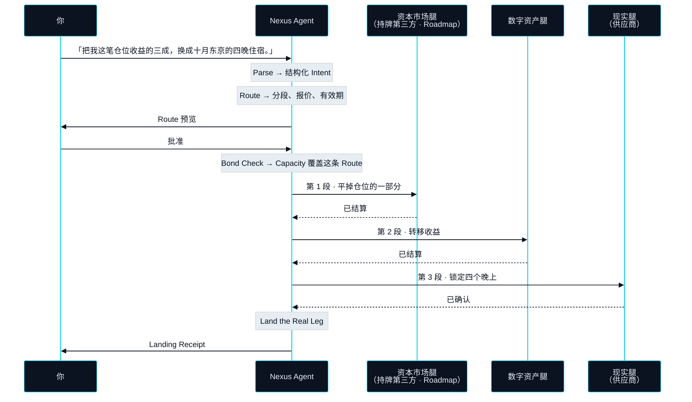

# 表达意图，而非操作产品

> 所以在 NEXON 上，你不再操作产品。你说出意图。

第一部分跟着一个请求走过了四个系统和一个星期。这一节让同一个请求在 NEXON 上再走一遍，逐步走，好让上一节引入的五个名字在全书继续展开之前先变得具体。

这个请求刻意选得很平常。它没有任何不寻常之处，它难，只是因为牵涉三个市场。

> 「把我这笔仓位收益的三成，换成十月东京的四晚住宿。」

今天说出这句话，它是一张待办清单。在 NEXON 上，它是一个 **Intent（意图）**——一个单一的输入，Nexus Agent 从它被说出的那一刻起，直到最后一段落地为止，全程对它负责。


**演示的是什么，上线的是什么。** 下面的推演展示的是一条完整 Route 的目标行为。数字资产腿与现实腿为 `In development`；资本市场腿是 `Roadmap` 能力，将由持牌第三方执行——NEXON 在任何环节都不经纪证券。旅行兑换同为 `Roadmap`。本节任何内容都不应被读作已上线。


## 五步 



## Parse（解析）

Agent 把这句话变成一个结构化的 Intent。「这笔仓位收益的三成」变成一个有来源的数量，「十月东京的四晚住宿」变成一个有地点、有时长、有时间窗的现实世界结果。句子有歧义时——哪笔仓位、哪几晚——Agent 追问一次，而不是猜。解析结束时，得到的是一个可以拿来要求 Agent 兑现的 Intent。



## Route（选路）

Agent 在三个市场之间规划一条路径：平掉仓位的哪一部分、经由哪家持牌场所，收益走哪条流动性、按什么汇率，以及哪家供应商能在那几天留出四个晚上。一条 Route 是一串分段，每段都带报价与有效期。在任何东西动之前，它会完整地展示给你看。



## Bond Check（额度校验）

一条 Route 能执行之前，网络先确认 Agent 有资格运行它。这个资格来自你押住的东西：记在 Bond 账本里的 XO 决定了一个 **Capacity（执行额度）**，也就是你的 Agent 能替你执行的上限。超出这个上限的 Route 不是在最后被拒绝——它根本无法被提出。这是第一、第二部分里唯一点到一种资产名字的地方，第五部分会解释为什么是它。



## Execute（执行）

Agent 逐段运行，整条 Route 始终在视野之内。每一段都以网络的结算单位计价与结算，每一段都对照它的报价与有效期被盯着。任何一段失败或报价失效，执行即停，已经做完的部分沿原路退回——这就是 **Rollback（回滚）**。你不会在路径中途被叫去介入。你在它开始之前就已经被问过了。



## Land the Real Leg（落地）

最后一段是碰到账本之外那个世界的那一段：一张确认的订单、一笔卡额度、一件送到的商品。它以一份 **Landing Receipt（落地凭证）** 收尾——一份可验证的记录，证明你说出的那个结果确实发生了。这份凭证不存在，Intent 就没有结算，不管前面几段怎么说。



## 什么变了，什么没变 


{% column width="50%" %}
**今天**

- 四个系统：券商、银行、换汇柜台、旅游网站。
- 四次身份验证，每个系统一次。
- 四次手工翻译，每一次都由你来做。
- 一个人把整个流程装在脑子里，任何一步出错都没法退回。



**在 NEXON 上**

- 一个 Intent，一个 Agent，一条在任何东西动之前完整展示的 Route。
- 一次批准，由你给出，在执行之前。
- 没有手工翻译——Agent 把含义从一段带到下一段。
- 在第一段运行之前就已定义好的 Rollback 路径。



值得说清楚的是什么没变，因为这套设计里大部分的诚实都在这里。交易场所是同样的。仓位仍然经由持牌场所变现，收益仍然经过真实的流动性，房间仍然由供应商在它自己的系统里锁定。NEXON 没有取代其中任何一个，也不打算取代。它取代的是那个从来就不是系统的环节——站在系统与系统之间做翻译的那个人。

这也是为什么上面的对照没有给 NEXON 这边一个时长。路径只能和它最慢的那一段一样快，而有些分段受制于 NEXON 并不控制的市场与供应商。这套设计去掉的不是时钟。它去掉的是四次交接、四次重新认证，以及四个让流程停下来等一个人想清楚下一步该怎么办的机会。

Agent 不替你冒险，它替你翻译。


**本节口径。** 本节承诺：一个 Intent 按五个固定命名的步骤处理——Parse、Route、Bond Check、Execute、Land the Real Leg——完整的 Route 在执行前可见、可批准，并有定义好的 Rollback 路径。本节不承诺：任何执行时长、任何具体交易场所或供应商，以及资本市场腿在其 `Roadmap` 状态确认之前可用。待定项：[OP-15 · OP-24](../open-parameters/README.md)。


*主轴：[译者](README.md) · 下一节：[这不是「AI + 支付」](not-ai-plus-payments.md)*
