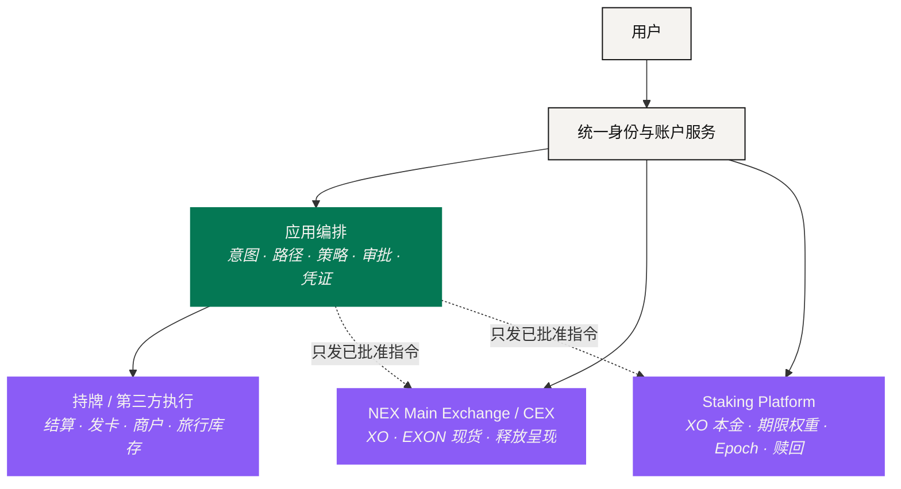

# 协议架构

> 体验统一，不需要由一个系统拥有全部资产、全部决定和全部义务。

NEXON 被设计成一层**协调层**，架在价值本来就待着的那些链、场所、账户体系和供应商之上。它追求一个连贯的体验，同时保留每一段执行的原生控制。这对价值连接命题是必要的：一条路径之所以可信，是因为责任看得见，而不是因为界面把它藏起来了。

## 五个责任域 

| 责任域 | 主要负责 | 边界在哪 |
|---|---|---|
| 统一身份与账户服务 | 会话、账户视图、资格引用、权限与用户策略 | 视图统一，不代表托管和法律义务被合并 |
| NEX 交易所 / 现货层 | XO 自由交易、EXON 现货（只卖不买）与逐日释放呈现 | 不发放本文所述的质押奖励 |
| Staking Platform | XO 质押本金、订单校验、期限权重、Epoch 收益与赎回 | 它的规则不会变成 PayFi 或商城的通用规则 |
| 应用编排 | 意图捕获、路径构造、策略校验、审批与凭证 | 它提议和协调，不会因此获得托管权或执行权 |
| 持牌或第三方执行 | 受监管结算、发卡、商户供货、旅行库存等外部环节 | 各自按自己的条款与辖区担责 |

一套账户让这五个域更好导航，但它们不会因此变成同一张资产负债表。用户应该随时能看出：这笔资产**现在在哪个域**、**归哪条规则管**、**出问题找谁**。

## 五个子系统 

应用层是按**责任**切的，不是按屏幕切的。

| 子系统 | 负责 | 留下什么证据 |
|---|---|---|
| [意图层](intent-layer.md) | 把一个目标和一组约束变成结构化、带版本的请求 | 意图记录 |
| [Agent 运行时](agent-runtime.md) | 提路径、跑策略、要审批、协调有边界的执行 | 路径与授权日志 |
| [结算与托管](settlement-and-custody.md) | 对账原生执行，而不假装所有资产共用一个托管人 | 场所、链或供应商凭证 |
| [质押与奖励层](trust-and-bonding.md) | 应用已定稿的 XO / EXON 订单、Epoch 与赎回规则 | 订单与收益账本 |
| [数据与预言机](data-and-oracles.md) | 提供价格、资格信号、库存与失败阈值 | 带时间戳的来源记录 |

它们和六段控制路径一一对上：**意图 → 路径 → 策略校验 → 用户审批 → 执行 → 凭证**。意图层拥有第一个结构化对象；运行时拥有路径构造、校验与授权；原生执行方拥有结算或交付；对账拥有凭证。

## 当前的经济边界 

经济架构比产品 Roadmap 更窄，也更确定。NEX 交易所承载 XO 与 EXON 现货、以及 EXON 逐日释放呈现；Staking Platform 承载 XO 质押、期限加成、推广奖励、领导奖金与收益提取。两边可以共享身份、账户可见性和资金操作，但账本、权限与披露各自独立。

一笔 Staking Platform 订单开单即分两份：28% 按当时 1 U 等值买入 EXON 存入燃料钱包（只能销毁），其余兑换 XO 进入质押、每 12 小时结算。**这是这个产品自己的规则**——不是通用架构模式，也不是未来应用的费率模型。

## 一条跨越边界的路径 

一条未来的路径可以碰到好几个域，而不需要把责任交给 Agent：



### 在社交里发现

社交产品提供语境。它不能替用户花钱、下单或审批。



### 在钱包里查状态

钱包暴露余额、受保护的储备、当前仓位与已授出的权限。



### 在 PayFi 里成路

PayFi 组织提议和审批：分段、成本、执行方、不可逆步骤。



### 由场所与供应商执行

场所结算兑换。供应商确认交付。这两件事分别记账。



如果供应商在付款之后没有履约，这条路径**不会**被整体标成成功。如果场所已结算而交付还挂着，凭证同时显示两个状态。如果某条策略校验中途失效，后面的分段停下。架构的功夫，就在于让用户体验到一条连贯的流程时，这些区分一个都没有丢。

## 六条不让步的控制 

<table><thead><tr><th width="180">控制</th><th>含义</th></tr></thead><tbody><tr><td><strong>最小权限</strong></td><td>每次审批只覆盖写明的资产、目的地、金额、动作和时间</td></tr><tr><td><strong>权限不来自持币</strong></td><td>持有 XO 或 EXON 本身不授权任何 Agent，也不扩大账户访问</td></tr><tr><td><strong>规则带版本</strong></td><td>每一次经济计算与策略判定都引用它当时所用的规则版本</td></tr><tr><td><strong>托管可分离</strong></td><td>编排界面必须为每一段指明真实的托管人或执行方</td></tr><tr><td><strong>失败是一等状态</strong></td><td>部分完成、待交付、争议中、已冲正，都是可以显示的状态</td></tr><tr><td><strong>状态不许美化</strong></td><td>提交不等于成功；对不上的状态保持「未知」，直到真的对上</td></tr></tbody></table>

结果不是一个庞大的单体协议，而是**若干独立系统之间一次受控的连接**，围绕一套共同的路径模型和证据模型组织起来。

*上一节：[这不是「AI + 支付」](../02-the-translator/not-ai-plus-payments.md) · 下一节：[意图层](intent-layer.md)*
