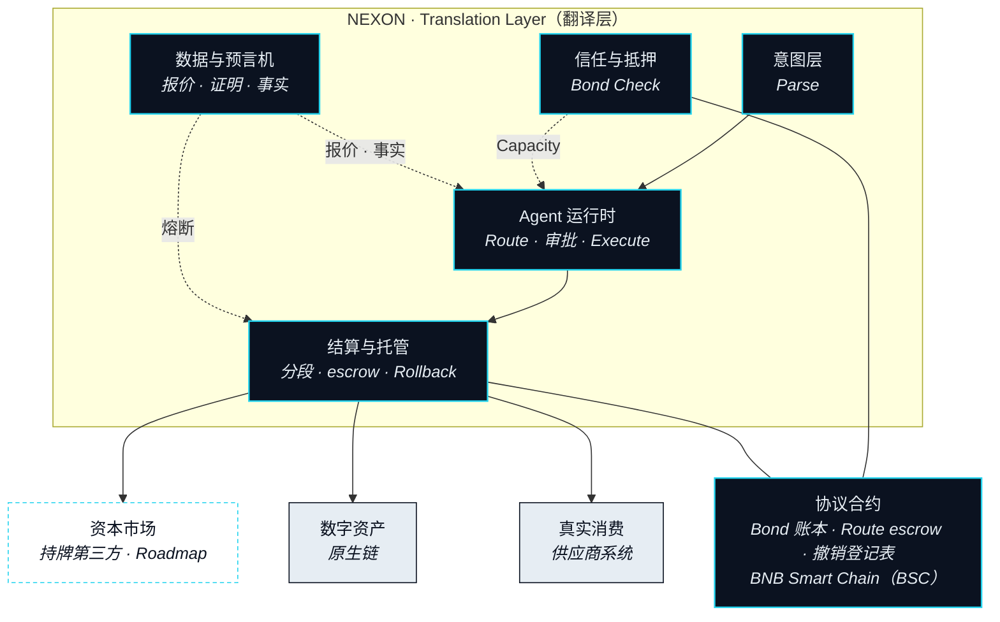

# 协议架构

> 在三个市场之间做实时翻译，需要同时做到五件事：读懂意图、找出路径、在四个系统上执行、以毫秒为单位盯住每一段、任何一段出错都要干净地退回来。

第二部分论证了一件事：三个市场之间的连接由 Agent 完成，而不是由桥完成。这一部分要讲的是这个 Agent 站在什么上面。这里的一切都是提议中的设计：每项能力都带状态徽章，没有任何东西被写成已经上线，仍在决定中的每个参数都列在[待定参数汇总](../open-parameters/README.md)里，而不是在这里猜一个数。

## 应用层协议 

NEXON 不是一条链。它是一个应用层协议，位于价值已经存在的那些链、交易场所与供应商之上，并且从构造上就是链无关的。一条 Route（路径）是一串分段，每一段都结算在其资产原生的地方：数字资产在持有它的那条链上，资本市场的仓位在持牌第三方的账簿上，一间酒店房间在供应商自己的系统里。协议在这些地方之间做翻译。它不要求其中任何一方搬家。

协议也有自己的记录。一本账本记录哪些 XO 已被押住、由此换来多少 Capacity（执行额度）。一个 escrow 托管着一条尚未收尾的 Route 将要花在各段上的 EXON。一份登记表记录哪些委托已被撤销。这些合约部署在 BNB Smart Chain（BSC）上。这个选择只决定协议自己的账写在哪里，别的什么都不决定：没有任何一段被要求在那里结算，翻译本身也不依赖它。


**从设计上就链无关。** 「NEXON 在哪条链上？」这个问题有两个答案。协议自己的记录在一条链上——BNB Smart Chain（BSC）。一条 Route 搬动的价值，在它原本所在的任何地方。这一部分里没有任何内容要求你先把资产桥到某一本账上，Agent 才能替你行动。


## 五个子系统 

整个架构组织为五个子系统，按一个 Intent（意图）走过的顺序排列：从你说出的话，到已经结算的结果。每个子系统各有一节。

<table data-view="cards"><thead><tr><th></th><th></th><th data-hidden data-card-target data-type="content-ref"></th></tr></thead><tbody><tr><td><strong>意图层</strong></td><td>一句话变成一个 Intent：捕获、三步 Parse、只追问一次、一套固定的 schema。</td><td><a href="intent-layer.md">intent-layer.md</a></td></tr><tr><td><strong>Agent 运行时</strong></td><td>Nexus Agent（连接体）在哪里运行，以及框住它能做什么的三道环。</td><td><a href="agent-runtime.md">agent-runtime.md</a></td></tr><tr><td><strong>结算与托管</strong></td><td>每一段都结算在资产所在处。谁持有什么，Rollback 如何退回。</td><td><a href="settlement-and-custody.md">settlement-and-custody.md</a></td></tr><tr><td><strong>信任与抵押</strong></td><td>Agent 凭什么可以行动：Bond（押注）换来 Capacity、Depth（沉淀）与一个 Seat（席位）。</td><td><a href="trust-and-bonding.md">trust-and-bonding.md</a></td></tr><tr><td><strong>数据与预言机</strong></td><td>Agent 行动前读什么，读数出错时一条 Route 怎么办。</td><td><a href="data-and-oracles.md">data-and-oracles.md</a></td></tr></tbody></table>

| 子系统 | 服务于 | 状态 |
|---|---|---|
| 意图层 | Parse（解析） | `In development` |
| Agent 运行时 | Route（选路）· 审批 · Execute（执行） | `In development` |
| 结算与托管 | Execute · Land the Real Leg（落地）· Rollback | `In development` · 资本市场腿 `Roadmap` |
| 信任与抵押 | Bond Check（额度校验） | `In development` |
| 数据与预言机 | 每一个需要报价、证明或事实的步骤 | `In development` · Foresight 信号 `Roadmap` |

## 一条 Route，从头到尾 

要看清五个子系统，最容易的办法是跟着一条 Route 走一遍。

**Agent 解析它、规划路径、对照你押住的额度、逐段执行，并把最后一段落进现实——一张确认单、一笔卡额度、一件送到手上的东西。**

一切从一句话开始：在 Circle（圈层）里说出来，或在钱包里敲出来。**意图层**解析它：抽出目标，句子有歧义就追问一次，再把结果连同约束写进一个结构化的 Intent。此时什么都还没动。

**Agent 运行时**接过这个已就绪（Ready）的 Intent，提出一条 Route：哪几段、按什么顺序、经由哪些 Leg Executor（腿执行方）——即执行某一段的交易场所、持牌方或供应商——以什么报价、何时过期。在提出任何东西之前，它先做 Bond Check，为此要去读**信任与抵押**：你押住的 XO 换来的 Capacity 就是上限，超出上限的 Route 根本不会被组出来。你看到这条 Route，批准或拒绝。批准会放下一个 Capacity Reservation（额度冻结），并授予运行时第一段的限定委托——只针对这一段，不针对整条 Route，也永远不是一把密钥。

那份提议里的每一个报价、各段将要依赖的每一个事实，都来自**数据与预言机**：价格来自不止一个来源，身份是对一份持牌证明的引用，库存与确认来自供应商系统。这个子系统在 Route 运行时也一直盯着，读数过期或两个来源打架时，让 Route 暂停的就是它。

**结算与托管**逐段执行，一次一段，每一段都落在其资产原生的账本或系统上。这条 Route 将要花掉的 EXON 在 escrow 里等着，每落地一段就付一段。最后一段是 Real Leg（现实腿），以一份 Landing Receipt（落地凭证）收尾——证明预订、卡额度或交付确实发生了。若任何一段失败，同一个子系统执行 Rollback（回滚），把一切沿原路退回。

## 器官与神经 

第四部分描述产品——Intent 诞生的 Circle、你按下批准的应用、会思考的钱包、价值落地的 Storefront（落地端）——每一个都是器官：你与协议相遇的地方。这一部分是在它们之间穿行的神经系统。一个产品可以重画而不改动任何子系统；一个子系统却不能拿掉，否则产品就会少一步。读接下来的五节时，请把上面那条 Route 放在心里。每一节都只回答关于它的一个问题：这一步需要什么，才能做好自己那一份？


**本节口径。** 本节承诺：NEXON 是应用层、链无关的协议，组织为五个子系统，自身记录在 BNB Smart Chain（BSC）上，每一段都结算在其资产原生的地方。本节不承诺：任何交易场所、供应商或执行伙伴，也不承诺任何能力已经上线。待定项：[OP-15](../open-parameters/README.md)。


*主轴：[译者](../02-the-translator/README.md) · 下一节：[意图层](intent-layer.md)*

*把你想要的，变成已经结算的。*
