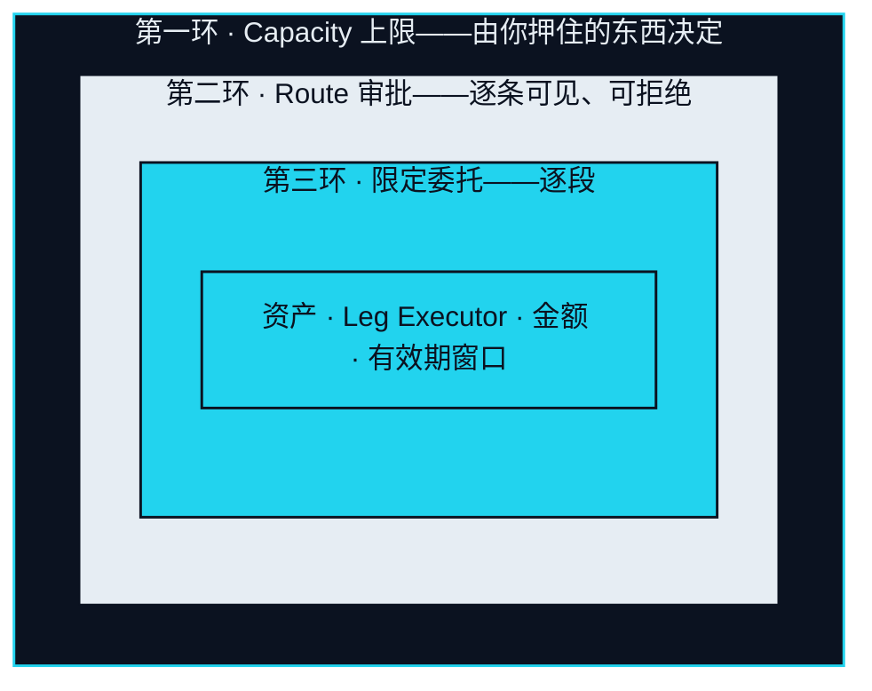
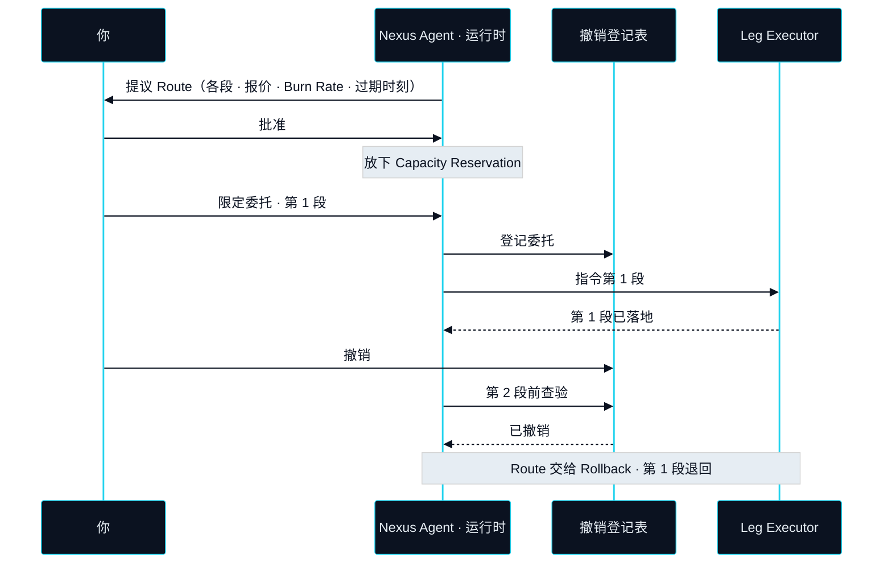

# Agent 运行时

> Agent 解析它、规划路径、对照你押住的额度、逐段执行，并把最后一段落进现实——一张确认单、一笔卡额度、一件送到手上的东西。

Agent 运行时是 Nexus Agent（连接体）干这些活时住的地方。这个子系统把一个已就绪的 Intent（意图）变成一条 Route（路径），把 Route 展示给你，并在你批准之后，驱动每一段穿过结算与托管。**跨三个市场选路——一条路径，横跨资本市场、数字资产与真实消费。** 这就是运行时的岗位说明，下面的每一个机制之所以存在，都是为了让它在从不持有自己所搬动之物的前提下，做好这份工作。

## Agent 在哪里运行 

### 链下运行时，绑定你的账户 

**状态** · `In development`

运行时在链下。它绑定一个账户——你的——读取这个账户的 Bond（押注）、Capacity（执行额度）、Intent 与历史；它不能替任何别人行动。它不持有资产，也不持有密钥。它持有的是权限：一份有边界、有时限的许可，允许它代表你指令特定的分段，按 Route 逐条授予，并记录在可以撤销的地方。链下是一个刻意的选择。选路需要报价、对话与判断，而且要以对话的速度进行，这些都不属于账本。属于账本的，是运行时被允许做什么、以及它做了什么的记录。


**Agent 从不持有你的密钥。** 你的资产始终在你自己的托管之下。运行时为一条已批准 Route 的每一段收到一份限定委托——一项资产、一个 Leg Executor（腿执行方）、一个金额、一个有效期窗口——除此之外没有更宽的。没有授予的委托不能使用，已经撤销的委托不能再次使用。


## 权限三环 

运行时里的权限是嵌套的。每一环都在前一环之内，外环不允许的事，内环一样做不了。

### 第一环 · Capacity 上限 

**状态** · `In development`

最外面这一环根本不是运行时定的，而是由你押住的东西定的。**① Agent 的执行上限由你 Bond 的 XO 决定（Capacity），超出额度的路径它根本发不起来。** 运行时在 Bond Check（额度校验）时从信任与抵押读取 Capacity，拒绝组出任何总额超过它的 Route。运行时里没有覆盖开关。想抬高上限，就得押更多，而那发生在另一个子系统里。

### 第二环 · Route 审批 

**状态** · `In development`

在上限之内，每一条 Route 在你表态之前都只是一份提议。**② 每一条 Route 在执行前是可见的、可拒绝的——你是审批者，不是旁观者。** 提议展示每一段、它的 Leg Executor、它的报价、这条 Route 将以 Burn Rate（消耗）形式消耗的 EXON，以及报价过期的时刻。拒绝不花任何东西。批准同时做两件事：授权这条 Route，并放下一个 Capacity Reservation（额度冻结）。

### 第三环 · 限定委托 

**状态** · `In development`

在一条已批准的 Route 之内，每一段拿到自己的委托，多一点都没有：哪项资产、哪个 Leg Executor、最多多少、有效到什么时候。数字资产腿的委托不能用在 Real Leg（现实腿）上；过期的不能迟用；金额小的不能撑大。运行时一次只向你的钱包申请一段的委托，所以任何时刻在外面的，至多只有正在飞的那一段。

## 两种审批模式 

### 逐条审批 Route 

**状态** · `In development`

默认模式，也是 v1 设计里唯一的模式。每一条 Route 在提议时单独审批，所有分段全部可见。你还没回答、报价就已过期的 Route，会被重新提议，而不是按旧报价执行。

### 预授权范围 

**状态** · `Roadmap`

之后的一种模式允许你预先设定一个 Pre-approved envelope（预授权范围）——一类有边界的 Intent、其中任何一条 Route 可消耗的上限、一个时间窗口——落在范围之内的 Route 无需重新审批即可执行。这个范围永远不会超出第一环，其上限是待定参数（`Open`，OP-18）。在它上线之前，每一条 Route 都由你亲手批准。



**状态** · `In development`

* 你看到：每一段、它的报价、它的 Leg Executor、Burn Rate 估算、过期时刻。
* 你要做：批准或拒绝，一次一条 Route。
* Agent 可以：恰好执行你批准的那几段，按你看到的顺序。
* Agent 不可以：批准后改动任何一段、重复使用一份委托、在截止时刻之后开始一段。



**状态** · `Roadmap`

* 你设定：一类 Intent、每条 Route 的上限、一个窗口。上限为 `Open`（OP-18）。
* 你要做：每条 Route 都不用管，除非某条 Route 落在范围之外。
* Agent 可以：执行落在范围内的 Route，逐段委托与默认模式相同。
* Agent 不可以：超出范围、超出你的 Capacity，或自行放宽范围。



## 冻结、执行、撤销 

### Capacity Reservation 

**状态** · `In development`

你批准一条 Route 时，运行时会把这条 Route 需要的 Capacity 冻住，冻多久取决于这条 Route 开着多久。被冻结的 Capacity 不能被第二条 Route 使用，也不能通过解押释放；它在 Route 到达 Landed（已落地）或 Unwound（已退回）时归还。正是这一点，防止两条已批准的 Route 悄悄加起来超过你的上限。

### 撤销 

**状态** · `In development`

运行时持有的每一份委托都登记在一份链上撤销登记表里，撤销即时生效。运行时在指令每一段之前都会查这份登记表，Leg Executor 也可以查。在 Route 中途撤销，会叫停下一段，并把这条 Route 交给 Rollback（回滚）。它不会把任何东西晾在半路：已经落地的分段，由同一套本来就用来退回失败分段的机制退回。

### Route 日志 

**状态** · `In development`

上面的一切都留下痕迹——提议、批准、每一份委托、每一段的指令与结果、每一份 Landing Receipt（落地凭证）的引用、每一次撤销。日志写下来的目的，是让一条 Route 可以在事后被逐步回放，由你，或由必须解决争议的任何人。一条 Route 做过什么，从来不是靠回忆。


**本节口径。** 本节承诺：一个绑定单一账户的链下运行时，持有权限但从不持有资产或密钥，权限嵌套为三道环，带冻结、即时撤销与可回放的日志。本节不承诺：预授权范围的上限、Capacity 函数，或哪些 Leg Executor 会被准入。待定项：[OP-07 · OP-15 · OP-18](../open-parameters/README.md)。


*主轴：[译者](../02-the-translator/README.md) · 下一节：[结算与托管](settlement-and-custody.md)*
