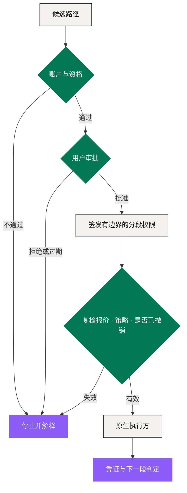

# Agent 运行时

Agent 运行时是结构化意图与原生执行方之间的**协调引擎**。它可以理解、比较、模拟和准备；只有在一份有效且有边界的授权之内，它才能执行。它不是托管人、交易所、合规权威、发卡机构、商户，也不是收益来源。

这个定义是**故意收窄**的。一个很强的模型可以给出很有用的路径，同时在价格、产品规则、目的地或者「用户到底什么意思」上出错。所以运行时必须把模型输出当成一份**提议**——一份确定性控制有权驳回的提议。

## 一条路径长什么样 

路径是一串有向的分段。每一段都要自己声明清楚：

* 输入是什么，预期输出是什么；
* 谁执行，落到哪里；
* 报价来自哪、金额多少、成本多少、什么时候过期；
* 需要过哪些资格与策略校验；
* 这一段是可逆、可退款，还是不可逆；
* 它依赖前面哪一段；
* 成功之后应该拿到什么凭证；
* 失败之后按什么动作处理。

运行时按**用户的约束**比较路径，不按平台自己没说出口的目标。更便宜但用了禁止场所的路径不合格；更快但击穿储备下限的路径不合格。如果没有一条路径能满足意图，那么「没有合格路径」就是一个有效且必要的答案。

## 三层嵌套的权限 

**第一层 · 账户与资格。** 先确认这个用户、这个账户、这个辖区可以访问每一个产品。AI 的解释推翻不了一次没通过的校验。资格引用应该来自负责的提供方，且不暴露超出执行方所需的身份数据。

**第二层 · 路径审批。** 预览把完整的经济与操作后果摆出来：分段、最大金额、预估成本、时间、执行方、权限、不可逆步骤、失败行为。用户批准的是**这一版**路径。金额、目的地、来源资产或执行方发生实质变化，这次审批立即作废。

**第三层 · 分段权限。** 每个执行方只拿到它需要的那条窄指令。支付段读不到也动不了无关资产；供应商段无权下市价单。权限用完即失效，或到写明的时间失效。每执行一个依赖段之前，运行时都要复检是否被撤销、上游假设是否还成立。

## 概率的外面，包一层确定性 

运行时不应该让同一个组件既提议动作、又负责监管自己的动作。

| 谁 | 干什么 |
|---|---|
| 模型 | 解析语言，在合格选项里排序 |
| 确定性服务 | 强制执行硬金额、白名单、储备下限、有效期、nonce 与签名规则 |
| 原生合约与场所 API | 强制执行产品机制本身 |
| 独立遥测 | 记录实际结果 |

放到一笔已批准的 Staking Platform 订单上：运行时**校验**已发布的字段，而不是自己发挥。它核对 72% 的 XO 质押 / PV 基数、28% 买入 EXON 注入 Treasury Liquidity，以及等值 `F = 0.28 × P` 的 EXON 余额。燃料留在用户账户里。余额校验没过，订单停下——它不会顺手授权卖掉另一种资产去补。

## 撤销与恢复 

撤销的粒度必须和授权一样细。用户可以取消一条还没开始的路径，撤回后面还没用掉的分段权限，或者关掉一条长期规则。

撤销**不能**倒回一段已经结算的不可逆动作。界面要把「权限被收回」和「后果被逆转」讲成两件事。

执行失败时，运行时按已披露的规则动作：

| 情形 | 运行时行为 |
|---|---|
| 报价或库存过期 | 停下，重新成路，重新要审批 |
| 策略或资格变了 | 停掉受影响的分段，保留原因码 |
| 执行方不可用 | 只在披露的次数内重试；否则过期或升级处理 |
| 凭证没回来 | 标为未知 / 待定——**不从「已提交」推断「已成功」** |
| 前段已结算、后段失败 | 保住部分状态，进入该产品的退款、对冲或争议路径 |
| 模型提出不支持的动作 | 在授权之前就拒掉 |

## 审计与解释 

每个事件都要能说清：责任主体、输入状态、规则与模型版本、策略结果、审批对象、原生交易或供应商引用，以及最终状态。

给用户看的解释不需要暴露模型的内部推理，但必须用操作语言讲明白：这条路径为什么合格、什么变了、哪条规则挡住了它、下一步的开关在谁手上。

审计链同时把**建议**和**执行**分开。社交内容、市场预测、模型推荐都是输入；授权对象和原生凭证才证明系统被允许做什么、以及它实际做了什么。

## 六条运行时不变量 

1. 持有 XO 或 EXON 永远替代不了账户权限。
2. 审批之后，运行时不能扩大金额、目的地、资产范围或期限。
3. 前置凭证缺失或无效时，后续分段不得执行。
4. 模型改不了 Tokenomics 定稿的任何一个经济参数。
5. 只提交了指令，永远不足以把一条路径标成完成。
6. 未知状态一直可见，直到真的对上账——不会为了界面好看而转成成功。

*上一节：[意图层](intent-layer.md) · 下一节：[结算与托管](settlement-and-custody.md)*
