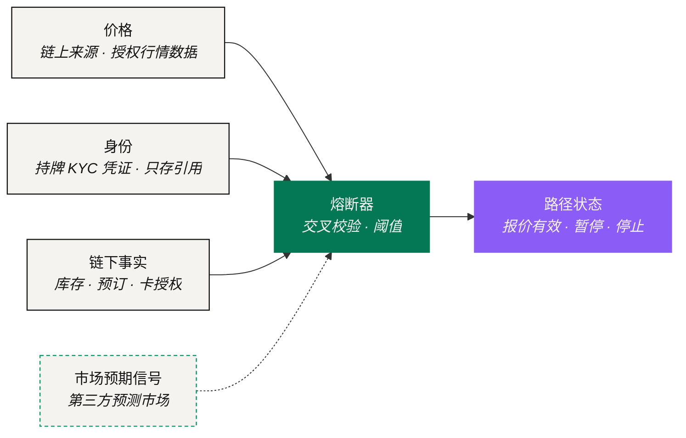

# 数据与预言机

> 一条路径在飞行途中要被一直盯着。这件事人做不好，Agent 做得好。

盯住每一段的执行状态，是翻译里人最做不动的一部分，也是最依赖「Agent 能看见什么」的一部分。这个子系统就是 Agent 的眼睛：提路径之前读什么、执行途中读什么、以及判断一条路径不能再信时依据什么。

协议本身不生产这些数据。它决定**去哪里读**、**怎么互相印证**，以及**读错了路径该怎么办**。

## 四类输入 



每一段要动资产的路径都需要价格，而且**没有任何一段由单一来源定价**。数字资产段读链上来源；任何触及资本市场的段读授权行情数据。

一个报价只有在多个独立来源落在同一条容差带内时才被接受，并且从被取到的那一刻起就开始计时过期。具体读哪些提供方、容差带多宽、有效期多长，属于[待定参数](../open-parameters/README.md)（OP-D01）。



有些执行方不会为一个未经验证的对象动作。验证由持牌 KYC / AML 提供方完成，他们签发一份凭证；**协议只存这份凭证的引用，不存它下面的任何东西。**

没有证件、没有个人档案、没有对话内容留在 NEXON 这一侧。需要知道的执行方去校验那个引用。接受哪些提供方属于待定参数（OP-D02）。



现实段依赖的事实活在供应商的系统里：那间房还在不在、那件货有没有库存、预订确认了没有、卡授权过了没有。

这些事实通过负责那一段的执行方读取。其中最后一条——确认——就是这一段的履约凭证。



钱包可以接入第三方去中心化预测市场，让 Agent 参考「市场怎么看」，用来判断**现在做还是再等等**。

NEXON 只提供基础设施和入口，不运营市场，也不在其中持仓。作为输入，它是一个判断信号，**永远不是一道闸**：它可以让一条路径延后，但它自己不能启动或停止任何一段。范围属于待定参数（OP-P03）。



## 六段路径分别读什么 

| 阶段 | 读什么 |
|---|---|
| 意图 | 什么都不读。这一步解析的是「你想要什么」，不是「它值多少」 |
| 路径 | 读价格（给每段报价）、身份（判断哪些执行方可以动作）、链下事实（确认现实段能不能落地）；可选读市场预期信号，用于择时 |
| 策略校验 | 复用路径阶段取到的读数，并核对它们仍在容差带和有效期内 |
| 用户审批 | 不引入新的外部读数。审批的对象必须和展示给用户的读数完全一致 |
| 执行 | 每发出一段指令前重读价格，确认报价仍然有效；委托被撤销时重读身份 |
| 凭证 | 读供应商的确认并写进凭证；争议窗口内被质疑时再读一次 |

## 数据出问题的时候 

一个预言机值多少钱，看的是它在坏天气里干什么。每一类输入都有五种坏法，每一种坏法对应一个**事先定好**的动作。这些动作是一个阶梯，路径一次只上一级。

| 失效模式 | 它长什么样 | 应对 |
|---|---|---|
| **过期** | 某个来源在它的窗口内没有更新 | 报价失效；不基于它提出任何路径 |
| **背离** | 独立来源之间的分歧超出容差带 | 路径暂停；重新取价；重新请用户审批 |
| **不可达** | 一个必需来源读不到 | 路径暂停；超过截止时间仍读不到，走已披露的失败路径 |
| **伪造** | 某个来源没通过真实性校验 | 丢弃该来源；路径暂停；若已有分段依赖过它则停止 |
| **争议** | 某个事实在分段落地之后被质疑 | 打开负责方的争议流程，保住部分状态 |

### 熔断器 

熔断器就是读上面那张表并执行它的组件。它的响应顺序是保守的：**报价失效 → 路径暂停 → 超时后走披露的失败路径 → 事实争议转交负责方。**

它是一个过滤器，不是决策者。它从不提议一段路径、不修改一段路径、也不放宽任何一条容差带。阈值与提供方属于待定参数（OP-D01、OP-A01）。

*上一节：[质押与奖励层](trust-and-bonding.md) · 下一节：[NEXON 产品生态](../04-product-stack/README.md)*
