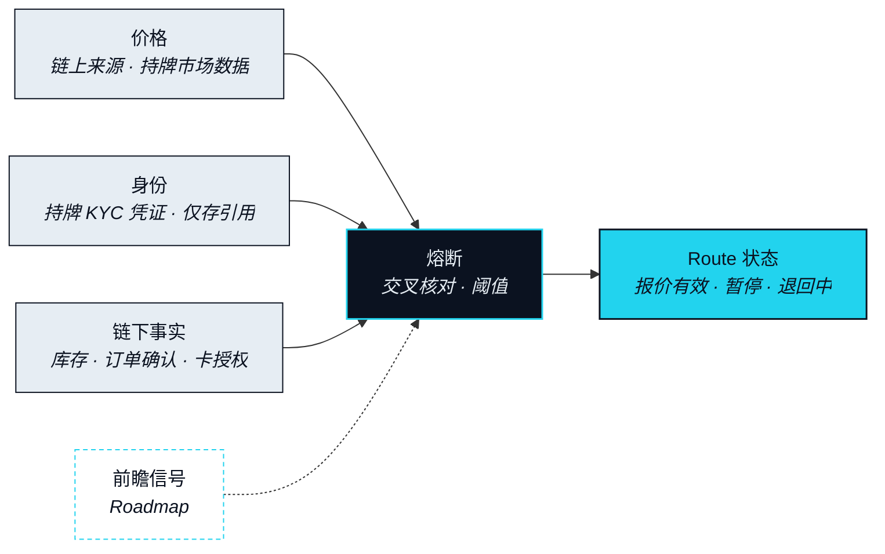

# 数据与预言机

> 没有人能做好这件事。Agent 可以。

在每一段进行期间盯住它，是翻译这件事里人做不到的那部分，也是完全取决于 Agent 能看见什么的那部分。这个子系统是 Agent 的眼睛：它在提出一条 Route 之前、执行一条 Route 期间、以及判定一条 Route 不再可信时所读取的那些来源。协议自己不生产其中任何数据。它选择在哪里读、拿一个来源去核对另一个，并把「读到的东西出错时该怎么办」固定下来。

## 四类输入 

### 价格 

**状态** · `In development`

每一段涉及资产转移的分段都需要价格，而没有任何一段的价格只来自单一来源。数字资产腿读取链上来源；资本市场腿所需触碰的一切读取持牌市场数据，而那一段为 `Roadmap`。当各自独立的来源在一个带宽内彼此一致时，一个报价才被接受，而它从被取得的那一刻起就带着有效期。读取哪些数据提供方为 `Open`（OP-16）。

### 身份 

**状态** · `In development`

有些 Leg Executor（腿执行方）不会为一个未经验证的对象行动。验证由持牌的 KYC 与反洗钱服务方完成，他们签发一份凭证；协议只存储对这份凭证的引用，不存储它下面的任何东西。没有任何文件、任何个人记录、任何 Circle（圈层）内容由 NEXON 持有。需要知道的 Leg Executor 去核对那个引用。接受哪些服务方为 `Open`（OP-22）。

### 链下事实 

**状态** · `In development`

一条现实腿依赖那些活在供应商系统里的事实：房间有空、商品有货、订单已确认、卡授权已通过。这些通过该段的 Leg Executor 读取，而其中最后一项——确认——会成为 Landing Receipt（落地凭证）。卡授权是协议在稳定币卡存在之后才会读取的一类事实，那一项为 `Roadmap`。

### 前瞻信号 

**状态** · `Roadmap`

**Foresight（前瞻）** 是钱包里那个关于前瞻性看法的去中心化市场：一份关于市场如何预期的读数，Agent 可以参考它来决定现在执行还是等一等。NEXON 只提供它的基础设施与入口；不运营这个市场，也不在其中持有任何头寸。作为一种输入，Foresight 是判断信号，永远不是闸门。它可以让一条 Route 延后；它本身不能启动或停止任何一段。其范围为 `Open`（OP-26）。



不读取任何外部数据。Parse 解决的是你的意思，不是它的代价。



读取价格，为每一段报价；读取身份，以知道哪些 Leg Executor 可以行动；读取链下事实，以确认现实腿究竟能不能落地。在前瞻信号存在之后，读取它来决定时机。



在每一段被指令之前重读价格，核对报价仍在其带宽与有效期之内。若某个委托已被撤销，则重读身份。



读取供应商的确认并把它写进 Landing Receipt。若该事实在争议窗口内被质疑，则再读一次。



## 当数据是错的 

一个预言机的价值，取决于它在糟糕的那天做了什么。每一类输入都可能以五种方式失效，而每一种失效都有一个事先固定的响应。这些响应构成一道阶梯，一条 Route 一级一级地往上走。

| 失效模式 | 它看起来是什么样 | 响应 | 状态 |
|---|---|---|---|
| 过期 | 某个来源在其窗口内没有更新 | 报价失效；不会有 Route 基于它被提出 | `In development` |
| 偏离 | 各自独立的来源分歧超出带宽 | Route 暂停；重新取价；由你再次批准 | `In development` |
| 不可达 | 某个必需来源无法访问 | Route 暂停；若该来源在截止时间之前仍不可达，则 Rollback | `In development` |
| 伪造 | 某个来源未通过真实性校验 | 丢弃该来源；Route 暂停；若已有分段依赖过它，则 Rollback | `In development` |
| 争议 | 某个事实在一段落地之后被质疑 | 开启争议窗口；未解决则该 Route 进入「部分退回」，由 Risk Council（风险委员会）处理 | `In development` |

### 熔断 

**状态** · `In development`

熔断是读取上面这张表并据以行动的那个部件。它的各级是固定的：未通过校验的报价失效；失去某个读数的 Route 暂停；在截止时间之前无法重新获得读数的 Route 退回；规则无法裁定的争议交给风险委员会。熔断是一个过滤器，不是决策者。它从不提出任何一段、从不修改任何一段、也从不放宽任何带宽；它只负责让事情停下来。触发它的阈值为 `Design Target`（OP-17），它所读取的数据提供方集合为 `Open`（OP-16）。


**本节口径。** 本节承诺：四类输入，没有任何一段的价格来自单一来源，身份只以对持牌凭证的引用形式保存，以及一条从报价失效到风险委员会的固定升级路径。本节不承诺：任何数据提供方、任何阈值，或 Foresight 作为输入的范围。待定项：[OP-16 · OP-17 · OP-22 · OP-26](../open-parameters/README.md)。


*主轴：[译者](../02-the-translator/README.md) · 下一节：[NEXON 产品栈](../04-product-stack/README.md)*
