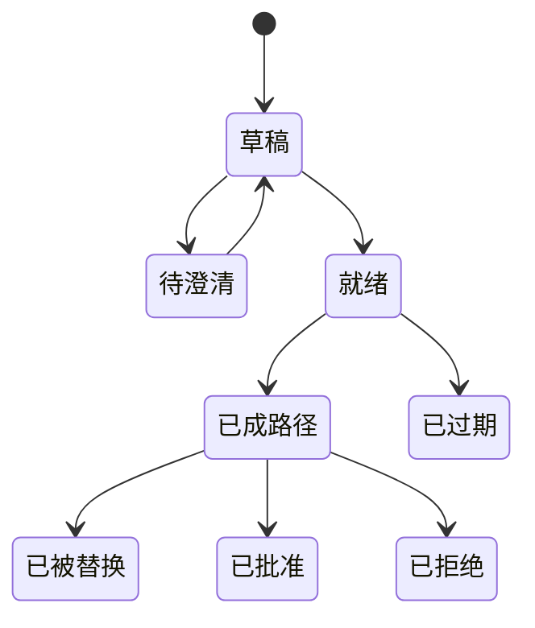

# 意图层

意图层把人话变成一个软件能评估的**持久请求**。它是应用架构里的第一个组件，也是「对话很方便」开始变成「控制问题」的那个点。

意图不是交易。它不含隐藏权限，也不移动任何资产。它说的是：想要什么结果、在什么约束下、持续多久、按什么方式审批。系统可以提示缺了哪些字段，但不能从语气、社交语境或一次无关的历史动作里**推断**出一项实质权限。

## 意图对象 <a href="#the-intent-object" id="the-intent-object"></a>

一个最小可用的意图，至少要有这些字段：

| 字段 | 它防的是什么 | 形态举例 |
|---|---|---|
| 所有者与账户范围 | 谁的策略和余额可以被纳入考虑 | 一个用户 + 指名的子账户 |
| 目标结果 | 「完成」到底指什么 | 一次兑换、一个仓位动作、一笔已履约的采购 |
| 金额与单位 | 规模含糊 | 精确金额或硬上限 |
| 允许来源 | 动用范围失控 | 显式白名单 |
| 禁止来源 | 储备被吃掉 | 显式黑名单与最低余额 |
| 时间 | 用过期假设继续跑 | 截止时间 + 路径有效期 |
| 价格与成本上限 | 经济偏离超出预期 | 滑点、总费用、汇率上限 |
| 场所与供应商限制 | 落到不该落的对手方 | 合格供应商与辖区 |
| 审批方式 | 权限被默认放大 | 逐段 / 整条路径 / 窄口径长期规则 |
| 失败策略 | 系统自作主张 | 未经审批不得替换 |

每个字段都带来源。有些直接来自当前这句话，有些来自用户自己维护的策略档案。**从策略继承来的值必须显示为「继承」**，不能装成是用户刚刚说的。用户可以独立查看和修改那份策略。

## 解析是一次受控的转换 <a href="#parsing-is-a-controlled-transformation" id="parsing-is-a-controlled-transformation"></a>

自然语言灵活——正因为灵活，解析必须保守。「用平时那个账户」对用户是有意义的，作为可执行约束却不安全。

解析器应该返回三类结果，而不是一个：



**已解析**

字段明确、可直接用于路径构造。



**未解析**

缺失或歧义，必须补齐。



**待确认的假设**

系统提出的推断，需要用户点头。



只有**完全解析**的意图才能进入路径阶段。

这次转换要足够可复现，才能被审计：一条记录把原始请求、结构化结果、解析器或模型版本以及任何一次澄清连起来。敏感的对话上下文不应该被复制进公开或链上记录——路径需要的是那几条已批准的约束，不是产生它们的整段对话。

社交语境适用同一条规则。社区里的一场讨论可以启发一个请求，或者为一个问题提供背景。它不会给别的成员任何权限，也不会把一个社区观点变成一条投资指令。

## 产品各自的扩展字段 <a href="#product-specific-extensions" id="product-specific-extensions"></a>

基础 schema 只能通过**显式的产品字段**扩展：商城意图需要交付、库存、取消与履约条件；卡片动作需要发卡机构与商户限制；预测市场入口需要第三方市场、结算来源与辖区资格；质押订单需要参数版本和机制定义的经济字段。

一笔质押订单要记下的变量：

```text
P = 合格订单本金
B = 0.28 × P   买入 EXON 注入 Treasury Liquidity
S = 0.72 × P   XO 质押 / PV 基数
F = 0.28 × P   等值 EXON 余额校验；仍归用户
```

订单同时记录期限、权重、12 小时 Epoch 排程，以及选定的赎回方式。**这些变量属于 Staking Platform。** 意图层不能把 EXON 挪去当别的路径的执行成本单位，也不能把这次燃料校验重新解释成一次支付。

## 状态机 <a href="#state-machine" id="state-machine"></a>

意图的状态机要小、要显式：



这里的「已批准」指的是**那条路径**被批准了，不代表每一段都已完成——执行与履约状态在下游。意图在成路之后如果发生实质变化，原路径转为已被替换或已过期，必须重新评估一条新路径。

## 隐私与留存 <a href="#privacy-and-retention" id="privacy-and-retention"></a>

系统应该尽量少留。一个人的目标可能暴露行程、财务、关系和位置。持久记录需要足以解释一次审批、足以处理一次争议的证据，但不需要每一条消息和每一个私人细节。留存期限、导出、删除以及与执行方共享哪些数据，都要在上线之前写清楚。

## 六条不变量 <a href="#six-invariants" id="six-invariants"></a>

1. 没解析清楚的实质字段，不能变成隐含权限。
2. 用户能分辨哪条约束来自这次请求、哪条来自保存的策略。
3. 产品特有的经济字段，跟着它自己的产品类型和参数版本走。
4. 成路之后再改意图，旧的审批对象作废。
5. 对话热度和社交人气，永远不算授权。
6. 原始请求与结构化结果保持可关联以便审计，同时不暴露多余内容。

*上一节：[协议架构](README.md) · 下一节：[Agent 运行时](agent-runtime.md)*
