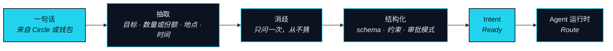
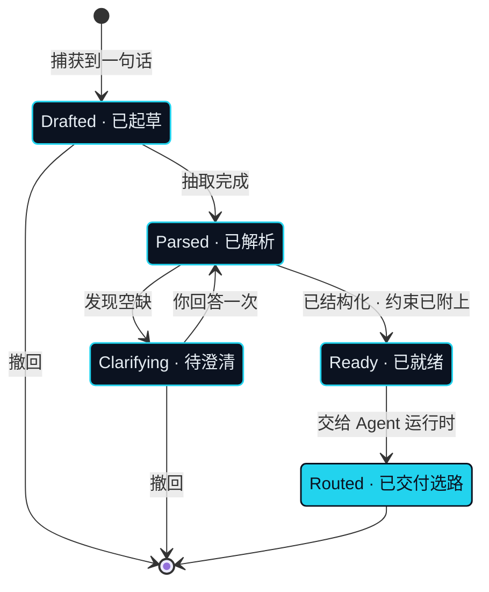

# 意图层

> 表达意图，而非操作——你说出你想要的，Agent 把它解析成一条可执行的路径。

意图层是连接开始的地方。它只收进一样东西——一句话——也只交出一样东西——一个 Agent 运行时能变成 Route（路径）的 Intent（意图）。这个子系统里没有任何环节碰资产。它的全部工作，是在任何别的事情被允许发生之前，先确定你到底想要什么。

有两个术语在这里定下，全书通用。**Intent（意图）** 是用户用自然语言表达的目标，Agent 的输入单元。**Parse（解析）** 是把一句自然语言变成结构化 Intent。用词是刻意的：在 NEXON 上，你提交一个 Intent，不是下一个单。下单是对某一个产品的操作。Intent 是关于一个结果的陈述，而通往那个结果的路径是 Agent 的问题，不是你的。

## 意图从哪里来 <a href="#where-an-intent-comes-from" id="where-an-intent-comes-from"></a>

### 捕获 <a href="#capture" id="capture"></a>

**状态** · `In development`

一个 Intent 从两扇门之一进来。第一扇是 Circle（圈层）——第四部分描述的社交单位——对话里说出的一句话可以不离开对话，直接被提起来变成一个 Intent。第二扇是钱包，用于你独自说出的 Intent。无论哪扇门，意图层记录的都是来源的引用，不是对话的誊本。在 Circle 里说过的话留在 Circle 里；只有 Intent 自己的字段会继续往前，进入 Route 日志。

## 三步解析 <a href="#parse-in-three-moves" id="parse-in-three-moves"></a>

Parse 不是一步，是三步，而中间那一步才是要紧的。



### 抽取 <a href="#extract" id="extract"></a>

**状态** · `In development`

第一步把目标的各个部分从句子里拉出来：最后应该存在什么，要多少或占什么的几成，必须落在哪里，在什么窗口之内。它也会拉出句子暗示了但没有说出口的东西——结果要从哪项资产里出、那项资产住在哪个市场、最后一段是一项数字资产、一张预订，还是一件送到手上的东西。

### 消歧 <a href="#disambiguate" id="disambiguate"></a>

**状态** · `In development`

第二步检查抽出来的部分是否足以在不猜测的前提下选路。如果不够——「这笔仓位」可能指两笔，「四晚」可以从任何一天开始——Agent 就在同一段对话里问一个问题，然后等。它不会拿一个默认值填上空缺，也不会就同一个空缺问第二次。一句话在得到一次回答后仍然悬着，就停在待澄清（Clarifying）状态，直到你重新说一遍。

<details>

<summary>为什么 Agent 选择追问而不是猜</summary>

表单里猜错了，按下提交之前就能改。Intent 里猜错了，就会变成一条 Route、一个 Capacity Reservation（额度冻结），而一旦批准，就变成必须退回的几段执行。一个问题花掉你片刻注意力，一次猜测可能换来一次 Rollback（回滚）。Agent 翻译你说的话，不替你决定你「一定是这个意思」。

</details>

### 结构化 <a href="#structure" id="structure"></a>

**状态** · `In development`

第三步把已经确定的目标写进一个固定的形状，并附上约束——从它提出的每一条 Route 都要受这些约束的管束。下面的形状是示意：字段是这个设计需要的，名字不是最终的。


```json
{
  "intent_id": "…",
  "owner": "…",
  "utterance": "把我这笔仓位收益的三成，换成十月东京的四晚住宿。",
  "goal": {
    "asset_out": "hotel_booking",
    "share": "thirty percent of what <position_ref> earned",
    "place": "Tokyo",
    "time_window": "October · four nights"
  },
  "constraints": {
    "max_slippage": "…",
    "max_burn_rate": "…",
    "deadline": "…",
    "venue_allowlist": ["…"]
  },
  "source": { "circle_ref": "…" },
  "approval_mode": "approve_each_route",
  "status": "Ready"
}
```


`goal` 是最后必须成立的东西；它带 `quantity` 或 `share` 之一，从不两者都带。`constraints` 是这个 Intent 对 Agent 运行时的常设指令。`max_slippage` 是一个报价在其所属 Route 过期之前允许移动的区间。`max_burn_rate` 是这条 Route 以 Burn Rate（消耗）形式消耗的 EXON 上限，让翻译的成本在画出任何路径之前就有边界。`deadline` 是此后任何一段都不得开始的时刻。`venue_allowlist` 可选，用来限定可以启用哪些 Leg Executor（腿执行方）。`approval_mode` 记录你希望这个 Intent 派生的 Route 以何种方式审批；模式是 Agent 运行时那一节的内容。`status` 是下面的生命周期状态。

## 生命周期 <a href="#lifecycle" id="lifecycle"></a>



### 生命周期状态 <a href="#lifecycle-states" id="lifecycle-states"></a>

**状态** · `In development`

一个 Intent 在它的话被捕获的那一刻是 Drafted（已起草），抽取成功后是 Parsed（已解析），有问题悬而未答时是 Clarifying（待澄清），结构化并附上约束后是 Ready（已就绪），被 Agent 运行时接走后是 Routed（已交付选路）。Routed 是这个子系统拥有的最后一个状态。之后的一切——Route、审批、各段——属于 Agent 运行时与结算与托管。一个 Intent 在 Routed 之前的任何时点都可以撤回，撤回不花任何东西，因为什么都还没有被冻结。

## 三个市场，三个 Intent <a href="#three-markets-three-intents" id="three-markets-three-intents"></a>

同一层服务三个市场，同一套 schema 装得下来自任何一个市场的请求。下面的例子只展示形状；每一条各自需要哪几段，是 Agent 运行时的事。



**状态** · `Roadmap`

「把我这笔仓位收益的三成，换成十月东京的四晚住宿。」

目标是一张住宿预订；份额来自一笔资本市场仓位。资本市场腿由持牌第三方执行——NEXON 不经纪证券——状态为 `Roadmap`。把四晚住宿落地属于旅行兑换（travel redemption），同样是 `Roadmap`。这条 Intent 今天就能被完整解析；它需要的那条 Route 目前还不能执行。



**状态** · `In development`

「把这份持仓的三分之一换成我平时持有的那种稳定资产，只在符合我设的滑点时执行。」

目标是一项数字资产；份额从持有它的那条链上的另一项数字资产里出。滑点约束直接读进 `max_slippage`。两段都在链上结算，整条 Route 从头到尾不离开数字资产市场。



**状态** · `In development`

「把我 Circle 里聊到的那台咖啡机买下来，月底前送到我常用的地址。」

目标是一件送到手上的东西；来源是 Circle，所以 `circle_ref` 被设置，商品引用直接从对话里提起。Real Leg（现实腿）落在商城里，附一份 Landing Receipt（落地凭证）。把同一个 Intent 落成一笔卡额度，是 `Roadmap`。




**本节口径。** 本节承诺：Intent 以来源引用的形式被捕获，经三步解析，每个空缺至多追问一次，只有在 Ready 后才向前交付。本节不承诺：最终字段名、任何约束的默认值，或 allowlist 可以点名哪些交易场所。待定项：[OP-13 · OP-15](../open-parameters/README.md)。


*主轴：[译者](../02-the-translator/README.md) · 下一节：[Agent 运行时](agent-runtime.md)*
