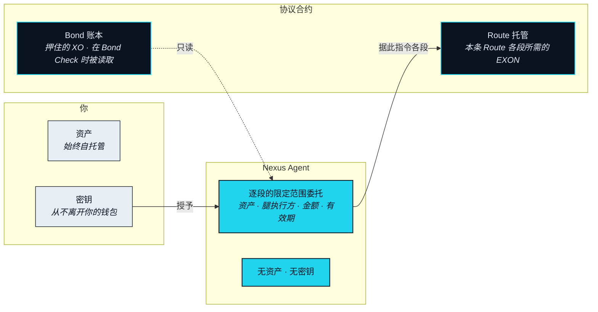

# 结算与托管

> 落到现实腿的结算——一张确认单、一笔卡额度、一件送到的商品。不是又一次代币互换。

这个子系统是一条 Route（路径）不再只是计划的地方。它执行运行时被委托的那些分段，在分段进行期间持有必须被持有的东西，并在某一段失败时把它们退回来。「哪条链」这个问题也在这里得到回答——答案是：这个问题是一段一段地问的。

## 每一段都在其资产原生的地方结算 <a href="#every-leg-settles-where-its-asset-lives" id="every-leg-settles-where-its-asset-lives"></a>

NEXON 不为一条 Route 选链，因为一条 Route 不活在某一条链上。每一段都在其资产原生的账本或系统上结算。这条规则让 Translation Layer（翻译层）保持链无关，也让它待在跨链桥这门生意之外：没有任何一段要求把资产包装、映射或搬到它并非来自的账本上。



**状态** · `In development`

在持有该资产的那条链上结算，经由那条链上的一个 Leg Executor（腿执行方）。这一段的终局性就是那条链的终局性。NEXON 自己的合约记录这一段的结果，但不承载资产本身。



**状态** · `Roadmap`

由持牌第三方在其自有账本上执行；NEXON 不经纪证券。这一段的终局性是该第三方的确认。返回 Route 的是一个已结算的仓位或其收益，以及确认凭据。股权挂钩结算为 `Roadmap`，合作方为 `Open`（OP-24）。



**状态** · 商城 `In development` · 稳定币卡 `Roadmap`

在供应商自己的系统里结算——一次库存预留、一份订单确认、一笔卡授权。它的终局性是供应商的确认，它的证明是一份 Landing Receipt（落地凭证）。



### Route 的终局性 <a href="#route-finality" id="route-finality"></a>

**状态** · `In development`

一条 Route 在它最慢的那一段终局时才终局。运行时不会在每一段都达到各自的终局性、且现实腿已产出 Landing Receipt 之前，把这条 Route 报告为已落地。因为最慢的一段可能是供应商的确认，也可能是持牌第三方的结算周期，所以一条 Route 的终局性并不是协议的属性；它继承自这条 Route 触碰到的那些系统。NEXON 不会让这件事变快。它让这件事变得可见，并让失败时会发生什么变得可预期。

## 托管边界 <a href="#the-custody-boundary" id="the-custody-boundary"></a>

三方触碰一条 Route，每一方持有的东西种类不同。



### 三方，三种持有 <a href="#three-parties-three-holdings" id="three-parties-three-holdings"></a>

**状态** · `In development`

你持有你的资产，自托管，在一条 Route 之前、之中、之后都是。Nexus Agent 只持有委托，别无其他：它能指令什么是逐段限定的，并随该段一起失效。协议的合约持有两样东西，且只有两样。Bond 账本持有你押住的 XO，它从不进入任何一段，只会被读取。Route 托管持有一条 Route 将在各段花掉的 EXON，从批准起直到这条 Route 落地或退回为止。两份合约都不能动对方持有的东西，也都不能动你没有放进去的任何东西。

这些合约部署在 BNB Smart Chain（BSC）上。这一段之上的任何内容都不依赖这个选择。

## Rollback（回滚） <a href="#rollback" id="rollback"></a>

**Rollback（回滚）** 是执行中任一段失败时的原路退回。它不是事后补上的异常路径，而是 Execute 的另一半：每一段在被指令时，它的退回方式就已经是已知的。

```mermaid
stateDiagram-v2
    state "预授权额度内（Roadmap）" as Env
    state "执行中（第 i 段）" as Exec
    state "部分退回" as Partial
    [*] --> 已提出
    已提出 --> 已批准 : 你批准
    已提出 --> Env : 落在预授权额度内
    已提出 --> 已关闭 : 拒绝 · 报价失效
    已批准 --> 已预留 : 额度冻结 · EXON 进入托管
    Env --> 已预留 : 额度冻结 · EXON 进入托管
    已预留 --> Exec : 指令第 1 段
    Exec --> Exec : 第 i 段落地 · 指令第 i+1 段
    Exec --> 已落地 : 现实腿确认 · Landing Receipt
    Exec --> 退回中 : 某段失败 · 被撤销 · 熔断
    退回中 --> 已退回 : 每一段已落地的都被反向撤销
    退回中 --> Partial : 某段已落地且无法反向撤销
    已落地 --> 已关闭 : 托管结清 · 额度冻结释放
    已退回 --> 已关闭 : 托管退回 · 额度冻结释放
    Partial --> 已关闭 : 已处理 · 追偿 · 席位议会
    已关闭 --> [*]
    %% NEXON palette v0 · placeholder until VI locks
    classDef navy  fill:#0B1220,stroke:#22D3EE,stroke-width:1.5px,color:#E6EDF3
    classDef cyan  fill:#22D3EE,stroke:#0B1220,stroke-width:1.5px,color:#0B1220
    classDef light fill:#E6EDF3,stroke:#0B1220,stroke-width:1px,color:#0B1220
    classDef ghost fill:#FFFFFF,stroke:#22D3EE,stroke-width:1px,stroke-dasharray:4 3,color:#0B1220
    class 已提出,已批准,已预留,Exec,退回中 navy
    class 已落地,已退回,已关闭 cyan
    class Partial light
    class Env ghost
```

### 状态机 <a href="#the-state-machine" id="the-state-machine"></a>

**状态** · `In development`

一条 Route 在你回答之前是「已提出」，你回答后成为「已批准」。它在批准时进入「已预留」，此时运行时放下 Capacity Reservation（额度冻结）；同一刻这条 Route 将要花掉的 EXON 进入托管，从那时起这条 Route 对两者都有主张，而别的什么都没有。它一次执行一段。每一段落地时都会连同「反向撤销它的那条指令」一起被记录下来，这样退回路径就永远不是临场编的。当现实腿确认、Landing Receipt 写下时，这条 Route 到达「已落地」；托管结清后进入「已关闭」：各段作为 Burn Rate（消耗）用掉的部分流向 Leg Executor、流向 Settlement Rail（结算轨）的运营与 Protocol Reserve（协议储备），分配比例为 `Open`（OP-11），剩余部分退回给你，Rebate（抵扣）入账。

三件事会把一条执行中的 Route 送进「退回中」：某一段失败、你撤销、或数据与预言机中的熔断被触发。退回过程按相反顺序反向撤销已落地的各段。如果每一段都能被反向撤销，这条 Route 即「已退回」，托管退回，额度冻结释放。被反向撤销的那一段的 Burn Rate 是否退还为 `Open`（OP-13）。图中的预授权额度路径是为完整性画出的，其状态为 `Roadmap`（OP-18）。

### 部分退回 <a href="#partial-unwinds" id="partial-unwinds"></a>

**状态** · `In development`

不是每一段都能反向撤销。一份已确认的订单也许可以取消，但未必免费；一件已经送达的商品就是送达了。当某一段已落地且无法被反向撤销时，这条 Route 进入「部分退回」，并停留在那里直到被处理完。处理首先动用这条 Route 的 EXON 托管中剩余的部分。若缺口仍在，则动用「信任与抵押」一节所描述的 Bond 追偿，其范围为 `Open`（OP-10）。当需要的是判断而不是规则时，由 Seat Council（席位议会）来做。一条部分退回的 Route 绝不会被悄悄关闭，也绝不会没有归属。


**部分退回可能需要人来处理。** 这个状态机保证：一条部分退回的 Route 有明确的状态、有既定的追偿顺序、有指定的处理者。它不保证每一段都能只靠软件反向撤销。当一条现实腿已经改变了现实世界，关闭这条 Route 可能牵涉一个争议窗口、供应商自己的取消条款，以及由人做出的决定。


### Landing Receipt（落地凭证） <a href="#landing-receipt" id="landing-receipt"></a>

**状态** · `In development`

Landing Receipt 是现实腿确实发生过的可验证证明：供应商的确认凭据、订了什么或送了什么、给谁、什么时候，以及它属于哪条 Route 的哪一段。它被写进 Route 日志，它是把一条 Route 从「执行中」推到「已落地」的那个动作，它也开启了第四部分中商城那一节所描述的争议窗口。没有它，任何现实腿都不被视为完成。


**本节口径。** 本节承诺：每一段都在其资产原生的地方结算；三方托管中协议只持有押住的 XO 与托管的 EXON；Rollback 状态机含明确的「部分退回」状态与固定的追偿顺序。本节不承诺：任何跨链桥、任何结算时长，或每一段失败都能仅靠软件处理。待定项：[OP-10 · OP-11 · OP-13 · OP-15](../open-parameters/README.md)。


*主轴：[译者](../02-the-translator/README.md) · 下一节：[信任与抵押](trust-and-bonding.md)*
