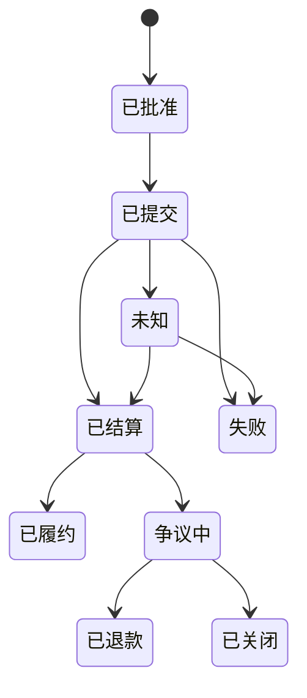

# 结算与托管

一条路径在用户那里看起来是连续的，它的资产和义务在底下却仍然分散着。结算与托管架构存在的意义，就是**把这份分散精确地显示出来**。

Agent 的一条指令不是托管。一份路径提议不移动资金。一个统一的账户视图，不会让 NEXON 变成上面每一笔资产的持有人或担保人。

## 先原生结算 <a href="#native-settlement-first" id="native-settlement-first"></a>

每一段都在真正负责这笔资产或这项服务的系统里结算：

* EXON 的买入、卖出与释放呈现 → NEX Main Exchange / CEX 的记录；
* XO 质押订单、Epoch 计息与赎回 → Staking Platform 的账本；
* 链上转账 → 相应的链与钱包 / 托管安排；
* 卡授权与结算 → 负责的持牌发卡机构及其网络；
* 商城支付与履约 → 已披露的支付服务商与供应商条款；
* 第三方预测市场仓位 → 那个协议本身，受它自己的准入与结算规则约束。

应用层把这些状态**对账**成一份路径凭证。它不改写它们的法律性质。

## 「NEXON 是不是托管的？」问错了 <a href="#is-nexon-custodial-is-the-wrong-question" id="is-nexon-custodial-is-the-wrong-question"></a>

这个问题太宽，一次答不了整个生态。有用的问法是：**每一刻，是谁在控制这笔资产，按谁的条款。**

路径预览应该逐段回答六件事：

<table><thead><tr><th width="150">属性</th><th>必须披露</th></tr></thead><tbody><tr><td>持有人 / 控制方</td><td>用户钱包、交易所账户、合约、发卡机构或其他服务商</td></tr><tr><td>权限来源</td><td>签名、账户指令、委托权限，还是供应商订单</td></tr><tr><td>结算证据</td><td>交易哈希、场所订单号、内部账目或供应商确认</td></tr><tr><td>可逆性</td><td>不可逆 / 可取消 / 可退款 / 可争议</td></tr><tr><td>对手方风险</td><td>哪个实体或协议的失败会影响这一段</td></tr><tr><td>恢复路径</td><td>对应的客服、退款、争议或技术处理流程</td></tr></tbody></table>

路径在两种托管模型之间跨越时，**边界上要重新解释一次**。链上转账可能不可逆；交易所订单按场所规则终局；卡交易在发卡条款下可能支持拒付；预订类订单可能只在供应商截止时间之前可取消。「回滚」这个词在这四种情况里根本不是同一个意思。

## 三个状态是三件事 <a href="#three-states-three-facts" id="three-states-three-facts"></a>

提交、结算、履约，必须分开记。



金融段可以停在「已结算」。现实段通常要走到「已履约」——**付款成功不等于订单完成。**「未知」必须一直可见，直到原生系统能够对上账；重试逻辑必须防重复执行。

## 当前的三本账 <a href="#the-three-ledgers-that-exist-today" id="the-three-ledgers-that-exist-today"></a>

已确认的机制至少意味着三个可分离的记录域：

| 记录域 | 记什么 |
|---|---|
| 交易所记录 | EXON 的买入、卖出与释放呈现 |
| 质押记录 | XO 本金、订单参数版本、期限权重、每一个 12 小时 Epoch、选定的赎回排程 |
| 燃料钱包记录 | 每笔入金 28% 按 1 U 等值买入的 EXON，只能销毁 |

收益赎回在选择带销毁的档位时，产生两个显式输出：

```text
Net  = W × (1 − b)
Burn = W × b
```

`W` 是提取的收益，`b` 是选定到账方式的销毁比例：立即到账 30%，30 天到账 20%，60 天到账 10%。系统在完成提取之前从燃料钱包销毁等值 EXON 并留下永久销毁记录。**这条机制属于提取选择本身**——它不是 PayFi 的路径费、不是卡片费、也不是商城的手续费。

燃料钱包同样不是转给某个运营方的托管：它是用户自己的 EXON，由入金的 28% 买入，只能销毁。账本必须把**燃料钱包里的 EXON** 与**质押中的 XO** 分开记。

## 部分失败与恢复 <a href="#partial-failure-and-recovery" id="partial-failure-and-recovery"></a>

没有哪套架构能保证每一种失败都能恢复。能做的是：**在审批之前，就把每条路径的应对写好。**

| 失败发生在 | 应对 |
|---|---|
| 提交之前 | 取消或过期，不移动任何价值 |
| 已提交、未确认 | 保持在待定 / 未知并对账；不自动重复提交 |
| 某段不可逆动作之后 | 保住凭证，停掉依赖段，说明按当前市况能否做一笔对冲 |
| 已付款、未履约 | 走供应商或发卡机构的退款与争议流程 |
| 模型给错了建议之后 | 停掉未执行的分段。模型出错本身冲不掉一次原生结算 |
| 账户或服务商被攻破之后 | 撤销后续权限，隔离受影响路径，走托管人的事件流程 |

**恢复取决于那一段的原生系统、可用流动性、合约行为、责任运营方和适用条款。**

## 这一层的六个承诺 <a href="#six-commitments-for-this-layer" id="six-commitments-for-this-layer"></a>

审批时让托管关系可读；用幂等执行标识；保留原生凭证；对账未知状态；把支付与履约分开；为每一段指名争议路径。

*上一节：[Agent 运行时](agent-runtime.md) · 下一节：[质押与奖励层](trust-and-bonding.md)*
