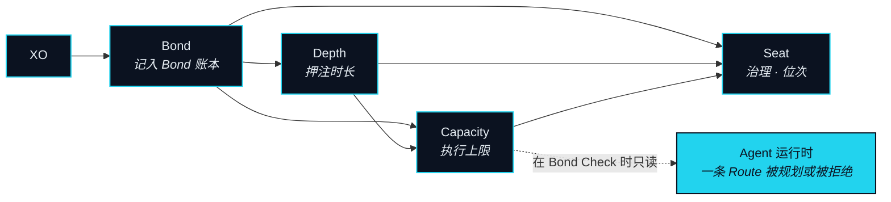
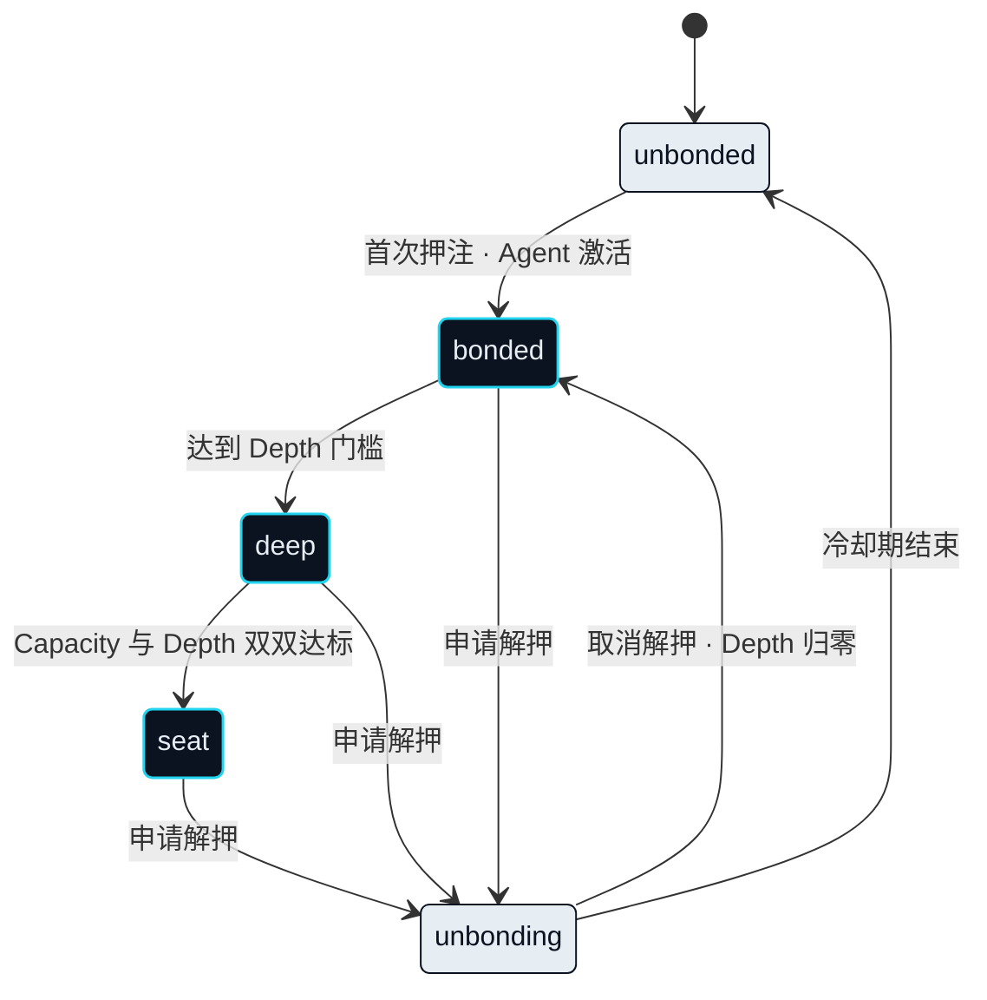

# 信任与抵押

要让一个 Agent 替你动价值，网络必须先回答一个问题，才允许它规划任何路径：凭什么信它能行动？不是因为它聪明，也不是因为它被关着。NEXON 的答案是抵押。在连接被开启之前，先押上一些东西；押上的东西有多大，Agent 能做的事就有多大。

> XO 只押不花——它是让你的 Agent 拿到额度、让你拿到投票权与位次的抵押品。

四个词撑起这个子系统，它们的定义是固定的。**Bond（押注）** 是押住 XO 的动作。**Capacity（执行额度）** 是押注换来的：Agent 能替你执行的上限。**Seat（席位）** 是治理与生态权益中的位次。**Depth（沉淀）** 是一份押注已经持有的时间长度。下面的一切都是这四者之间的关系。

## 押注记在哪里 

### 起步阶段：NEX 内的托管记录 

**状态** · `In development`

本节描述的 Bond 账本，是「一份记录」的协议形态：某个账户押住了多少 XO、从什么时候起、由此产生的 Capacity 有多少正被冻结。起步阶段，这份记录以托管型质押产品的形式保存在持牌数字资产交易所 NEX 内。在那里押住的 XO 由交易所按其自有产品条款持有与记录，而它换来的位次——Capacity、Depth、Seat——由这份记录推导得出。Bond Check 读取对某个账户而言具有权威性的那一份记录。交易所为其托管产品附加的任何收益都属于交易所，是浮动的、非承诺的；它不是协议机制，本文也不描述它。

### 链上 Bond 账本 

**状态** · `In development`

位于 BNB Smart Chain（BSC）上的链上 Bond 账本是协议自己的记录，也是本节其余部分所假定的那一份。托管记录向它迁移的方式、以及账户迁移的先后顺序，是一个待定项（OP-31）。下面的机制不会因为这次迁移而改变。改变的是记录由谁保管。

## 一份押注变成什么 

### Bond（押注） 

**状态** · `In development`

押注把 XO 放进 Bond 账本——一份记录押住了多少、从何时起、以及由此产生的 Capacity 当前有多少被未结束的 Route 冻结的协议合约。押住的 XO 仍然是你的。它不被花掉、不被出借、不被移进任何一段，也从不触碰 Route 托管。这份账本是 Agent 运行时在 Bond Check 时读取的唯一来源，而 Bond Check 对它做的唯一一件事就是读。

### Capacity（执行额度） 

**状态** · `In development`

Capacity 是 Bond Check 用来比对一条 Route 的那个数字。它随押住的数量上升，也随 Depth 上升，并且在两者都保持不变时永不下降：这个函数对 Bond 与 Depth 都是单调的。它的确切形式是一个待定项（OP-07）。固定下来的是它的形状——押得越多，Capacity 越大；押得越久，Capacity 越大；除此之外没有任何输入能改变它。Capacity 由冻结消耗，而不是由花费消耗：一条未结束的 Route 冻结它所需的那部分，这一部分在 Route 关闭时归还。

### Depth（沉淀） 

**状态** · `In development`

Depth 就是时间。它从押注放下的那一刻开始累积，并对任何被解押的 XO 归零。Depth 改善的是位次——你在分层中的位置、你何时够得上一个席位、同样一份押注能换来多少 Capacity——而它改善的只有位次。押得越久越有利，是因为它把你在一个序列里往前挪，而不是因为它支付了什么。

### Seat（席位） 

**状态** · `In development`

当 Capacity 与 Depth 双双达到门槛（这是一个待定项，OP-09）时，即取得一个席位。席位持有者对治理所掌管的参数投票，并从他们中间选出 Seat Council（席位议会）：一个拥有有时限暂停权的小组，其组成为 `Open`（OP-20）。席位是位次，不是收入。治理一章描述席位决定什么；这一节只描述它怎么够得上。

## 四级身份 

网络中的每一级身份都由押注决定，别无其他。一共四级，名称照原样使用。

| 身份 | 含义 | 获得方式 | 状态 |
|---|---|---|---|
| unbonded | 还没押 XO 的新人 | 默认；刻意保持中性 | `In development` |
| bonded | 已押注；Agent 已激活 | 完成首次押注 | `In development` |
| deep | 长期押注者 | 押注达到一定 Depth 门槛 | `In development` |
| seat | 持有治理席位 | Capacity 与 Depth 双双达标 | `In development` |

### 解押 

**状态** · `In development`

解押是一个冷却期，不是一个开关。在冷却期内，这份押注提供的 Capacity 线性衰减到零（`Design Target`，OP-08），使得没有新的 Route 能靠着一份即将离开的 Capacity 被提出。被未结束的 Route 冻结的 Capacity，在那条 Route 关闭之前无法开始解押。XO 本身在冷却期结束时归还，离开不扣除任何东西；失去的是 Depth——如果你再次押注，它从零开始。

## 追偿 

### Bond 追偿 

**状态** · `In development`

一条无法完全退回的 Route 会留下一个缺口：某一段已落地且无法反向撤销，而某个 Leg Executor 尚未被结清。追偿就是这个缺口被填补的顺序。它首先动用这条 Route 的 EXON 托管中剩余的部分。只有在缺口仍然存在时，它才动用支撑了这条 Route 那笔 Capacity Reservation 的 XO——绝不动用冻结额度之外押住的 XO，也绝不动用任何其他 Route 的。第二步是否适用、对哪几类失败适用，为 `Open`（OP-10）。这是追偿，不是罚没。它被限定在引起它的那一条 Route 之内，也正是它让一份押注成为抵押品而不是一笔手续费。



**押注给你什么**

* Capacity —— 你的 Agent 可执行的上限。
* Depth —— 随押注时长改善的位次。
* 一个席位 —— 双门槛达标后的治理权重。
* 追偿 —— 一个 Leg Executor 之所以敢接受一条素未谋面的 Route 的原因。



**押注从不做什么**

* 它从不为任何一段付款。XO 不进入 Route。
* 协议不为一份押注支付任何东西。Depth 改善位次，不是收入。
* 它从不离开你的所有权。押住的 XO 是你的，记在 Bond 账本里。
* 它从不为另一条 Route 的缺口买单。追偿被限定在那笔冻结额度之内。



为什么用 Bond，而不用行业里那个惯用词

行业里表示锁住一枚代币的惯用词，只说了「被锁住了」这一件事。Bond 同时说两件事：某个东西被押上并被持有，以及一条纽带现在把两方约进了一份契约。第二层含义才是这里要的，而它与 NEXON 这个名字的词根同源——nexus，连接本身。你押上的不是一次对网络的下注。它是让一个 Agent 能以你的身份行动的那条纽带，也是让一个 Leg Executor 愿意接受它的抵押品。


**本节口径。** 本节承诺：押注是只读的抵押品，它决定 Capacity、累积 Depth、够得上席位；解押有冷却期且 Capacity 线性衰减；追偿被限定在单条 Route 的冻结额度之内。本节不承诺：Capacity 函数、任何门槛值、冷却期长度，或追偿覆盖哪几类失败。待定项：[OP-07 · OP-08 · OP-09 · OP-10 · OP-20 · OP-31](../open-parameters/README.md)。


*主轴：[译者](../02-the-translator/README.md) · 下一节：[数据与预言机](data-and-oracles.md)*
