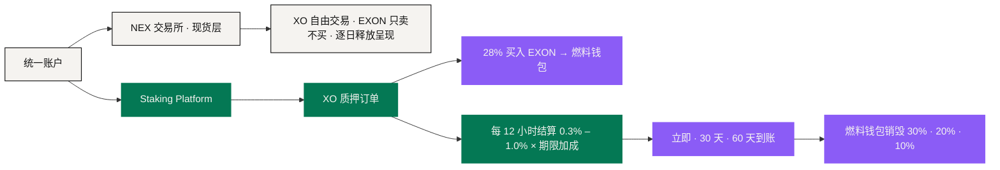
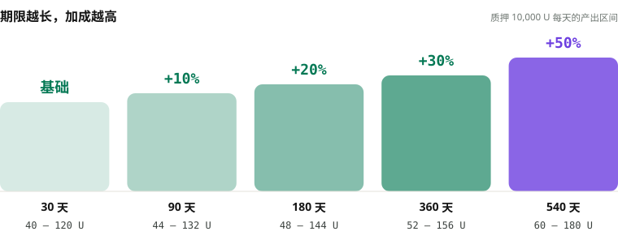
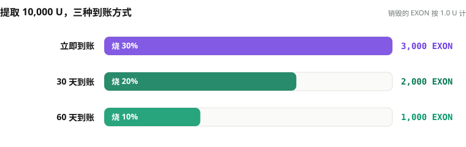

# 质押与奖励层

这一层的权威产品是独立的 **Staking Platform**，规则是 NEXON 现行的经济机制（2026 年 9 月 10 日定稿）。

它有五件核心工作：**开立 XO 质押订单、把入金的 28% 买成 EXON 存入燃料钱包、每 12 小时结算期限加成后的收益、结算 20 代推广奖励与 V1 – V12 领导奖金、按三档到账方式执行提取与销毁。** 它可以与 NEX 交易所共享身份、账户可见性与资金操作，但它的奖励规则不属于交易所的现货规则书。

## 一个账户，两个运营层 <a href="#one-account-two-operating-layers" id="one-account-two-operating-layers"></a>



NEX 交易所**不发放**本节所述的质押奖励。Staking Platform 也**不把**自己的产品变量变成通用的支付、卡片、商城或 Agent 规则。

## 开一笔订单 <a href="#opening-an-order" id="opening-an-order"></a>

对入金 `P`，当前机制记录两笔：

```text
燃料 = 0.28 × P   → 按当时 1 U 等值买入 EXON → 燃料钱包（只能销毁）
质押 = 其余部分   → 兑换 XO → 质押，每 12 小时结算
```

<figure><figcaption>入金 1,000 U：280 枚 EXON 进燃料钱包，其余兑换 XO 开始计息</figcaption></figure>

燃料钱包只进不出：不能转出、不能交易，只能在提取收益时销毁。最低开单 100 U。任何一次 EXON 的获取都来自私募，各自承担价格与流动性。

## 带参数的收益账本 <a href="#a-parameterized-reward-ledger" id="a-parameterized-reward-ledger"></a>

**每 12 小时结算一次，单次 0.3% – 1.0%，北京时间 08:00 / 20:00**，乘以期限加成：

```text
单次结算 = 质押金额 × (0.3% – 1.0%) × (1 + 加成)
```

<figure><figcaption>期限越长，加成越高；加成只看期限，不看金额</figcaption></figure>

| 期限 | 加成 | 质押 1,000 U · 每天 | 期满 | 累计锁定 |
|---:|---:|---:|---|---:|
| 30 天 | 基础 | 6 – 20 U | 第 31 天退出窗口，不收违约金 | 1,200 天 |
| 90 天 | +10% | 6.6 – 22 U | 自动进入下一期限 | 1,170 天 |
| 180 天 | +20% | 7.2 – 24 U | 自动进入下一期限 | 1,080 天 |
| 360 天 | +30% | 7.8 – 26 U | 自动进入下一期限 | 900 天 |
| 540 天 | +50% | 9 – 30 U | 期满取回本金 | 540 天 |

每一笔订单和每一次结算都要记下它当时所用的**参数版本**。后来的参数调整不能悄悄改写一次历史计息。账本应保留入金、期限、加成、结算时间、收益总额，以及任何一次带明确原因的更正或冲正。

## 提取与销毁 <a href="#withdrawal-and-burn" id="withdrawal-and-burn"></a>

收益以 XO 到账，随时可提取，到账方式三选一：

<figure><figcaption>到账越快，销毁越多：提取 1,000 U 收益的三种结果</figcaption></figure>

| 到账方式 | 等待 | 燃料钱包销毁 |
|---|---:|---:|
| 立即到账 | 立即 | 30% |
| 30 天线性到账 | 30 天 | 20% |
| 60 天线性到账 | 60 天 | 10% |

对提取额 `W` 与销毁比例 `b`：`Burn = W × b ÷ P_EXON`。销毁的 EXON 永久退出流通。燃料够就立即到账；不够就选更慢的到账方式，或去私募补燃料。**平台不会自动卖掉另一种资产去补燃料。**

## 推广奖励与领导奖金 <a href="#referral-rewards-and-leadership-bonuses" id="referral-rewards-and-leadership-bonuses"></a>

推广奖励按下级每日静态产出计算，最多 20 代、合计 76%，解锁按本人质押与直推人数逐级打开；领导奖金 V1 – V12 按等级极差（Differential Matching Bonus）发放，考核按入金累计、永不降级，V10 – V12 分享全球 XO 入金 3% 的奖金池。两者与静态收益同一个周期、一律以 XO 发放，提取时同样从燃料钱包销毁 EXON。完整比例表见[质押与收益](../05-tokenomics/staking-and-returns.md)。

## 和产品生态的关系 <a href="#how-it-relates-to-the-product-ecosystem" id="how-it-relates-to-the-product-ecosystem"></a>

Staking Platform 可以出现在钱包里，也可以通过 PayFi 界面被解释，但**界面不会创造新的收益来源**。AI 层可以解释期限选择，或者按用户给出的假设模拟公式；它改不了订单拆分，也动不了燃料钱包。

叙事上，XO 是价值锚，EXON 是流通引擎——这两个定位解释的是长期生态。当前的质押与提取操作，就是上面写的这些。

## 实现层的六条控制 <a href="#six-implementation-controls" id="six-implementation-controls"></a>

1. 已记录事件的参数版本不可变，除非做一次已披露的更正；
2. 燃料买入、XO 质押、每次结算、到账方式选择与销毁，各留独立记录；
3. 交易所权限与质押权限可分离；
4. 每一个收益视图都区分**待提取 / 提取中 / 已到账**；
5. 面向用户的演算，紧邻结果写明它依赖的价格假设；
6. 领导奖金的执行值按参数版本记录，界面显示管辖该订单的版本。

这一层是当前定义得最实的经济核心。更大的应用架构围着它转，不改写它。

*上一节：[结算与托管](settlement-and-custody.md) · 下一节：[数据与预言机](data-and-oracles.md) · 经济全貌：[通证经济](../05-tokenomics/README.md)*
