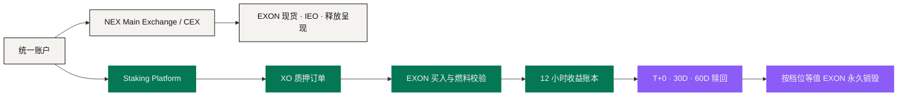

# 质押与奖励层

这一层的权威产品是独立的 **Staking Platform**，规则来自项目方 2026 年 9 月 6 日定稿的 Tokenomics。

它有四件核心工作：**开立单币质押订单、校验 EXON 燃料余额、每 12 小时计算期限加权收益、执行三档赎回之一。** 它可以与 NEX Main Exchange / CEX 共享身份、账户可见性与资金操作，但它的奖励规则不属于交易所的现货规则书。

## 一个账户，两个运营层 <a href="#one-account-two-operating-layers" id="one-account-two-operating-layers"></a>



NEX Main Exchange / CEX **不发放**本节所述的质押奖励。Staking Platform 也**不把**自己的产品变量变成通用的支付、卡片、商城或 Agent 规则。

## 开一笔订单 <a href="#opening-an-order" id="opening-an-order"></a>

对合格订单金额 `P`，当前机制记录三个量：

```text
B = 0.28 × P    通过现货买入 EXON，注入 Treasury Liquidity
S = 0.72 × P    XO 质押 / PV 基数
F = 0.28 × P    用户账户中需持有的等值 EXON 余额
```

`F` 是**被校验**的，不是被转走、被收费或被销毁的，它仍归用户。燃料要求不满足，订单开不了；这次校验也不授权平台去动另一种资产把差额补上。任何一次 EXON 的获取，都是一笔独立的市场动作，各自承担价格与流动性。

## 带参数的收益账本 <a href="#a-parameterized-reward-ledger" id="a-parameterized-reward-ledger"></a>

基础年化参数为 **200%**，乘以期限权重 `w`，每 12 小时结算一次：

```text
Epoch Reward = (S × 200% × w) ÷ (365 × 2)
```

<figure><figcaption>期限权重把 200% 的基础年化抬到 200% – 300% 的区间</figcaption></figure>

| 期限 | 权重 `w` | 有效年化参数 | 流动性条件 |
|---:|---:|---:|---|
| 30 天 | 1.00 | 200% | 灵活；提前退出从本金基数扣 10% – 15% |
| 90 天 | 1.10 | 220% | 到期解锁 |
| 180 天 | 1.20 | 240% | 到期解锁 |
| 360 天 | 1.35 | 270% | 到期解锁 |
| 540 天 | 1.50 | 300% | 定稿文件建议的长期档 |

每一笔订单和每一个 Epoch 都要记下它当时所用的**参数版本**。后来的参数调整不能悄悄改写一次历史计息。账本应保留输入本金、期限、权重、Epoch 时间、收益总额，以及任何一次带明确原因的更正或冲正。

## 赎回与销毁 <a href="#redemption-and-burn" id="redemption-and-burn"></a>

待领收益走三档之一：

<figure><figcaption>等得越久，销毁越少：赎回 1,000 U 待领收益的三种结果</figcaption></figure>

| 档位 | 等待 | 等值 EXON 销毁 | 净释放 |
|---|---:|---:|---:|
| T+0 | 立即 | 30% | 70% |
| 30D 线性 | 30 天 | 15% | 85% |
| 60D 线性 | 60 天 | 0% | 100% |

对待领收益 `W` 与销毁率 `b`：`Net = W × (1 − b)`，`Burn = W × b`。带销毁的赎回要求等值 EXON 被永久销毁。**销毁只挂在这个赎回选择上**，它不代表一个持续的市场回购计划。

## 动态奖励 <a href="#dynamic-rewards" id="dynamic-rewards"></a>

定稿模型里还有一套动态系统，围绕**相邻等级的 Differential Matching Bonus** 组织，Reward Payout Ratio 区间为 150% – 200%，与静态收益在同一个 Epoch 结算，并可按发行轮次与市场状态调节。

完整的等级表、晋级门槛、各级差比例与团队业绩计算边界**尚未公布**。架构可以为这些规则预留带版本的字段，但不应自行补齐缺失的表格，也不应把一份个性化推算显示成已确认的结果（见[待定参数汇总](../open-parameters/README.md) OP-T04）。

## 和产品生态的关系 <a href="#how-it-relates-to-the-product-ecosystem" id="how-it-relates-to-the-product-ecosystem"></a>

Staking Platform 可以出现在钱包里，也可以通过 PayFi 界面被解释，但**界面不会创造新的收益来源**。AI 层可以解释期限选择，或者按用户给出的假设模拟公式；它改不了订单拆分，也免不掉 EXON 校验。

叙事上，XO 是价值锚，EXON 是流通引擎——这两个定位解释的是长期生态。当前的质押与赎回操作，就是上面写的这些。

## 实现层的六条控制 <a href="#six-implementation-controls" id="six-implementation-controls"></a>

1. 已记录事件的参数版本不可变，除非做一次已披露的更正；
2. 余额校验、Treasury 买入、Epoch 计息、赎回选择与销毁，各留独立记录；
3. 交易所权限与质押权限可分离；
4. 每一个收益视图都区分**已计提 / 待领 / 可赎回 / 已释放**；
5. 面向用户的演算，紧邻结果写明它依赖的价格假设；
6. 未公布的动态奖励细节保持「待定」，不做推断。

这一层是当前定义得最实的经济核心。更大的应用架构围着它转，不改写它。

*上一节：[结算与托管](settlement-and-custody.md) · 下一节：[数据与预言机](data-and-oracles.md) · 经济全貌：[通证经济](../05-tokenomics/README.md)*
