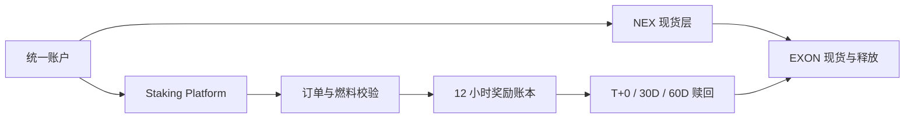

# 质押与奖励层

本路径为保持链接稳定而保留；旧 订单账本设计已由定稿 Staking Platform 模型替代。

平台承担四项职责：开立单币质押订单、校验 EXON 燃料储备、每 12 小时计算期限加权收益，以及执行用户选择的赎回进度。它与 NEX Main Exchange/CEX 共享身份、余额和资金后台，但质押规则不进入交易所现货规则体系。

实现时应为每笔订单和每个 Epoch 记录所用参数版本；参数调整不得静默改写历史计算。余额检查、销毁指令与净释放都应生成可审计回执，并与相应现货和 Treasury 记录对账。

*下一节：[数据与预言机](data-and-oracles.md) · 经济模型：[通证经济](../05-tokenomics/README.md)*
