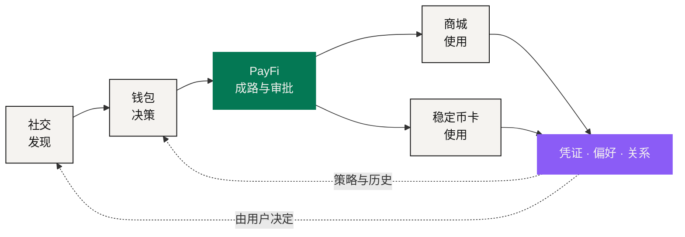

# NEXON 产品生态

> 在社交里发现 → 在钱包里决策 → 通过 PayFi 成路 → 在商城或卡上使用 → 带着数据、关系与行为回来。

NEXON 的产品方向是一个**超级金融社交综合体**，由五个彼此连着的面组成：AI 原生 PayFi、钱包、商城、稳定币卡、去中心化社交 App。它们不是五张互不相干的功能清单——每一个都占据用户价值闭环里的**一个特定时刻**，并且各自扛一组特定的责任。

AI 原生 PayFi 是整体叙事的**第二重点**。第一重点仍然是 NEXON 本身的命题和双币架构：NEXON 连接资本、数字金融与真实消费；XO 承载价值，EXON 驱动流通。PayFi 让这个命题变得可触摸——它把一个目标翻译成一条能被校验、被审批、被执行、被出具凭证的路径。

## 五个面，一个闭环 

| 产品 | 在闭环里的位置 | 它不会变成 |
|---|---|---|
| 去中心化社交 App | 发现、社区、沟通、策略语境与价值互动 | 自动的金融权限，或投资建议 |
| 钱包 | 资产状态、权限、质押入口、决策支持与第三方应用入口 | 一个新的收益来源 |
| AI 原生 PayFi | 意图捕获、路径预览、策略校验、审批、执行协调与凭证 | 托管人、商户、合规权威或收益引擎 |
| 商城 | 旅游、酒店、商品与服务库存，以及供应商履约证据 | NEXON 对每一家供应商履约的担保 |
| 稳定币卡 | 通过持牌发卡 / 运营方延伸到日常受理 | 一张已经发出的卡 |

## 目标体验 



### 在社交里发现

用户碰到一场社区讨论、一个策略、一次活动或一个旅行的念头。社交语境可以帮他形成意图，但它**不能**替他花钱、交易或审批。别人分享的策略是信息，不是指令。



### 在钱包里决策

用户看到可用余额、受保护的储备、当前质押仓位、已授出的权限，以及相关的第三方体验。钱包帮他决定**哪些资源可以被纳入考虑**。



### 通过 PayFi 成路

用户说出结果和约束。PayFi 结构化这条意图，比较合格路径，跑策略，把成本、时间、参与方和不可逆步骤摆出来。用户批准一条有边界的路径。



### 在商城或卡上使用

路径抵达一个现实终点。商城接上旅游、酒店、商品或服务库存；稳定币卡通过合格发卡方延伸可用价值。**供应商或发卡机构对自己那一段负责，支付结算与履约分开记账。**



### 带着数据、关系与行为回来

凭证、偏好与结果可以改善用户下一次的决策——在同意与留存规则之内。一次完成的动作也可以由用户自己决定要不要回流到社交层。**私人金融状态默认不会变成社交内容。**



## 闭环里的分界 

闭环是一条产品叙事，不是一份循环担保。XO 与 EXON 保持它们已确认的机制角色：XO 当前承载质押本金；EXON 当前是现货、释放、买入、校验与销毁资产。

每一个面都要把**责任执行方**露出来：

* 钱包视图不合并托管；
* PayFi 的推荐不替代用户审批；
* 商城的付款不证明交付；
* 卡片界面不替代发卡机构的条款；
* 社交人气不等于适合这个用户。

## 用能力门槛衡量进度 

进度按证据衡量，不按日历承诺衡量。一个产品要跨过「规划中」，需要交付：已发布的规格、威胁模型、托管与发卡安排、辖区审查、测试结果、事件处理流程、面向用户的披露。

**门槛齐了，并且可用性被公布了，这个产品才算真的上线。**

<table data-view="cards"><thead><tr><th></th><th></th><th data-hidden data-card-target data-type="content-ref"></th></tr></thead><tbody><tr><td><strong>去中心化社交 App</strong></td><td>发现与语境。让关系丰富决策，同时不让社交压力绕过控制。</td><td><a href="social.md">social.md</a></td></tr><tr><td><strong>AI 原生 PayFi</strong></td><td>叙事第二重点。从金融意图到执行证据的六段路径。</td><td><a href="payfi.md">payfi.md</a></td></tr><tr><td><strong>钱包</strong></td><td>金融主页与控制中心：状态、权限、质押入口与决策支持。</td><td><a href="wallet.md">wallet.md</a></td></tr><tr><td><strong>商城</strong></td><td>真实消费的那一环。付款和交付是两件事。</td><td><a href="marketplace.md">marketplace.md</a></td></tr><tr><td><strong>稳定币卡</strong></td><td>日常受理的延伸，依赖一个持牌发卡 / 运营方。</td><td><a href="stablecoin-card.md">stablecoin-card.md</a></td></tr></tbody></table>

*上一节：[数据与预言机](../03-architecture/data-and-oracles.md) · 下一节：[去中心化社交 App](social.md)*
