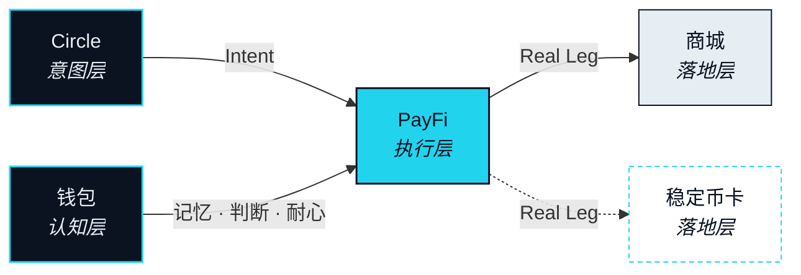

# NEXON 产品栈

> 意图诞生在对话里，所以 NEXON 从社交开始。它经过一个由 Agent 操作、由你确认的支付应用。它在一个钱包里思考——那里存着你的记忆、读着市场、也知道什么时候该等。最后它落进商城和一张卡，价值在那里真正碰到现实世界。

第三部分讲的是神经：把一个 Intent（意图）从一句话送到一条已结算的 Route（路径）的五个子系统。这一部分讲的是这些神经穿过的身体。NEXON 以五个产品的形态到达你手上，而本章只有一条规矩：没有一个产品被写成功能清单。每一个都由它在「你想要的」到「已经结算的」这条路径上的位置来定义，由 Nexus Agent（连接体）在那个位置需要它做什么来定义。

请把它当解剖图读，不要当产品目录读。一个器官在那里，不是因为它单独拿出来有多好看，而是因为少了它，身体就完不成某一项功能；评判它的标准也只有一条：这项功能，它做没做到。

## 一条路径，四层 

第二部分的那条路径上，有四个位置必须有产品存在。意图得从某处来。得有东西去执行它。执行期间，得有东西替你记住、替你判断、替你等。最后一段，得碰到现实世界。这四个位置就是产品栈的四层，由五个产品填满。

| 层 | 产品 | 在主轴里是什么 |
|---|---|---|
| 意图层 | 去中心化社交 app | Agent 的意图源头 |
| 执行层 | AI 原生 PayFi app ★ 主角 | Agent 的手 |
| 认知层 | 钱包应用 ★ 主角 | Agent 的记忆、判断与耐心 |
| 落地层 | 商城 · Stablecoin Card | Agent 触达现实的末端 |

有两个名字要先固定下来，后面的小节才好用。**Circle（圈层）** 是社交层的基本单位，也是意图的来源；它不是群，也不是聊天频道，本文从头到尾不会这么叫它。**Storefront（落地端）** 是商城与 Stablecoin Card（稳定币卡，`Roadmap`）的统称——一条 Route 在这两端不再是链上的价值，而变成你能拿在手里、用得上、或者能住进去的东西。

## 为什么是器官，不是功能 

这样定义产品，会带来三个结果。

第一，没有一个产品是「功能」意义上的可选项。去掉 Circle，Agent 照样执行，只是它执行的 Intent 得由你在表单里敲出来。去掉 Storefront，每一条 Route 都终结在另一种代币上。身体还能动，只是不再能干活。

第二，五个之中有两个分量更重。PayFi 是每一条 Route 被执行、计价、结算的地方；钱包是 Agent 决定怎么做、做多少、什么时候做的地方。它们是这一部分的主角，得到的描述也最具体。

第三，一个产品在主轴上的位置，比它的形态更稳定。即使某个产品在上线前改了样子，它服务的那一层不会挪，Agent 在那一层需要的东西也不会变。这就是本章从位置出发来论证的原因，也是产品名只出现在标题和下面那张状态表里的原因。

## 五个器官 

<table data-view="cards"><thead><tr><th></th><th></th><th data-hidden data-card-target data-type="content-ref"></th></tr></thead><tbody><tr><td><strong>社交 —— 意图的源头</strong></td><td>在 Circle 里说的一句话，不离开对话就变成一个 Intent。</td><td><a href="social.md">social.md</a></td></tr><tr><td><strong>PayFi —— Agent 的手</strong></td><td>每一条 Route 都在这里执行、计价、结算——在你批准之后。</td><td><a href="payfi.md">payfi.md</a></td></tr><tr><td><strong>钱包 —— 记忆、判断与耐心</strong></td><td>Agent 决定怎么做、做多少、什么时候做的时候，它知道些什么。</td><td><a href="wallet.md">wallet.md</a></td></tr><tr><td><strong>商城 —— 落地的一端</strong></td><td>生态内的落地：一件商品、一笔预订、一张 Landing Receipt。</td><td><a href="marketplace.md">marketplace.md</a></td></tr><tr><td><strong>稳定币卡</strong></td><td>生态外的落地，由持牌发卡机构提供。Roadmap。</td><td><a href="stablecoin-card.md">stablecoin-card.md</a></td></tr></tbody></table>

## 本版本的状态 


**这一部分的徽章怎么读。** 下表每一项能力都带着本文开头介绍的五个状态徽章之一。这一部分没有任何能力被写成已上线。整张矩阵的确认是一个待定项：[OP-29](../open-parameters/README.md)。


| 能力 | 器官 | 状态 |
|---|---|---|
| Circle 与 Intent 捕获 | 社交 | `In development` |
| Route 预览 · 审批 · 数字资产腿 | PayFi | `In development` |
| Rebate（抵扣） | PayFi | `In development` |
| 预批额度包（pre-approved envelope） | PayFi | `Roadmap` |
| 记忆 —— 资产与历史 | 钱包 | `In development` |
| Foresight（前瞻） | 钱包 | `Roadmap` |
| Patience（耐心） | 钱包 | `Roadmap` |
| 商城与 Landing Receipt（落地凭证） | 落地端 | `In development` |
| 旅行兑换（travel redemption） | 落地端 | `Roadmap` |
| Stablecoin Card（稳定币卡） | 落地端 | `Roadmap` |
| 资本市场腿 · 股权挂钩结算 | PayFi · 落地端 | `Roadmap` |


**本节口径。** 本节承诺：五个产品由「从意图到结算」路径上的四个位置来定义，每项能力的状态以本版本为准写明。本节不承诺：任何产品的最终形态、名称或上线顺序，也不承诺任何能力已经上线。待定项：[OP-29](../open-parameters/README.md)。


*主轴：[译者](../02-the-translator/README.md) · 下一节：[社交 —— 意图的源头](social.md)*

*把你想要的，变成已经结算的。*
