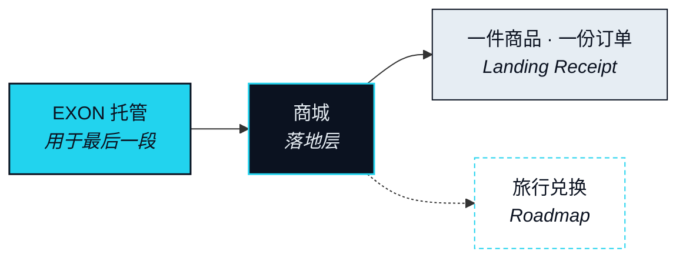

# 商城 —— 落地的一端

> 落到现实腿的结算——一张确认单、一笔卡额度、一件送到的商品。不是又一次代币互换。

一条 Route 的价值，全部兑现在最后一段。商城是生态内的落地，Card 是生态外的落地——两者合起来，Agent 才算真的能碰到现实世界。这一层最难，也最不能省：没有 Real Leg 的连接，只是又一个换币的地方。

这也是本文把两者合称 Storefront（落地端）、并且把商城放在前面的原因。它是协议能够端到端看见的那一种落地——供应商、库存、凭证——因而也是第一个能把「Land the Real Leg」演示出来、而不是只声称一句的地方。

## 生态内的落地 

### 商城 

**状态** · `In development`

商城是最后一段的落地场所，不是一家支持代币结账的商店。Nexus Agent 带着一条前面各段都已落地的 Route 到达这里，并为这一段带着托管中的 EXON。商城的工作是把这笔托管变成一件真实的东西——一件发出的商品、一份确认的订单——并交回它确实做到了的证明。这里没有通常意义上的浏览。Agent 是在兑现一个 Intent，而商城是这个 Intent 的对象所在的地方。

### 落地凭证与争议窗口 

**状态** · `In development`

一条 Route 不在供应商收到款时关闭。它在现实腿能被展示出来时关闭。Landing Receipt（落地凭证）就是那份证明：一份可以拿去和供应商自己的系统核对的记录，而不是只能和 NEXON 的日志核对。它开启一个争议窗口；在这个窗口内，一条已付款却未交付的现实腿按部分退回处理——托管退回，供应商的信誉受影响，这条 Route 以「部分退回」而不是「完成」关闭。

### 谁可以成为供应商 

**状态** · `In development`

三个条件，没有例外。库存必须是真的：提供的东西确实存在，并在这一段执行时被锁定。它必须可退：一段失败可以在供应商自己的系统里被反向撤销。它必须可验证：供应商能出具一份足以作为 Landing Receipt 的确认。三条都满足的供应商，就是现实腿的一个 Leg Executor（腿执行方）。这个集合为待定项（[OP-15](../open-parameters/README.md)）；本版本不点名任何一家。

### 旅行兑换 

**状态** · `Roadmap`

第二部分那个东京的例子，结束在酒店的四个晚上。当这种落地发生在生态之内时，它就发生在这里：订单是现实腿，酒店是供应商，确认是 Landing Receipt。机制不变，变的只有对象。旅行兑换为 `Roadmap`；在它建成之前，商城先落地商品，再落地房间。

## 里面与外面 



**里面 —— 商城。** 供应商是协议已准入的 Leg Executor。库存、退款与凭证在这一段运行之前对 Agent 就是可见的。这是协议能够为之背书的那一种落地。



**外面 —— 稳定币卡。** 最后一段变成一张由持牌发卡机构签发的卡上的一笔额度，现实世界在这张卡被受理的任何地方被触达。NEXON 只是接入层。这是协议能够使之发生、却无法为之背书的那一种落地。`Roadmap`



现实腿是最难的那一段

前面每一段都在为结算而生的系统里结算。最后一段在一家酒店的订房引擎或一个仓库里结算。供应商可以答应了却不交付；一个房间可以确认了又被超订。没有任何一条链能强制交付。只有托管、凭证、争议与信誉能让它变得大概率发生——而这些东西缓慢、琐碎、做起来毫不光彩。它们同时也正是「翻译」与「换币」之间的全部差别。


**本节口径。** 本节承诺：商城是生态内的现实腿，落地凭证可与供应商自有系统核对，争议窗口以部分退回收场，以及供应商准入的三个条件。本节不承诺：任何供应商、任何商品品类，或旅行兑换已可用。待定项：[OP-15](../open-parameters/README.md)。


*主轴：[译者](../02-the-translator/README.md) · 下一节：[稳定币卡](stablecoin-card.md)*
