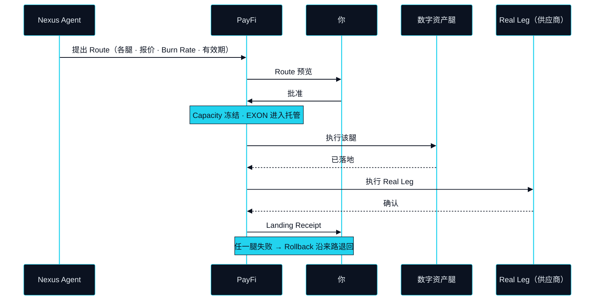

# PayFi —— Agent 的手

> 人是审批者，不是操作者。

Route（路径）这一步产出的一切，总得在某个地方被执行。在 NEXON 上，这个地方是 PayFi：Route 在这里被执行、计价、结算，你也在这里、在它运行之前看到它。它是 Agent 的手——身体里真正会动的那一部分——也是这一部分的主角，因为每一个 Intent（意图），不论从哪里来，去往现实世界的路上都要经过它。

## 「AI 原生」在这里指什么 

这个词在行业里用得很松。在这里它只有一个意思。它不是一个加了 AI 功能的支付 app，而是一个默认由 Agent 发起交易、人只做确认与否决的支付 app。人是审批者，不是操作者。

区别体现在你的手在做什么。在一个「支付 app 加 AI」里，你仍然要选资产、输金额、挑收款方、按发送；AI 只是帮你做得快一点。在 PayFi 里，这些你一件都不做。Nexus Agent（连接体）带着一整条 Route 来——每一腿、每一个报价、每一笔成本——只问一个问题。操作已经发生过了。留给你的，是判断。

## 屏幕上的 Route 

一条 Route 在 PayFi 里经过四个状态。每个状态是一屏，每一屏都对应着第三部分的协议在底下正在做的某件事。



### Route 预览 

**状态** · `In development`

Agent 的提案，在任何东西移动之前。每一腿都列出来：出什么、进什么、这一腿在哪里结算、按什么报价结算。整条 Route 的预估 Burn Rate（消耗）以 EXON 显示——这次执行会逐腿消耗掉多少。预览带有效期；背后的报价过期，预览随之失效，Agent 会重新提案，而不是拿着旧数字继续跑。



### 批准或拒绝 

**状态** · `In development`

一个决定，针对整条 Route。批准，Agent 的 Capacity（执行额度）为它冻结，第一腿开始。拒绝，什么都不发生——没有腿、没有托管、除了「一条 Route 被拒绝过」之外没有任何记录。默认模式是逐条 Route 审批。预批额度包（pre-approved envelope）——在你事先设定的范围之内，Route 不必逐条重新审批即可运行——为 `Roadmap`（[OP-18](../open-parameters/README.md)）。



### 各腿进度 

**状态** · `In development`

各腿按顺序执行，每一腿边走边报状态——已冻结、执行中、已落地。数字资产腿是这一屏最先承载的；由持牌第三方执行的资本市场腿为 `Roadmap`。若某一腿失败，Rollback（回滚）就在这里变得可见：已落地的腿沿来路退回，而一旦某次退回无法自行完成，你会在第一时间被告知。



### Landing Receipt 

**状态** · `In development`

Real Leg（现实腿）确已发生的记录：一个预订编号、一笔卡额度、一份送达确认，其形式可以拿到供应商自己的系统里核对。Route 在 Landing Receipt（落地凭证）上关闭，Real Leg 的争议窗口也从它开始计时。



有一件事在这些屏幕出现之前就已经决定了：Agent 究竟能不能提出这条 Route，由第三部分的 Bond Check（额度校验）决定，对照的是你押住的 XO 给它的 Capacity。这次校验是只读的，它读到的任何东西都不会进入任何一腿。

## 以 EXON 计价与结算 

### Settlement Rail 与 Burn Rate 

**状态** · `In development`

一条 Route 的每一腿都以 EXON 计价、以 EXON 结算。这就是 EXON 之所以是 Settlement Rail（结算轨）的原因：一条数字资产腿、一份供应商确认、以及执行它们的成本，能被放在一起表述的那个唯一单位。批准时，这条 Route 需要的 EXON 进入托管。每一腿执行时，它那一份被消耗掉——这就是 Burn Rate，而消耗的意思是在执行中被用掉，不是被销毁。Route 关闭时，托管中未被消耗的部分退回给你。各类腿的 Burn Rate 是待定参数（[OP-13](../open-parameters/README.md)）。

### Rebate 

**状态** · `In development`

Rebate（抵扣）是 PayFi 里第一个能在链上验证的东西，所以也最先建。一条 Route 消耗掉的 EXON，有一部分在 Route 关闭后按一个时间表退回给 Intent 的所有者，这个时间表是待定参数（[OP-12](../open-parameters/README.md)）。它退回的是已经花掉的燃料，以 EXON 支付，也只以 EXON 支付。它不是持有任何东西的奖励。

## 当某一腿失败 

从你坐的位置看，Rollback 是一屏调转了方向的画面。已落地的腿沿来路反向退回；从未运行的腿，其托管被释放；Route 从执行中转为退回中。有些腿无法自行退回——包裹已经发出，或者供应商无法撤销的确认。这时 Route 处于部分退回的状态，Agent 停下，剩下的部分以一个问题的形式来到你面前，而不是一个已经替你做好的决定。


**在本版本的设计里，审批不是可选项。** 每一条 Route 都在运行前展示，并且必须经你批准才能运行。Agent 不能执行一条你没有看到的 Route；一条在你回答之前失效的 Route，会被重新提出，而不是被执行。将来可能放宽这一点的预批额度包为 `Roadmap`，其限额是 [OP-18](../open-parameters/README.md)。


这些都不是往支付 app 上加的功能。这是当一个支付 app 的默认操作者是 Agent、你的默认角色是判断时，它本来就该有的样子。手在动；你决定它该不该动。


**本节口径。** 本节承诺：由 Agent 发起的 Route、执行前逐条审批、以 Landing Receipt 收尾的四个可见状态、EXON 作为每一腿计价与结算的单位、以 EXON 支付的 Rebate。本节不承诺：Burn Rate 数值、Rebate 时间表、预批额度包的限额，或任何资本市场腿。待定项：[OP-12 · OP-13 · OP-18](../open-parameters/README.md)。


*主轴：[译者](../02-the-translator/README.md) · 下一节：[钱包 —— 记忆、判断与耐心](wallet.md)*
