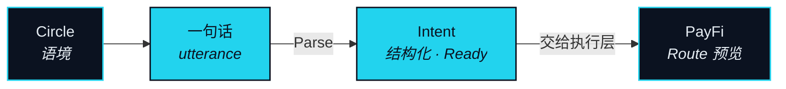

# 社交 —— 意图的源头

> 社交层是意图的源头——因为意图诞生在对话里，不在表单里。

意图不是凭空产生的。你想去东京，是因为朋友发了照片；你想加仓，是因为群里在讨论。意图诞生在关系里。所以社交层不是「顺便做个聊天工具」，它是 NEXON 里 Agent 的意图入口——在这里，一句话就能直接变成一个可执行的 Intent，不需要你切到另一个 app 重新组织语言。

这就是「金融社交」四个字背后的全部机制——把它当机制来讲，而不是当标签来贴。不是往对话里加钱。而是：一条 Route（路径）的理由最先存在于对话之中，Agent 就守在那个理由变成一句话的地方听着。

## 这一层做的三件事 

### Circle 

**状态** · `In development`

**Circle（圈层）** 是社交层的基本单位，也是意图的来源。它不是群，也不是聊天频道，而这个区别不是修辞上的。群是一份人员名单加一条消息流。Circle 是一个语境：里面有哪些人，他们持有什么、正在讨论什么、以前一起做过什么，以及当其中一个人说出一句听起来像 Intent（意图）的话时，Agent 可以调用哪些东西。正是这个语境，让一句话不经表单就能被解析。

### 从一句话到一个 Intent 

**状态** · `In development`

在 Circle 里，一句表达目标的话会作为候选 Intent 交给 Nexus Agent（连接体）。Parse（解析）就在这里运行，以 Circle 为语境；句子有歧义时，Agent 追问一次，而不是猜。Intent 就绪（Ready）后交给执行层，Route 预览就出现在那句话被说出的地方。你没有离开对话，也没有把话重说一遍。

### 留在 Circle 里的东西 

**状态** · `In development`

Circle 的内容永远不上链。进入 Route 日志的只是一个引用——Intent 的标识符，加一个指向它所来自的那个 Circle 的指针——这样一条 Route 可以追溯到源头，却不暴露当时说了什么。其他成员只有在 Intent 的所有者主动展示时，才看得到从对话里形成的那个 Intent。任何一条 Route 的审批只属于所有者本人，在 PayFi 里完成；Circle 里任何人说的任何话，都不算审批。

## 方向是社交 → 意图 → 执行 

两种设计用的是同样三个词，却不是同一台机器。本文只认其中一种。



**反过来的那一种。** 有些产品从一笔支付出发，再把人围上去：转账附一句留言、朋友之间分账、一条「别人买了什么」的动态。支付是主体，社交层是它的包装。这种设计里，没有任何东西知道这笔支付为什么发生。


**NEXON 的这一种。** 对话在前，因为意图在那里成形。Intent 从对话里被提取出来。执行是结果。社交层从不碰结算；它把一个结构化的 Intent 交给 Agent，然后停下。在这里，社交永远在金融的上游，从不在下游。



顺序就是重点。在第一种设计里，更好的社交层让支付更顺手。在第二种设计里，它让 Agent 的 Intent 更准——更接近你的本意、更早成形、你花在重述上的力气更少。

Circle 不是什么

- **不是加了付款按钮的群聊。** Circle 产出 Intent；它不搬运、不持有、不结算价值。
- **不是一条照着别人交易的频道。** Circle 产出的是你的 Intent，用你自己的话。里面没有任何东西是推荐，Agent 也不复制任何人。
- **不是权威。** Circle 里没有人能替你审批一条 Route。审批逐条进行，由所有者本人在执行层完成。


**本节口径。** 本节承诺：Circle 是意图的来源，Parse 在其中运行，Circle 内容不上链、只有 Intent 引用进入 Route 日志。本节不承诺：社交产品的最终形态，或 Circle 内容对执行产生超出其所产出 Intent 之外的影响。待定项：[OP-29](../open-parameters/README.md)。


*主轴：[译者](../02-the-translator/README.md) · 下一节：[PayFi —— Agent 的手](payfi.md)*
