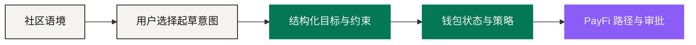

# 去中心化社交 App —— 发现与语境

*产品阶段 · Roadmap*

金融意图常常起于一段关系：社区在聊一件事，朋友分享了一趟旅行，一群人在比较对某个市场的看法。NEXON 的去中心化社交 App 要把这份语境接进生态里，同时**不让对话变成看不见的金融权限**。

产品方向是把沟通、社区、策略分享与用户自主的价值互动放在同一个地方。「去中心化」在这里指的是身份自持、可携带、关系可验证、参与开放；最终采用的协议、内容治理模型与去中心化程度是[待定参数](../open-parameters/README.md)（OP-P06）。

## 从发现到意图 

用户可以选择把一条消息、一个帖子、一场活动或一份分享的策略，变成一条**意图草稿**。应用把可能的目标抽出来，然后问他：金额多少、用哪些资产、储备下限是多少、什么时候截止、怎么审批。

**社交 App 里什么都不会动。** 这条结构化请求只有在它的所有者确认之后，才进入钱包与 PayFi 的控制。

这个顺序防的是一件具体的事：**一个社交信号变成一次执行触发。** 一份被广泛转发的策略不会因此就适合你。一个预测不是保证。创作者、管理员或任何社区成员都不能替另一个人的账户批准一条路径。

## 策略分享，但没有暗中委托 

产品可以让人发布分析、模拟组合、路径模板或市场观点。模板能帮别人理解一个序列——但**导入模板只会在接收者自己的策略下生成一份新草稿**。金额、合格场所、成本与风险，都要按那个人、在那个时刻重新算一遍。

系统应该把**科普、个人观点、推广、受监管的建议**区分开。赞助、返佣或任何影响排序的路由激励都要披露。展示历史表现时，要写明来源、时间区间、是否扣费，以及那是已实现、模拟还是精选出来的结果。

## 社交里的价值互动 

将来的互动可能包括受许可的转账、团购、活动准入、商城发现与社区参与。它们各自的支付资产、费用、限额与资格，由负责的产品条款定义。

EXON「流通引擎」的叙事角色**不会**让它自动变成一个通用的社交支付代币；XO「价值锚」的角色也不会给社区管理员任何控制别人仓位的能力。

每一次价值动作都会离开对话，进入和别处一样的六段控制路径：意图 → 路径 → 策略校验 → 用户审批 → 执行 → 凭证。界面可以把用户挑选的结果送回对话，但**余额与交易细节默认保持私密**。

## 身份、隐私与治理 

一个去中心化的社交产品仍然需要能问责的规则。用户应该清楚：哪些身份要素是公开的、可携带的、私密的、已验证的；谁能删内容；举报滥用和欺诈怎么走；哪些数据会共享给金融执行方。**金融资格信息不应该变成一个公开的声誉分数。**

社区会被冒名、协同操纵、恶意链接和虚假声明攻击。对应的控制包括签名身份或来源信号、链接权限处理、明确的推广标注、频率限制、治理申诉，以及一条独立的账户失陷处理通道。

## 它在闭环里的位置 

社交 App 拥有**发现与语境**；钱包拥有金融状态与权限；PayFi 拥有路径准备与审批；商城供应商和卡运营方拥有现实执行。完成之后，用户自己决定这份凭证是变成一段私人记录、一条公开动态，还是根本不产生任何社交对象。

**这层分离让关系可以丰富决策，而不让人气绕过控制。**

## 上线之前要交付什么 

<table><thead><tr><th width="200">交付项</th><th>为什么</th></tr></thead><tbody><tr><td>身份与数据架构</td><td>用户要能分清什么是公开的、什么是可携带的</td></tr><tr><td>内容与治理规则</td><td>冒名与协同操纵需要有处理流程</td></tr><tr><td>金融推广政策</td><td>把科普、观点、推广与受监管建议分开</td></tr><tr><td>隐私与留存条款</td><td>对话可能含高度敏感的财务与行程信息</td></tr><tr><td>安全审查与滥用响应</td><td>社交面是攻击的第一入口</td></tr><tr><td>可携带性设计与辖区控制</td><td>「去中心化」要能被检验</td></tr></tbody></table>

*上一节：[NEXON 产品生态](README.md) · 下一节：[AI 原生 PayFi](payfi.md)*
