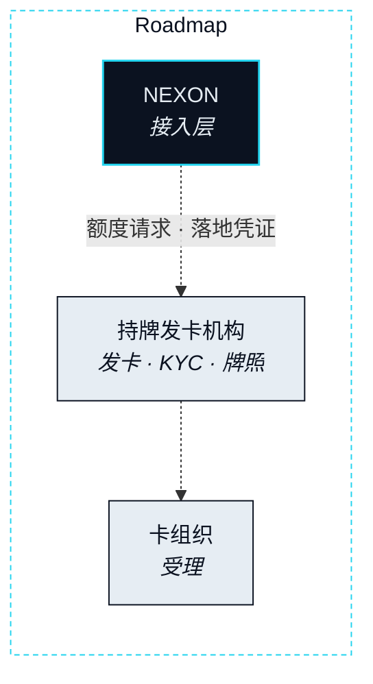

# 稳定币卡


**Roadmap。** 本页任何内容均未上线。这里描述稳定币卡，是为了在它存在之前而不是之后，就把它在主轴上的位置与它的合规暴露面说清楚。


**状态** · `Roadmap`

商城是生态内的落地，稳定币卡是生态外的落地：从一条 Route 通往生态本身并不承载的日常消费的最后一公里。两者合起来就是 Storefront（落地端）。第二部分点出过最后一段可以有三种形态——一份订单、一笔卡额度、一件送到的商品——卡是其中第二种。

## 卡在主轴上的位置 

### 一笔卡额度作为最后一段 

**状态** · `Roadmap`

当一个 Intent 结束于生态之外的消费时，这条 Route 的最后一段不是一次购买。它是一笔额度。为这一段托管的 EXON 在 Settlement Rail（结算轨）上结算成这张卡所承载的稳定币。发卡机构据此确认一笔消费限额，而那份确认就是 Landing Receipt（落地凭证）。从那里开始，现实世界在这张卡被受理的任何地方被触达，而这条 Route 关闭——Agent 的工作结束在额度，而不是结束在收银台。

这种窄是刻意的。Agent 把价值落到一张卡上；它不从卡里消费。额度存在之后发生的事，是你、发卡机构与商户之间的事，跑在生态并不运营的通道上。

## 谁提供什么 

### 发卡机构、卡组织、接入层 

**状态** · `Roadmap`

卡由持牌发卡机构提供，并通过合规聚合通道触达。NEXON 是接入层，仅此而已：它把一条已落地的分段变成一次额度请求，并记录那份确认。它不发卡、不持有持卡人资金、不做身份验证。

| 职能 | 由谁提供 | 状态 |
|---|---|---|
| 发卡与发卡牌照 | 持牌发卡机构 | `Open` · [OP-25](../open-parameters/README.md) |
| 持卡人身份验证（KYC） | 持牌服务方，向发卡机构出具凭证 | `Open` · [OP-22](../open-parameters/README.md) |
| 商户受理 | 卡组织，经由发卡机构 | `Roadmap` |
| 已落地 Route → 额度请求 · 落地凭证 | NEXON —— 接入层 | `Roadmap` |
| 卡在哪里提供 | 发卡机构持牌覆盖的地方 | `Open` · [OP-21](../open-parameters/README.md) |

## 合规暴露面 

卡带来了产品栈其余部分所没有的暴露面，本文把它列出来，而不是留给读者自己去发现。

- **发卡牌照**属于发卡机构，不属于 NEXON。卡只存在于有持牌发卡机构提供它的地方。
- **身份。** 持卡人由持牌服务方验证，并向发卡机构出具凭证。NEXON 只存储对该凭证的引用，从不存储其背后的文件。
- **辖区。** 卡只在发卡机构获准提供它的地方提供。该集合为待定项（[OP-21](../open-parameters/README.md)）。

第六部分的披露表里带着同样这三项。本页不提供任何功能清单——没有充值流程、没有消费品类、没有费率表——因为那些属于发卡机构的产品，不属于协议的主轴。


**本节口径。** 本节承诺：稳定币卡是生态外的现实腿，由持牌发卡机构提供而 NEXON 仅为接入层，并明确牌照、身份、辖区三项合规暴露面。本节不承诺：任何发卡机构、任何辖区、任何卡功能，或任何日期。待定项：[OP-21 · OP-22 · OP-25](../open-parameters/README.md)。


*主轴：[译者](../02-the-translator/README.md) · 下一节：[通证经济](../05-tokenomics/README.md)*
