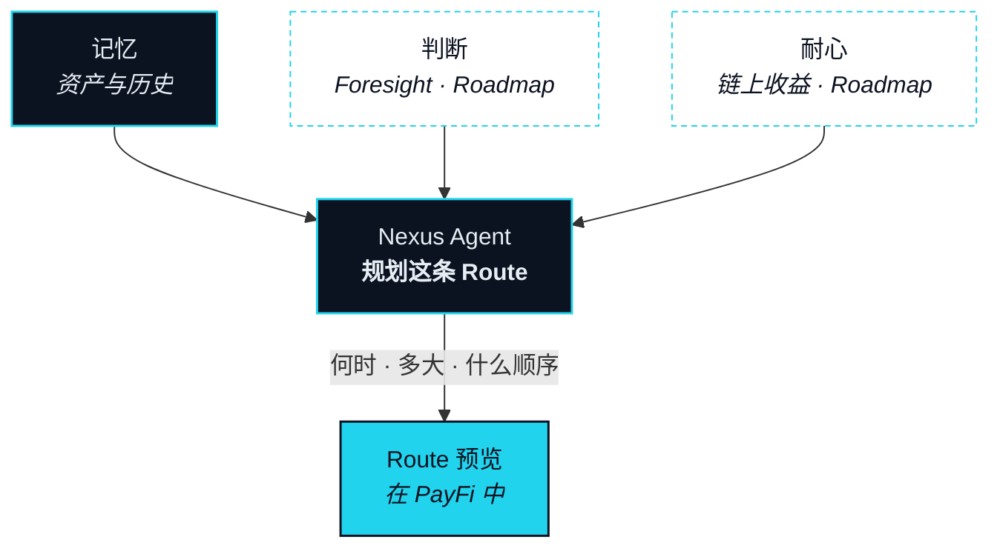

# 钱包 —— 记忆、判断与耐心

> 它在一个钱包里思考——那里存着你的记忆、读着市场、也知道什么时候该等。

在大多数产品里，钱包是一份带发送按钮的资产列表。在 NEXON 上，钱包是 Agent 的认知中枢：让上一节那只手能够依据的东西，多于眼前这一句话。它是本部分的第二个主角产品，因为一条 Route 的好坏，取决于 Agent 规划它时知道些什么。

钱包给 Nexus Agent 三种能力。它们由三句话固定下来，本节照此保留：

- **资产与历史 ＝ 记忆**：Agent 知道你有什么、习惯怎么处理。
- **Foresight（前瞻）＝ 判断力**：Agent 需要知道市场怎么想，才能决定现在执行还是等一等。
- **Patience（耐心）＝ 链上收益**：不是所有意图都需要立刻执行。等待期间，资产不该闲着。

## 三种能力 

### 记忆 —— 资产与历史 

**状态** · `In development`

记忆让第二个 Intent 比第一个容易。钱包持有你在三个市场中拥有的东西，以及你对它们做过什么：你会动用哪些资产、你会放着不碰哪些、你习惯把一条 Route 做多大、你在哪些供应商那里落过地、你拒绝过哪些 Route 以及为什么。这些都不离开钱包。Agent 在规划一条 Route 时读取它，于是「这笔仓位收益的三成」不用追问就能落到正确的那笔仓位上，而一条你永远不会批准的 Route 根本不会被提出来。

### 判断 —— Foresight（前瞻） 

**状态** · `Roadmap`

Foresight 是一个去中心化的场所，从钱包内部进入，参与者在那里为自己预期会发生的事情押上一个立场。NEXON 只建设它的基础设施与入口；不运营 Foresight，也不在其中做市。对 Agent 来说，Foresight 是与价格、身份、链下事实并列的第四类数据——一个关于市场怎么想的信号，用来决定一条 Route 是现在跑还是等一等。它从不凌驾于你之上：一条被 Foresight 反对的 Route 仍然会作为预览出现，并附上理由。其范围为待定项（[OP-26](../open-parameters/README.md)）。

### 耐心 —— 链上收益 

**状态** · `Roadmap`

不是每个 Intent 都该在说出口的那一刻执行。更好的报价可能几分钟后才到；供应商的日期可能在下个月；Foresight 可能建议等。Patience 让「等」这件事负担得起：当一个 Intent 被暂缓时，为它备好的资产被放进链上收益而不是闲置，并在这条 Route 准备好时释放。Agent 决定何时等，Patience 决定这次等待的代价。


**Patience 是链上收益：浮动 · 非承诺 · 非保本。** 任何收益都是可变的，不由 NEXON 或任何人承诺，并且可能导致本金损失。其来源不在本版本中描述，为待定项（[OP-27](../open-parameters/README.md)）。


## 三者如何喂给一条 Route 

一条 Route 有三个变量需要 Agent 在提出任何方案之前定下来：何时、多大、按什么顺序。每种能力都对每个变量说话，但分量不同。



判断为主。Foresight 告诉 Agent 市场大概率会朝这条 Route 有利还是不利的方向动，从而判断现在还是稍后更符合这个 Intent。Patience 让「稍后」负担得起。记忆划定边界：这个 Intent 带着的截止时间，以及你以往愿意等多久。



记忆为主。它知道你有什么、其中你真正会动用的是哪些、你的 Route 通常做多大——于是「三成」不用追问就能落定。判断在边际上调整：若 Foresight 提示市场不稳，一条 Route 可以被分批提出。Patience 不决定规模；它让暂时用不上的部分继续工作。



仍然是记忆为主。它知道你宁可不碰哪些资产、你见过哪些分段失败过，于是 Agent 把最容易反向撤销的排在前面。Patience 加一条规则：后面分段暂时用不上的资产继续工作，直到轮到那一段。判断则决定整个序列是否该等。



所以钱包不是价值待着的地方。它是 Agent 思考的地方——而上一节那只手，稳到什么程度，取决于它背后的思考。


**本节口径。** 本节承诺：钱包是认知层，三种能力共同决定一条 Route 的时机、规模与顺序；Foresight 仅为基础设施与入口；Patience 明确表述为浮动、非承诺、非保本。本节不承诺：Foresight 的范围、任何收益的来源，或任何收益率。待定项：[OP-26 · OP-27](../open-parameters/README.md)。


*主轴：[译者](../02-the-translator/README.md) · 下一节：[商城 —— 落地的一端](marketplace.md)*
