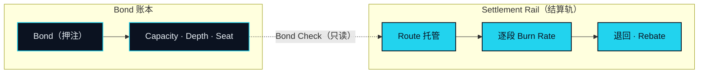

# 通证经济

> 抵押品不是燃料。这就是为什么是两个。

前面四个部分，没有任何一处需要靠一种代币来解释。连接由 Agent 完成。五步从 Parse 一路走到 Land the Real Leg。产品是这条路径上的器官。这个顺序是刻意的：一种资产的存在是为了让连接运转起来，而它只能拿一个已经能独立站住的连接来衡量。

现在说资产。NEXON 是生态，XO 承载价值，EXON 驱动流通。

## 两条账本 

网络保有两条账本，它们从不合并。

第一条是 **Bond 账本**。它记录每个参与者押住了多少 XO、押了多久，以及这份押注换来了怎样的 Capacity（执行额度）、Depth（沉淀）与 Seat（席位）。它的条目在有人押注、解押或跨过某个门槛时改变。它们不会因为某个 Intent 被执行而改变。一次被执行的 Intent 在这条账本上根本不是一个事件。起步阶段，这份记录以托管形式保存在 NEX 内；位于 BNB Smart Chain（BSC）上的链上账本是它迁移的目标协议记录（OP-31）。记录由谁保管，不改变它记录的是什么。

第二条是 **Settlement Rail（结算轨）**。它记录每条 Route 逐段消耗了多少 EXON：多少进了托管、每一段的 Burn Rate（消耗）取走了多少、退回了多少、有多少作为 Rebate（抵扣）返还。它的条目随每一次被执行的 Intent 改变，且只随它改变。某个参与者的押注在这条账本上根本不是一个事件。

两者在五步中的恰好一步上相触：**Bond Check（额度校验）**。一条 Route 执行之前，结算轨向 Bond 账本问一个问题——这位持有者的 Capacity 能否覆盖这条 Route——并得到一个回答。这个提问是只读的。没有任何东西从一条账本移动到另一条，任何方向都没有。

本部分其余的一切都从这张图推出来。一条账本记录留下来的东西，另一条记录周转的东西。每种资产只活在其中一条账本上，而任何一句把它放到另一条上的话，在构造上就是错的。

## 本部分包含什么 

<table data-view="cards"><thead><tr><th></th><th></th><th data-hidden data-card-target data-type="content-ref"></th></tr></thead><tbody><tr><td><strong>双币，两份工作</strong></td><td>为什么一种资产既锚定信任又结算执行是做不到的。论证、对照，以及本文永远不会出现的那些句子。</td><td><a href="two-assets-two-jobs.md">two-assets-two-jobs.md</a></td></tr><tr><td><strong>XO —— 抵押品，不是燃料</strong></td><td>只押不花。一份押注换来什么、价值从哪里来、以及 XO 从不做什么。</td><td><a href="xo.md">xo.md</a></td></tr><tr><td><strong>EXON —— 燃料与结算单位</strong></td><td>只花不押。一个 Intent 从托管到 Rebate 的全程，以及按可验证性排序的四种用途。</td><td><a href="exon.md">exon.md</a></td></tr><tr><td><strong>分配与释放</strong></td><td>将要披露什么、依据哪些原则，以及数字为什么要等第 2 版。</td><td><a href="distribution.md">distribution.md</a></td></tr><tr><td><strong>价值流转</strong></td><td>六种角色、两条流向、三个相触点与六条不变量。</td><td><a href="value-flows.md">value-flows.md</a></td></tr></tbody></table>

顺序是有讲究的。「双币，两份工作」先立起这个分工的论证。随后两页各自在自己的账本上、用自己的语言描述一种资产——都不借助对方来解释自己。「分配与释放」说明将要披露什么、依据哪些原则。「价值流转」以角色、流向、两条账本相触的三个点，以及六条任何后续版本都必须守住的不变量收尾。

## 先机制，后数字 

本文的第 1 版描述机制、角色、流向与不变量。它不描述数量。总量、分配、解锁、释放，以及两种资产之间的关系，每一项都是待定项，连同负责角色与预期版本一起列在[待定参数汇总](../open-parameters/README.md)页上。当那些格子被填上时，它们周围的句子不需要改动。这正是这套机制被写出来时要通过的检验。


**第 1 版的本部分不包含什么。** 没有总量。没有分配。没有解锁或释放计划。没有释放速率。没有两种资产之间任何方向的兑换机制。没有任何形式的价格、估值或回报。以上每一项都是待定项（OP-01 至 OP-06）；第 2 版填格子，不重写章节。



**本节口径。** 本节承诺：两种资产分处两条账本，只在 Bond Check 处相触，且只以读取的方式相触。本节不承诺：任何数量、计划、比例或价格。待定项：[OP-01 · OP-02 · OP-03 · OP-04 · OP-05 · OP-06 · OP-31](../open-parameters/README.md)。


*主轴：[译者](../02-the-translator/README.md) · 下一节：[双币，两份工作](two-assets-two-jobs.md)*

*把你想要的，变成已经结算的。*
