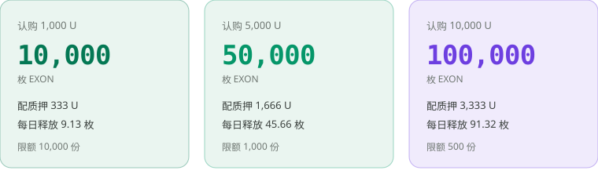
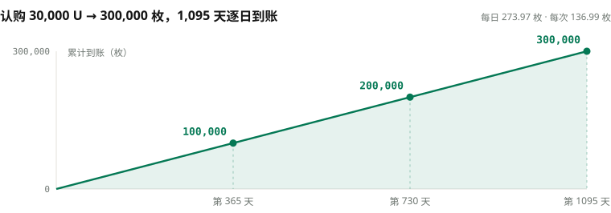

# 分配与释放

## 私募到上线 <a href="#from-private-sale-to-listing" id="from-private-sale-to-listing"></a>

| 阶段 | 价格 | 发生什么 |
|---|---|---|
| **私募** | 固定 `0.1 U`，按档位限量 | 唯一的 EXON 获取渠道；认购与 XO 质押按 3:1 配置，两条收益线同时开跑 |
| **上线** | `1.0 U`，认购价的 10 倍 | NEX 现货开放，只挂卖单、不挂买单；当日起首日释放 |
| **释放** | — | 上线当日起 1,095 天逐日释放，每 12 小时到账一次，共 2,190 次 |

## 私募的三档 <a href="#the-three-tiers" id="the-three-tiers"></a>

<figure><figcaption>三档共 11,500 份，合计 2,000 万 U，对应 2 亿枚 EXON</figcaption></figure>

| 认购档位 | 配置 XO 质押 | 合计投入 | 获得 EXON | 每日释放 | 限额 |
|---:|---:|---:|---:|---:|---:|
| 1,000 U | 333 U | 1,333 U | 10,000 枚 | 9.13 枚 | 10,000 份 |
| 5,000 U | 1,666 U | 6,666 U | 50,000 枚 | 45.66 枚 | 1,000 份 |
| 10,000 U | 3,333 U | 13,333 U | 100,000 枚 | 91.32 枚 | 500 份 |
| **合计** | | | **2 亿枚** | | **11,500 份** |

配置的质押金额取整数部分；上线后配置比例切换为 1:1。EXON 总量 10 亿枚，私募只放 2 亿枚，占 20%，售完即止。

## 线性释放 <a href="#linear-release" id="linear-release"></a>

一份额度 `A` 在 **1,095 天**内释放完毕，每天两次，共 **2,190 次**：

```text
D = A ÷ 1,095                  每日释放量
R_epoch = D ÷ 2 = A ÷ 2,190    每次释放量
```

<figure><figcaption>释放是一条直线：满一年三分之一，满两年三分之二，第 1,095 天走完</figcaption></figure>

释放出来的 EXON 进入现货账户，可以持有，也可以在 NEX 卖出。


**释放曲线是一条直线，不是一个台阶。** 没有悬崖式解锁，也没有加速段。整个私募的 2 亿枚，每天固定释放 18.26 万枚，供给节奏完全可预期。


*上一节：[EXON —— 流通引擎](exon.md) · 下一节：[质押与收益](staking-and-returns.md)*
