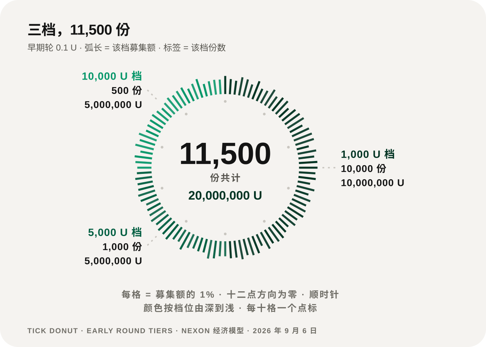
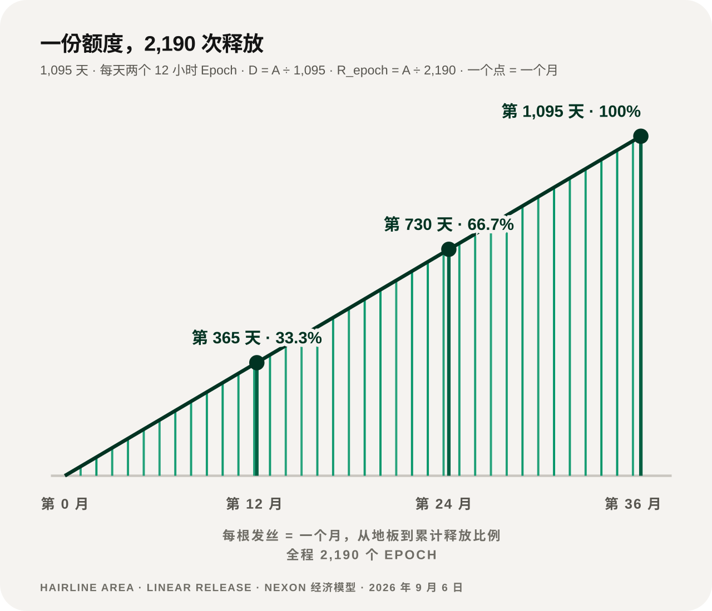

# 分配与释放

## 定价与轮次 <a href="#pricing-and-rounds" id="pricing-and-rounds"></a>

| 阶段 | 定价机制 | 释放 |
|---|---|---|
| **早期轮** | 固定 `0.1 U`，按档位限量 | 从 TGE 起进入共同的 1,095 天释放 |
| **TGE** | 指导价 `1.0 U`；NEX 现货市场开放 | 线性释放开始 |
| **后续轮** | 按当时市价折价发行，折扣逐轮披露 | 从 T+1 开始释放 |

## 早期轮的三档 <a href="#the-three-early-tiers" id="the-three-early-tiers"></a>

<figure><figcaption>三档共 11,500 份，合计 2,000 万 U。档位越大，份数越少</figcaption></figure>

| 单笔金额 | 份数 | 该档合计 |
|---:|---:|---:|
| 1,000 U | 10,000 | 10,000,000 U |
| 5,000 U | 1,000 | 5,000,000 U |
| 10,000 U | 500 | 5,000,000 U |
| **合计** | **11,500** | **20,000,000 U** |

按 `0.1 U` 的早期价，2,000 万 U 对应 2 亿枚 EXON 进入同一条释放曲线。

## 线性释放 <a href="#linear-release" id="linear-release"></a>

一份额度 `A` 在 **1,095 天**内释放完毕，每天两个 12 小时 Epoch，共 **2,190 次**：

```text
D = A ÷ 1,095            每日释放量
R_epoch = D ÷ 2 = A ÷ 2,190   每个 Epoch 释放量
```

<figure><figcaption>释放是匀速的：满一年三分之一，满两年三分之二，第 1,095 天走完</figcaption></figure>

释放出来的 EXON 进入现货账户，可以持有或交易。


**释放曲线是一条直线，不是一个台阶。** 没有悬崖式解锁，也没有加速段。任何时点的已释放比例，等于已经过去的天数除以 1,095。


## 目前没有公布的 <a href="#not-yet-published" id="not-yet-published"></a>

* EXON 的数字总量；
* 团队、生态、Treasury 与市场的完整分配；
* 初始流通量；
* 后续轮次的规模、折扣与单账户上限；
* 最终的 TGE 与各轮日期。

这些字段保持[待定](../open-parameters/README.md)（OP-T01、OP-T02、OP-T03、OP-T05），不由其他文件替它补齐。

*上一节：[EXON —— 流通引擎](exon.md) · 下一节：[质押与收益](staking-and-returns.md)*
