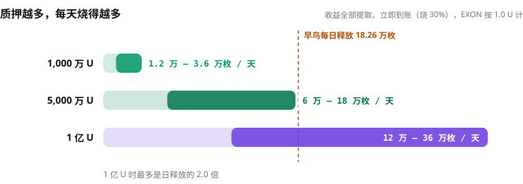

# EXON —— 流通引擎

EXON 同样有两句相互对齐、但各说各话的定义。

在 NEXON 的叙事中，EXON 是**流通引擎**，把数字金融与交易所、体验、支付、费用和消费连起来。在现行机制中，EXON 是**核心价值代币**：私募认购，上线现货，逐日释放，燃料钱包买入，提取销毁。

## 名字与叙事角色 

`EX` 取自 exchange 与 experience。`ON` 是流通开启。EXON 是双币模型里**一直在动的那一侧**：价值可以被定价、被交换，并随着生态展开而被使用。

## 唯一渠道：私募 

**私募是 EXON 唯一的获取渠道。** 认购价 0.1 U，三档 1,000 / 5,000 / 10,000 U，限额 10,000 / 1,000 / 500 份，共 11,500 份，售完即止。认购与质押按 3:1 配置：认购 1,000 U 配质押 333 U，认购拿释放，质押拿结算，两条收益线同时开跑。

EXON 总量 10 亿枚，私募只放 2 亿枚，占 20%。上线 1.0 U，认购价的 10 倍；上线当日起 1,095 天逐日释放，每 12 小时到账一次，到账即可在 NEX 卖出。

## 只能卖，不能买 

> **私募，是 EXON 唯一的获取渠道。杜绝快进快出的热钱投机，只有单边上涨。**

* NEX 二级市场只挂卖单、不挂买单，也不上去中心化交易所——市场上不存在「买入 EXON」这条路。
* EXON 只在两个地方：私募参与者的账户，和质押者的燃料钱包。燃料钱包里的 EXON 只能烧。
* 释放表固定：2 亿枚在 1,095 天内逐日释放，每天 18.26 万枚，供给节奏完全可预期。
* 卖出手续费 2%。

## 当前的三条供需机制 



每一笔质押入金的 28% 按当时 1 U 等值买入 EXON，存入燃料钱包。入金 1,000 U，燃料钱包里就有 280 枚 EXON。

燃料钱包只进不出：不能转出、不能交易，只能在提取收益时销毁。**每一笔入金都在买入。**



提取收益时按到账方式从燃料钱包销毁 EXON：立即到账销毁提取额的 30%，30 天到账 20%，60 天到账 10%。提取 1,000 U 收益、立即到账，按 1.0 U 计销毁 300 枚。

静态收益、推广奖励、领导奖金，提取一次烧一次；烧掉的永久退出流通。**每一次提取都在销毁。**



收益全部提取并立即到账、EXON 按 1.0 U 计：质押总额 1,000 万 U，一天烧 1.8 万 – 6 万枚；5,000 万 U，9 万 – 30 万枚；1 亿 U，18 万 – 60 万枚。对照早鸟每天释放 18.26 万枚。

质押到 5,000 万 U，一年烧掉的就超过一年释放出来的；到 1 亿 U，一天最多烧 60 万枚，是日释放的 3.3 倍。



<figure><figcaption>质押越多，每天烧得越多；1 亿 U 时最多是日释放的 3.3 倍</figcaption></figure>

买入不停，销毁不停，释放表固定，流通盘只会越来越小——这就是 EXON 的上涨引擎。

## 随入口开放的用途（Roadmap） 

EXON 是 AI 原生 PayFi 的流通与结算通证。今天就在运转的：质押燃料、提取销毁、NEX 现货、PayFi 结算。随钱包、商城、去中心化社交与 U 卡逐个上线接入的：交易、支付、兑换与手续费（Roadmap）。每一项接入时，由该入口的条款写清楚价格来源、费用去向、托管与退款、支持的辖区与责任执行方。

## EXON 的三句话 

1. **叙事**：EXON 是 NEXON 的流通引擎。
2. **当前机制**：EXON 是核心价值代币；私募 0.1 U 唯一渠道，上线 1.0 U，只能卖不能买，燃料钱包买入，提取即销毁。
3. **随入口开放**：交易、支付、兑换与手续费随五个入口接入（Roadmap）。

*上一节：[XO —— 价值锚](xo.md) · 下一节：[分配与释放](distribution.md)*
