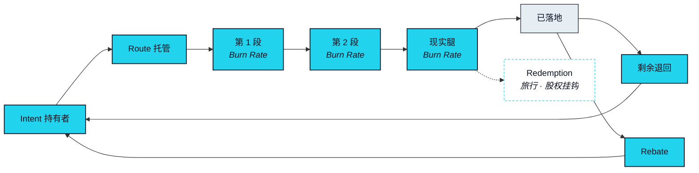

# EXON —— 燃料与结算单位

> EXON 只花不押——它是每一次意图执行的燃料与结算单位。抵押品不是燃料。这就是为什么是两个。

## 只花不押 

一次被执行的 Intent 有一些与信任无关的成本。每一段都必须以一个共同单位计价，Agent 才能在三个市场之间比较路径。每一段在运行时都要用掉一些东西——场所费用、执行方费用、结算轨自身的开销。而整体还必须在几个互不共享账本的系统之间结清。EXON 就是这一切被计价、被用掉、被退回时所使用的单位。它活在 Route 之内，在 Route 之外没有角色。

这就是「燃料」在这里的含义，也是本文赋予这个词的唯一含义。燃料为一段旅程而买，被这段旅程用掉，剩下的回到油箱里。它不为自身而被保有，它不是对任何东西的主张，它也不带来任何位次。那一类属性属于另一条账本，并且在另一条账本的页面上被描述。

## 一个 Intent，从头到尾 



### 备付

Route 预览会以 EXON 说明这条路径预计将用掉多少。你从自己的账户为它备付，而在你批准之前不会动用任何东西。


### 托管

批准时，这笔 EXON 进入一个以本条 Route 为范围的托管。它只属于这条 Route，不属于别的任何一条，也是这条 Route 唯一能动用的那一笔。


### 逐段消耗

每一段执行时，从托管中用掉它那一份。**Burn Rate（消耗）** 是一次 Intent 的执行所用掉的 EXON。某一类型的分段用掉多少，是一个待定项（[OP-13](../open-parameters/README.md)）。被用掉的 EXON 不是被销毁：它被继续结算给执行了这一段的各方与结算轨，分配比例是一个待定项（[OP-11](../open-parameters/README.md)）。


### 退回

当这条 Route 到达「已落地」——或者在 Rollback 跑过之后到达「已退回」——托管中剩下的一切退回给你。没有运行过的分段不用掉任何东西。运行过又被退回的分段，按同一套规则用掉它的执行与退回所花的部分。


### 抵扣

这条 Route 关闭之后，它所用掉的一部分以 **Rebate（抵扣）** 的形式、以 EXON 记回给你，用于抵扣未来的 Route。Rebate 是第一个你能在单张凭证上端到端验证的 EXON 机制，这也是它在下面那份清单里排第一的原因。它的规则是一个待定项（[OP-12](../open-parameters/README.md)）。




**Burn Rate 的意思是被用掉，不是被销毁。** 一条 Route 用掉的 EXON 会被继续结算出去——给 Leg Executor、给结算轨的运营、给 Protocol Reserve（协议储备）与 Rebate 池。它离开这条 Route，但它不离开流通。本页没有任何内容描述总量的减少，本页也没有任何一句话应当被这样理解。


## 四种用途，按可验证性排序 

下面按照你能自己核实它们的先后顺序排列，从一张凭证到一条横跨三个市场的完整 Route。

| 用途 | 是什么 | 由谁执行 | 状态 |
|---|---|---|---|
| **Rebate（抵扣）** | 以 EXON 记回、用于抵扣未来 Route 的费用减免 | 结算轨 | `In development` |
| **Settlement Rail（结算轨）计价单位** | 每条 Route 的每一段都以 EXON 计价与结算 | 结算轨，与各 Leg Executor | `In development` |
| **Redemption（兑换）· 旅行兑换** | 现实腿是一份订单的 Intent：EXON 在结算轨上被用掉，供应商交付这份订单 | 商城上的供应商 | `Roadmap` |
| **Redemption（兑换）· 股权挂钩结算** | 资本市场腿由持牌第三方执行的 Intent；NEXON 不经纪证券 | 持牌第三方（[OP-24](../open-parameters/README.md)） | `Roadmap` |
| **早期参与轮** | 若举行早期参与轮，则为其标的。是否举行、依据什么条款，均未决定 | —— | `Open`（[OP-23](../open-parameters/README.md)） |

**Redemption（兑换）** 是 EXON 为换取现实世界结果而被用掉的那些场景的统称——旅行兑换与股权挂钩结算都在其中。本文只描述每一项的机制与状态，此外不做任何描述：不写标的、不写供应商、不写合作方。最后一行描述的是一种结构，不是一份要约。

## EXON 在哪里流通 

EXON 发行在 BNB Smart Chain（BSC）上。它被设计为在 NEX 生态内以及在结算轨上流通，且不是交易所平台币——不是 NEX 的，也不是对 NEX 的任何主张。EXON 在哪里交易、何时交易，只通过官方渠道公布；本文不点名任何一处。

## 价值从哪里来 

EXON 的价值来源是：网络每天执行多少意图。每条 Route 都会用掉一些；Route 越多，用掉的越多；结算轨上没有别的东西为它创造需求。类比是电费与过路费：你为你用掉的部分付费，在你用它的时候付，其余时间不必想着它。用三个字说：用得上。

## EXON 从不做什么 

EXON 不带来 Capacity，不带来 Depth，不带来 Seat。无论一个参与者花掉了多少，它都不携带治理权重。本文任何地方都不把它描述为稀缺、价值储存或值得留着的东西，因为这些词没有一个是在描述燃料。那一类属性全都活在 Bond 账本上，并在 [XO 的页面](xo.md)上被描述。


**本节口径。** 本节承诺：EXON 只花不押；它以托管、消耗、退回、抵扣的形式活在一条 Route 之内；Burn Rate 是被用掉而非被销毁。本节不承诺：任何 Burn Rate 数值、费用分配、Rebate 规则、发行政策或释放速率，也不承诺任何 Redemption 的合作方或标的。待定项：[OP-04 · OP-05 · OP-11 · OP-12 · OP-13 · OP-23 · OP-24](../open-parameters/README.md)。


*主轴：[译者](../02-the-translator/README.md) · 下一节：[分配与释放](distribution.md)*
