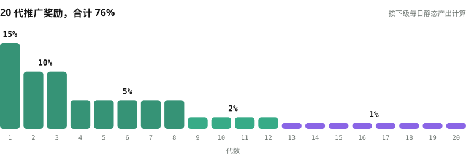

# 质押与收益

质押入金兑换为 XO 后即开始计息。**每 12 小时结算一次，单次 0.3% – 1.0%，北京时间 08:00 / 20:00，一天两次。** 收益以 XO 直接到账。

```text
单次结算  = 质押金额 × (0.3% – 1.0%) × (1 + 期限加成)
每天      = 单次结算 × 2
```

质押 1,000 U，一天 6 – 20 U；540 天档加成 +50%，一天 9 – 30 U。

## 五个期限 <a href="#five-terms" id="five-terms"></a>

<figure><figcaption>期限越长，加成越高；加成只看期限，不看金额</figcaption></figure>

| 期限 | 加成 | 质押 1,000 U · 每天 | 质押 10,000 U · 每月 | 期满 | 累计锁定 |
|---:|---:|---:|---:|---|---:|
| 30 天 | 基础 | 6 – 20 U | 1,800 – 6,000 U | 第 31 天退出窗口 | 1,200 天 |
| 90 天 | +10% | 6.6 – 22 U | 1,980 – 6,600 U | 自动进入下一期限 | 1,170 天 |
| 180 天 | +20% | 7.2 – 24 U | 2,160 – 7,200 U | 自动进入下一期限 | 1,080 天 |
| 360 天 | +30% | 7.8 – 26 U | 2,340 – 7,800 U | 自动进入下一期限 | 900 天 |
| 540 天 | +50% | 9 – 30 U | 2,700 – 9,000 U | 期满取回本金 | 540 天 |

## 退出与续期 <a href="#exit-and-renewal" id="exit-and-renewal"></a>

* **30 天档**：第 31 天是退出窗口，本金加 30 天收益一起领，不收违约金。错过窗口自动续期，90 → 180 → 360 → 540 天逐级往上，累计锁定 1,200 天。
* **540 天档**：一步到位，加成 +50%，累计锁定只有 540 天——锁得最短，拿得最多。
* 最低开单 100 U；收益到账满 100 U 就能再开一单，本金越滚越大。

## 提取与销毁 <a href="#withdrawal-and-burn" id="withdrawal-and-burn"></a>

收益随时可提取。到账方式三选一，到账越快，销毁越多：

<figure><figcaption>提取 1,000 U 收益，三种到账方式各烧多少 EXON</figcaption></figure>

| 到账方式 | 销毁比例 | 提取 1,000 U 销毁的 EXON（按 1.0 U 计） |
|---|---:|---:|
| 立即到账 | 30% | 300 枚 |
| 30 天线性到账 | 20% | 200 枚 |
| 60 天线性到账 | 10% | 100 枚 |

销毁的是燃料钱包里的 EXON，永久退出流通。燃料够就立即到账；不够就选更慢的到账方式，或去私募补燃料。静态收益、推广奖励、领导奖金，提取一次烧一次。

## 推广奖励：20 代，合计 76% <a href="#referral-rewards-20-generations" id="referral-rewards-20-generations"></a>

推广奖励按下级每日静态产出计算，最多 20 代，与静态收益同一个周期、一律以 XO 发放。

<figure><figcaption>第 1 代 15%，一路排到第 20 代</figcaption></figure>

| 代数 | 比例 | 解锁：本人质押 | 解锁：直推人数（累计） |
|---|---:|---:|---:|
| 第 1 代 | 15% | 100 U | 4 人，单笔 ≥ 100 U |
| 第 2 – 3 代 | 10% | 100 U | 4 人 |
| 第 4 代 | 5% | 100 U | 4 人 |
| 第 5 – 8 代 | 5% | 500 U | 8 人，单笔 ≥ 500 U |
| 第 9 – 12 代 | 2% | 1,000 U | 12 人，单笔 ≥ 1,000 U |
| 第 13 – 16 代 | 1% | 2,000 U | 16 人，单笔 ≥ 1,000 U |
| 第 17 – 20 代 | 1% | 5,000 U | 20 人，单笔 ≥ 1,000 U |

## 领导奖金：V1 – V12 等级极差 <a href="#leadership-bonuses-v1-v12" id="leadership-bonuses-v1-v12"></a>

领导奖金按**等级极差**（Differential Matching Bonus）发放：本人比例减去下级比例。考核按入金累计，取最大区业绩加其余小区合计，达标后永不降级；V6 起要求两条线各出一个下一级。

| 等级 | 本人质押 | 最大区业绩 | 其余小区合计 | 比例 |
|---|---:|---:|---:|---:|
| V1 | 500 U | 2 万 U | 1 万 U | 1% – 15% |
| V2 | 1,000 U | 3 万 U | 2 万 U | 16% – 25% |
| V3 | 2,000 U | 10 万 U | 5 万 U | 26% – 35% |
| V4 | 3,000 U | 20 万 U | 10 万 U | 36% – 45% |
| V5 | 5,000 U | 50 万 U | 20 万 U | 46% – 55% |
| V6 | 6,000 U | 200 万 U | 2 个 V5 团队 | 56% – 65% |
| V7 | 7,000 U | 500 万 U | 2 个 V6 团队 | 66% – 75% |
| V8 | 8,000 U | 800 万 U | 2 个 V7 团队 | 76% – 85% |
| V9 | 9,000 U | 1,000 万 U | 2 个 V8 团队 | 86% – 100% |
| V10 | 13,000 U | 2,000 万 U | 2 个 V9 团队 | 全球池 20% |
| V11 | 17,000 U | 3,000 万 U | 2 个 V10 团队 | 全球池 30% |
| V12 | 20,000 U | 5,000 万 U | 2 个 V11 团队 | 全球池 50% |

V10 – V12 分享全球 XO 入金 3% 的奖金池，按 20 / 30 / 50 权重、同级平分。推广奖励与领导奖金提取时同样从燃料钱包销毁 EXON。


**每一笔订单和每一次结算都记录它当时所用的参数版本。** 单次产出区间、期限加成与领导奖金执行值按市场阶段设定，后续调整不改写历史计息；界面能告诉用户这笔订单执行时用的是哪一版。


*上一节：[分配与释放](distribution.md) · 下一节：[完整演算案例](worked-examples.md)*
