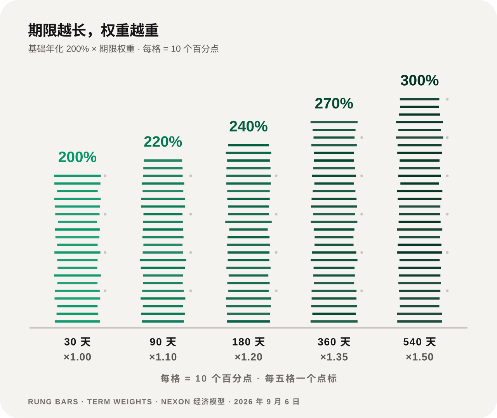

# 质押与收益

计息基数是订单本金的 72% 部分 `S`。基础年化参数为 **200%**，每 12 小时结算一次，并乘以选定的期限权重 `w`。

```text
r_epoch = (S × APY × w) ÷ (365 × 2)     每个 Epoch
r_day   = (S × APY × w) ÷ 365           每天
R_term  = S × APY × w × T ÷ 365         整个期限
```

三条公式其实是同一条：**基数 × 年化 × 权重**，再按时间切片。

## 五个期限 <a href="#five-terms" id="five-terms"></a>

<figure><figcaption>权重把 200% 的基础年化抬到 200% – 300% 的区间</figcaption></figure>

| 期限 `T` | 权重 `w` | 有效年化参数 | 流动性条件 |
|---:|---:|---:|---|
| 30 天 | 1.00 | 200% | 灵活；提前退出扣本金基数的 10% – 15% |
| 90 天 | 1.10 | 220% | 到期解锁 |
| 180 天 | 1.20 | 240% | 到期解锁 |
| 360 天 | 1.35 | 270% | 到期解锁 |
| 540 天 | 1.50 | 300% | 定稿文件建议的长期档 |

## 续期阶梯 <a href="#the-renewal-ladder" id="the-renewal-ladder"></a>

续期路径是 `30 → 90 → 180 → 360 → 540 天`。逐级续下来，累计锁定约 **1,200 – 1,400 天**。

用户也可以选择另一条路：到期赎回，然后直接开一笔新的 540 天订单。**两条路径的权重终点相同，中间的流动性完全不同。**

## 提前退出 <a href="#early-exit" id="early-exit"></a>

只有 30 天这一档支持提前退出：

```text
Refund = S × (1 − λ)，其中 λ 为 10% – 15%
```

λ 在这个区间内的确切取值尚未公布。以 `S = 21,600 U` 为例，提前退出返还 **18,360 – 19,440 U**。

## 动态奖励 <a href="#dynamic-rewards" id="dynamic-rewards"></a>

动态部分按**社区贡献与团队业绩**分级，相邻等级之间采用 **Differential Matching Bonus**（等级极差奖励），与静态收益在**同一个 Epoch** 结算。

**Reward Payout Ratio 区间为 150% – 200%**，可按发行轮次与市场状态调节。

等级名称、晋级条件、各等级差比例与团队业绩计算边界尚未公布，因此**个人的动态奖励无法从本文推算出来**（[待定参数](../open-parameters/README.md) OP-T04）。


**200% 和 150% – 200% 都是可调的协议参数，可能随发行轮次与市场状态变化。** 每一笔订单和每一个 Epoch 都记录它当时所用的参数版本，后续调整不改写历史计息。界面应该能告诉用户：他这笔订单执行时用的是哪一版。


*上一节：[分配与释放](distribution.md) · 下一节：[完整演算案例](worked-examples.md)*
