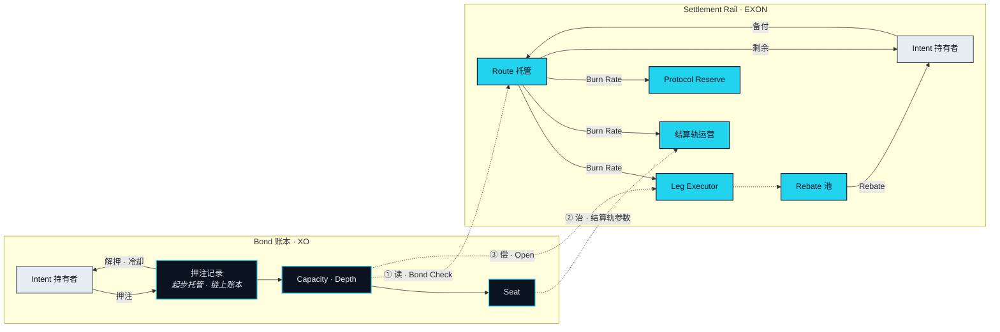

# 价值流转

> 把一句话里的「XO」换成「EXON」，如果它仍然成立，那这句话一定写错了。

前面几页各自在自己的账本上、用自己的语言描述了一种资产。本页把两条账本放进同一张图：参与方是谁、每种资产往哪个方向动、两条账本在哪三个地方相触，以及本文任何后续版本——包括那个填上数字的版本——都必须守住的六条规则。

## 六种角色 

| 角色 | 做什么 | 触碰哪条账本 |
|---|---|---|
| **Intent 持有者** | 说出一个 Intent、批准一条 Route、为它的托管备付、收到它的 Landing Receipt 与 Rebate | 两条都触碰，但从相反的两侧：在一条上押注，在另一条上花掉 |
| **Nexus Agent** | 在持有者的 Capacity 与批准之下解析、选路、校验、执行与落地 | 读一次 Bond 账本；指令结算轨 |
| **Leg Executor（腿执行方）** | 执行某一段——一个交易场所、一个持牌第三方、一个供应商——并确认它 | 结算轨：为它执行的那一段从托管中获得结算 |
| **Seat 持有者** | 持有通过押注取得的位次；对治理所掌管的参数投票 | 仅 Bond 账本 |
| **Protocol Reserve（协议储备）** | 协议的金库：EXON 经由结算轨被用掉时的去向之一 | 仅结算轨 |
| **Settlement Rail（结算轨）** | 每一段被计价、被托管、被用掉、被退回时所依托的单位与机制 | 结算轨——它*就是*那条账本 |

没有任何一种角色以同一种身份出现在两条账本上。Intent 持有者是唯一同时触碰两条的角色，而它是用两种资产、以两个不同的动词触碰的。

## 两条流向 



**状态** · `In development`

EXON 走一个以 Intent 持有者开始、也以他结束的环，环上的每一站都是一个 Route 事件。

1. 持有者为一条 Route 备付；批准时这笔 EXON 进入该条 Route 的托管。
2. 每一段落地时，它的 Burn Rate 从托管中被用掉并继续结算出去：给执行了这一段的 Leg Executor、给结算轨的运营、给 Protocol Reserve。三者之间的分配是一个待定项（[OP-11](../open-parameters/README.md)）。
3. 这条 Route 关闭时，托管中未被用掉的部分退回给持有者。
4. 关闭之后，从被用掉的 Burn Rate 所汇入的池中，按一定规则把 Rebate 记回给持有者，该规则是一个待定项（[OP-12](../open-parameters/README.md)）。

被用掉的 EXON 离开这条 Route。它不离开流通。



**状态** · `In development`

XO 动一次，留下来，再动回去。它的每一站都不是 Route 事件。

1. 持有者押住 XO。起步阶段这份记录是 NEX 内的托管产品；它迁移的目标链上 Bond 账本是协议记录（[OP-31](../open-parameters/README.md)）。
2. Capacity 由押注及其 Depth 推导得出。每条被批准的 Route 放下一笔 Capacity Reservation（额度冻结）——那是记录上的一个标记，不是 XO 的移动——并在关闭时释放。
3. 当 Capacity 与 Depth 双双跨过门槛时，登记一个席位。
4. 解押时，冷却期运行，Capacity 衰减，XO 回到持有者手中。

XO 从不被支付给任何 Leg Executor，从不进入托管，也从不在一条 Route 运行期间离开押注记录。



**状态** · `In development` · 第三个相触点 `Open`

两条账本恰好在三个点上相触，而每一个相触点的性质都不同。

**读。** 在 Bond Check 时，结算轨向 Bond 账本询问持有者的 Capacity 是否覆盖这条 Route。Bond 账本回答。没有任何东西在任何方向上移动。

**治。** Seat 持有者——通过 Bond 账本取得的位次——对结算轨的参数投票：Burn Rate 表、Rebate 规则、费用分配。治理作用于结算轨的规则，从不作用于它的余额，并且在 Seat 投票生效之前为 `Roadmap`（见[治理](../06-governance/README.md)）。

**偿。** 当一条 Route 无法完全退回时，缺口首先由这条 Route 的 EXON 托管来填补。只有在托管耗尽时，才动用支撑了这条 Route 那笔额度冻结的 XO，且绝不超出它。第二步是否适用，是一个待定项（[OP-10](../open-parameters/README.md)）。这是唯一一个价值有可能从 Bond 账本流向结算轨的相触点，而它被限定在单独一条 Route 之内。



这张图引出的一个问题被刻意留空。任何流入 Protocol Reserve 的东西是否会被导向 Bond 账本、若会又以什么形式，是 [OP-12b](../open-parameters/README.md)。第 1 版的设计在协议储备处与在其他任何地方一样，让两条账本彼此分开；本文没有任何一句话描述有东西因为某人持有 XO 而流向他。

## 六条不变量 


**本文任何后续版本都必须守住这六条。**

**I1.** XO 从不作为任何一段的付款离开押注记录。它被押住，然后被读取。

**I2.** EXON 从不计入 Capacity、Depth 或 Seat。花掉不带来任何位次。

**I3.** Bond Check 读取押注记录，且不向它写入任何东西。

**I4.** Burn Rate 是被用掉而非被销毁：一条 Route 用掉的 EXON 被继续结算出去，并留在流通中。

**I5.** 治理权重只来自席位，别无其他；无论花掉或持有多少 EXON，都不能移动一票。

**I6.** 把一句话里的「XO」换成「EXON」，如果它仍然成立，那这句话一定写错了。


前五条是设计的属性。第六条是对行文的检验，也是那个能在读者之前先抓住漂移的检验。两个资产页上的每一句话，以及本页上的每一句话，都跑过它。


**本节口径。** 本节承诺：六种角色、两条从不合并的流向、三个具名的相触点，以及对每个后续版本都有约束力的六条不变量。本节不承诺：费用分配、Rebate 规则、Bond 追偿的范围，或协议储备与 Bond 账本之间的任何流向。待定项：[OP-10 · OP-11 · OP-12 · OP-12b · OP-31](../open-parameters/README.md)。


*主轴：[译者](../02-the-translator/README.md) · 下一节：[治理](../06-governance/README.md)*
