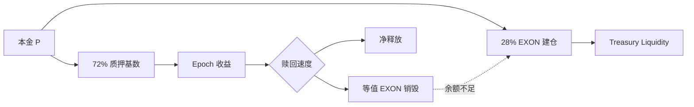

# 价值流转

定稿价值循环包含六个相连机制：

1. **程序化买入。** 每笔本金把 28% 用于 EXON 现货买入。
2. **期限锁定。** 期限越长，质押权重越高。
3. **燃料储备。** 开单前需持有订单额 28% 的 EXON；余额仍归用户。
4. **永久销毁。** 收益越快到账，销毁的等值 EXON 越多。
5. **二次买入。** 燃料不足时须先从现货买入，才能完成赎回销毁。
6. **复投入口。** 后续轮按披露的市价折扣发行，并于 T+1 开始释放。

这是供需机制，不是价格底线。程序化买入与销毁可能被释放、卖出、低流动性、市场环境或规则调整抵消。

*上一节：[完整演算案例](worked-examples.md) · 下一节：[治理](../06-governance/README.md)*
