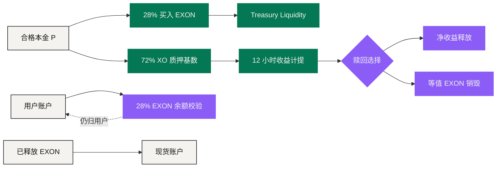

# 价值流转

NEXON 的经济里有好几条流，很容易被压成同一个故事。**把它们分开，是读懂这套机制的前提。**

本金拆分不是费用；用户余额校验不是 Treasury 托管；已计提的收益不是已到手的现金；销毁不是价格托底；产品闭环不是当前的代币流。

## 流 ①　合格本金 <a href="#flow-1-qualifying-principal" id="flow-1-qualifying-principal"></a>

<figure><figcaption>本金进来，先分两路：一路成为计息基数，一路成为 Treasury 里的 EXON</figcaption></figure>

```text
B = 0.28 × P   → EXON 现货买入 → Treasury Liquidity
S = 0.72 × P   → XO 质押与收益 / PV 基数
B + S = P
```

`B` 按实时 EXON 价格成交，所以**买到多少枚代币不由这个 U 金额单独决定**。`S` 成为 Staking Platform 内静态与动态奖励的记账基数。

## 流 ②　用户手上的燃料余额 <a href="#flow-2-the-fuel-balance-in-the-user-s-hands" id="flow-2-the-fuel-balance-in-the-user-s-hands"></a>

开单还额外要求：

```text
F = 0.28 × P 的 EXON 价值
```

`F` **留在用户账户里**。它是一次资格校验，账上要和 Treasury Liquidity 拥有的 `B` 分开记。EXON 价格变化时，满足同一个 U 价值所需的代币数量会变。余额不足时订单停下——不会自动卖掉另一种资产去补。

## 流 ③　时间与收益计提 <a href="#flow-3-time-and-reward-accrual" id="flow-3-time-and-reward-accrual"></a>

XO 质押基数进入选定的 30 / 90 / 180 / 360 / 540 天期限，权重依次为 1.00 / 1.10 / 1.20 / 1.35 / 1.50。平台每 12 小时算一次：

```text
Epoch Reward = (S × 200% × w) ÷ (365 × 2)
```

这是当前参数版本下的**记账流**。已计提或待领的收益，不应该被显示成已经赎回、已经可流通的样子。

## 流 ④　线性释放 <a href="#flow-4-linear-release" id="flow-4-linear-release"></a>

一份 EXON 额度 `A` 在 1,095 天、2,190 个 Epoch 内线性释放：

```text
D = A ÷ 1,095
R_epoch = A ÷ 2,190
```

释放出来的 EXON 进入现货账户，可以持有或交易。**释放扩大的是可交易的供应量**，它不保证在指导价或案例假设价上能成交。

## 流 ⑤　收益赎回与等值销毁 <a href="#flow-5-reward-redemption-and-equivalent-burn" id="flow-5-reward-redemption-and-equivalent-burn"></a>

对待领收益 `W`，用户选择释放速度：

| 选择 | 销毁率 `b` | 净额比例 | 经济动作 |
|---|---:|---:|---|
| T+0 | 30% | 70% | 立即净释放 + 等值 EXON 销毁 |
| 30D | 15% | 85% | 线性释放 + 等值 EXON 销毁 |
| 60D | 0% | 100% | 线性释放，无销毁 |

```text
Net  = W × (1 − b)
Burn = W × b
```

销毁是永久的。如果用户手上不够带销毁档位所需的 EXON，机制可能要求先做一笔现货买入。

## 流 ⑥　后续轮次参与 <a href="#flow-6-later-round-participation" id="flow-6-later-round-participation"></a>

后续轮次按已披露的折扣、相对当时市价发行，从 T+1 开始释放。轮次规模、折扣、上限与最终时间尚未公布，须逐轮公告。

**再投入是一次全新的参与决策，按新条款执行**，不是上一次结果的自动延续。

## 当前的经济闭环 <a href="#the-current-economic-loop" id="the-current-economic-loop"></a>



图上的箭头描述的是**资金和代币怎么走**，不是一个自我强化的循环。程序化买入与销毁，与释放供应、卖出、需求、流动性、费用同时作用，方向不一定相同。

## 长期的产品闭环 <a href="#the-long-term-product-loop" id="the-long-term-product-loop"></a>

更大的叙事叠加了另一条**用户体验闭环**：社交发现 → 钱包决策 → PayFi 成路 → 商城 / 卡使用 → 数据与关系在用户控制下回流。

EXON 未来的支付、费用或消费用途，只有在产品条款发布之后才接得上这条闭环；XO 未来的参与或生态权益，同样要等它自己的规则。**因此这条产品闭环应该独立于当前的资金与代币流来建模。**

## 对账时要能回答的七个问题 <a href="#seven-questions-reconciliation-must-answer" id="seven-questions-reconciliation-must-answer"></a>

任何一个时刻，一次审计都应该能答出来：

1. 谁持有这笔资产？
2. 哪本账记录了它？
3. 适用哪个参数版本？
4. 这个数值是报价，还是已结算？
5. 这笔收益是待领，还是已释放？
6. 需不需要销毁？
7. 现实那一段是已付款，还是已履约？

**有一个答不上来，这条路径就没有对完账。**

*上一节：[完整演算案例](worked-examples.md) · 下一节：[治理](../06-governance/README.md)*
