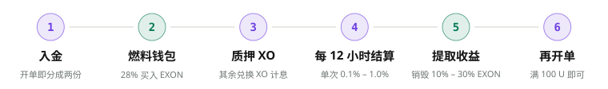
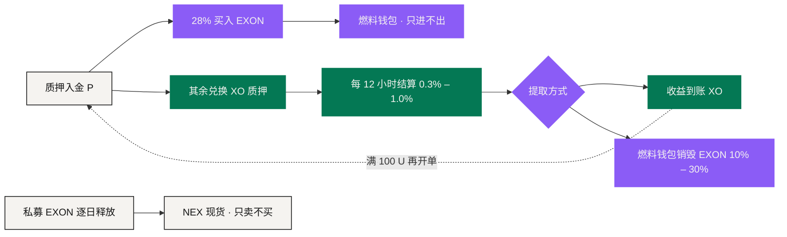
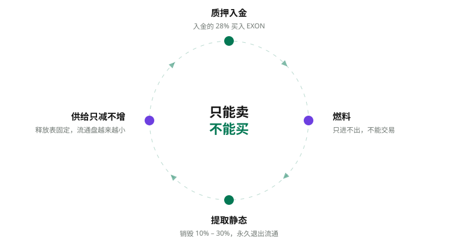

# 价值流转

NEXON 的经济里有好几条流。**把它们分开记账，是读懂这套机制的前提；把它们放到一起看，就是 EXON 的上涨引擎。**

<figure><figcaption>一笔入金的动线：从质押到销毁，再到下一单</figcaption></figure>

## 流 ①　入金拆分 <a href="#flow-1-the-deposit-split" id="flow-1-the-deposit-split"></a>

```text
燃料 = 0.28 × P   → 按当时 1 U 等值买入 EXON → 燃料钱包
质押 = 其余部分   → 兑换 XO → 质押，每 12 小时结算
```

入金 1,000 U：280 枚 EXON 进燃料钱包，其余兑换 XO 开始计息，一天 6 – 20 U。**每一笔入金都在买入。**

## 流 ②　燃料钱包 <a href="#flow-2-the-fuel-wallet" id="flow-2-the-fuel-wallet"></a>

燃料钱包只进不出：不能转出、不能交易，只能在提取收益时销毁。它与质押中的 XO 是两笔账——前者只能烧，后者计息并发放奖励。

## 流 ③　时间与结算 <a href="#flow-3-time-and-settlement" id="flow-3-time-and-settlement"></a>

XO 质押进入选定的 30 / 90 / 180 / 360 / 540 天期限，加成依次为基础 / +10% / +20% / +30% / +50%。每 12 小时结算一次：

```text
单次结算 = 质押金额 × (0.3% – 1.0%) × (1 + 加成)
```

收益以 XO 到账，随时可提取；到账满 100 U 就能再开一单——时间复利。

## 流 ④　线性释放 <a href="#flow-4-linear-release" id="flow-4-linear-release"></a>

私募的 EXON 从上线当日起 1,095 天、2,190 次逐日释放：

```text
D = A ÷ 1,095
R_epoch = A ÷ 2,190
```

释放出来的 EXON 进入现货账户，可以持有，也可以在 NEX 卖出——只能卖，不能买。整个私募每天固定释放 18.26 万枚。

## 流 ⑤　提取与销毁 <a href="#flow-5-withdrawal-and-burn" id="flow-5-withdrawal-and-burn"></a>

提取收益 `W`，选择到账方式：

| 到账方式 | 销毁比例 `b` | 经济动作 |
|---|---:|---|
| 立即到账 | 30% | 收益立即到账，燃料钱包销毁等值 30% 的 EXON |
| 30 天线性到账 | 20% | 30 天内逐日到账，销毁 20% |
| 60 天线性到账 | 10% | 60 天内逐日到账，销毁 10% |

```text
Burn = W × b ÷ P_EXON
```

销毁是永久的。**每一次提取都在销毁。**

## 流 ⑥　推广奖励与领导奖金 <a href="#flow-6-referral-rewards-and-leadership-bonuses" id="flow-6-referral-rewards-and-leadership-bonuses"></a>

推广奖励按下级每日静态产出计算，最多 20 代、合计 76%；领导奖金 V1 – V12 按等级极差发放。两者与静态收益同一个周期、一律以 XO 发放，提取时同样销毁 EXON。

## 汇成一个飞轮 <a href="#one-flywheel" id="one-flywheel"></a>



<figure><figcaption>买入不停，销毁不停，释放表固定，流通盘只会越来越小</figcaption></figure>

质押越多，买入越多；提取越多，烧得越多；释放表固定。质押总额到 5,000 万 U 起，一年烧掉的就超过一年释放出来的；到 1 亿 U，一天最多烧 60 万枚，是日释放的 3.3 倍。

## 长期的产品闭环 <a href="#the-long-term-product-loop" id="the-long-term-product-loop"></a>

更大的叙事叠加了另一条**用户体验闭环**：社交发现 → 钱包决策 → PayFi 成路 → 商城 / 卡使用 → 数据与关系在用户控制下回流。EXON 在交易、支付、兑换与手续费上的用途随这五个入口逐个接入（Roadmap），每接入一个，就多一条消耗 EXON 的路。

## 对账时要能回答的六个问题 <a href="#six-questions-reconciliation-must-answer" id="six-questions-reconciliation-must-answer"></a>

任何一个时刻，一次审计都应该能答出来：

1. 这笔资产是质押中的 XO，还是燃料钱包里的 EXON？
2. 适用哪个参数版本？
3. 这笔收益是待提取，还是已到账？
4. 选的是哪种到账方式，销毁了多少 EXON？
5. 这笔 EXON 是私募释放的，还是燃料钱包买入的？
6. 现实那一段是已付款，还是已履约？

*上一节：[完整演算案例](worked-examples.md) · 下一节：[治理](../06-governance/README.md)*
