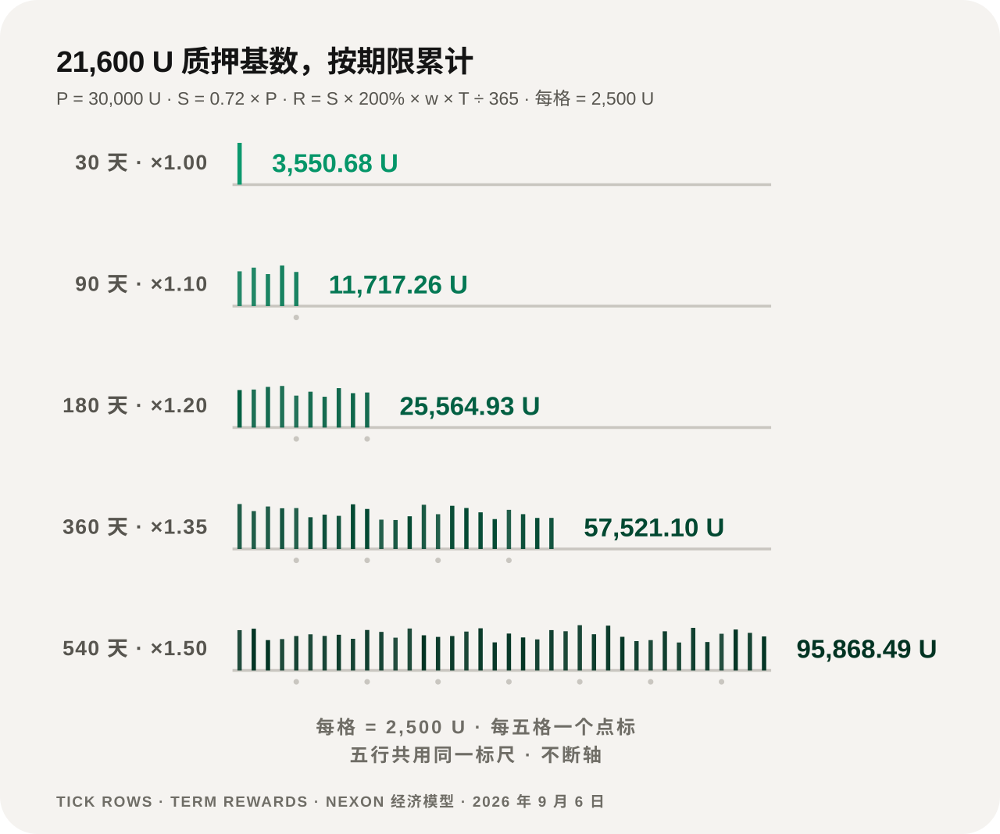
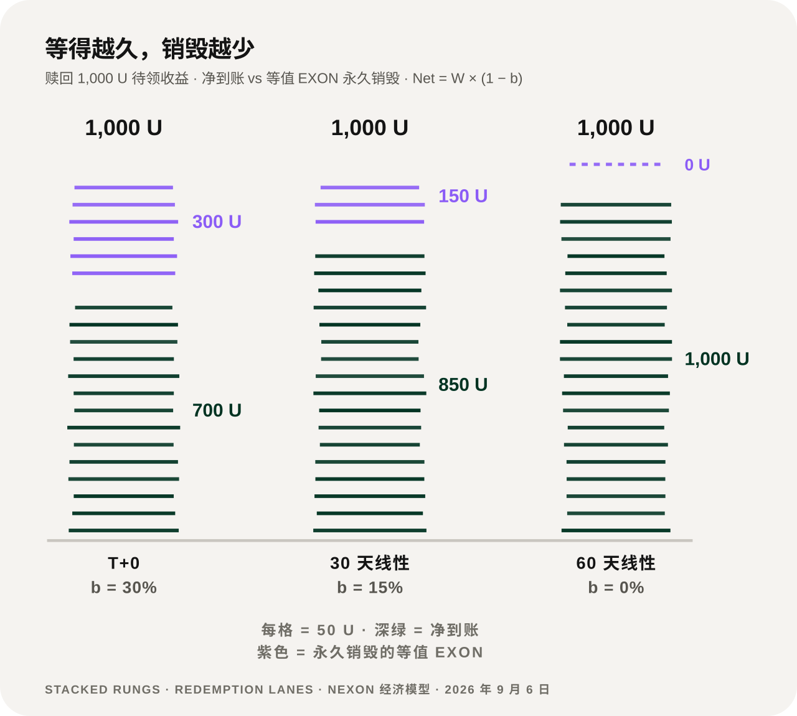

# 完整演算案例

下面三个案例来自定稿的经济模型。每一处结果都把它依赖的价格假设写在句子里。

## 案例 A —— 早期轮 EXON 的释放价值 <a href="#example-a-the-release-value-of-early-round-exon" id="example-a-the-release-value-of-early-round-exon"></a>

投入 `30,000 U`，按早期价 `0.1 U`，获得 `300,000 EXON`。

```text
D = 300,000 ÷ 1,095 = 273.97 EXON/天
R_epoch = 273.97 ÷ 2 = 136.99 EXON/Epoch
ROI_month = (D × P_market × 30) ÷ P_in × 100%
```

释放速度是固定的：**每天 273.97 枚，每 12 小时 136.99 枚。** 这部分不依赖任何假设。

依赖假设的是它值多少钱：

| 假设的市场价 | 每月释放价值 | 对应的月度 ROI 演算 |
|---:|---:|---:|
| 1.0 U | 8,219.18 U | 27.40% |
| 2.0 U | 16,438.36 U | 54.79% |

在 `2.0 U` 这个假设下，静态回本算术是 `30,000 ÷ 16,438.36 ≈ 1.83 个月`。


**这两行读的是同一条释放曲线，只是把它乘上了两个不同的假设价格。** 演算本身不包含流动性、滑点、手续费、税费和执行约束，也不预测价格会走到哪里。


## 案例 B —— 一笔 30,000 U 的质押订单 <a href="#example-b-a-30-000-u-staking-order" id="example-b-a-30-000-u-staking-order"></a>

对 `P = 30,000 U`：建仓 `B = 8,400 U`，质押基数 `S = 21,600 U`。若建仓价为 `0.1 U`，`B` 买到 `84,000 EXON`。

<figure><figcaption>同一个 21,600 U 的基数，期限不同，期限总收益参数相差 27 倍</figcaption></figure>

| 期限 | 权重 | 每天 | 每个 Epoch | 期限总计 |
|---:|---:|---:|---:|---:|
| 30 天 | 1.00 | 118.36 U | 59.18 U | 3,550.68 U |
| 90 天 | 1.10 | 130.19 U | 65.10 U | 11,717.26 U |
| 180 天 | 1.20 | 142.03 U | 71.01 U | 25,564.93 U |
| 360 天 | 1.35 | 159.78 U | 79.89 U | 57,521.10 U |
| 540 天 | 1.50 | 177.53 U | 88.77 U | 95,868.49 U |

**注意每天那一列**：从 118.36 到 177.53，只差 1.5 倍——那正是权重的差。期限总计之所以差 27 倍，主要来自时间，不是来自权重。

540 天的权重对应 **300% 的有效年化参数**。30 天期限提前退出，在 15% – 10% 的扣减之后，从 `21,600 U` 的本金基数返还 **18,360 – 19,440 U**。

## 案例 C —— 赎回 1,000 U 收益 <a href="#example-c-redeeming-1-000-u-of-rewards" id="example-c-redeeming-1-000-u-of-rewards"></a>

<figure><figcaption>三档的差别只有一个变量：愿意等多久</figcaption></figure>

| 选择 | 等值 EXON 永久销毁 | 净到账 |
|---|---:|---:|
| T+0 | 300 U | 700 U |
| 30 天线性 | 150 U | 850 U |
| 60 天线性 | 0 U | 1,000 U |

三档之间唯一变化的变量是**等待时间**。`Net = W × (1 − b)`，`Burn = W × b`。

*上一节：[质押与收益](staking-and-returns.md) · 下一节：[价值流转](value-flows.md)*
