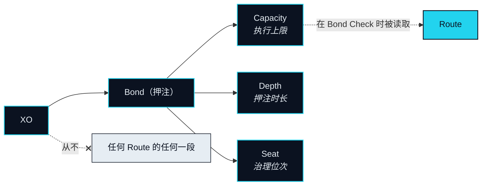

# XO —— 抵押品，不是燃料

> XO 从不参与任何一次具体的交易，它是那次交易能够发生的前提。

## 只押不花 

在一个 Agent 能替你动价值之前，网络需要一个答案：凭什么信它？NEXON 把这个答案放在一条账本上。你押住 XO，Bond 账本把它记下来，而你的 Agent 的上限——就从这条记录、且只从这条记录——推导出来。这份押注不是手续费，不是针对某笔具体购买的保证金，也不是一条 Route 会去扣减的余额。它是让 Route 得以被提出的那个持续存在的前提条件。

### XO 押在哪里 

起步阶段，XO 通过持牌数字资产交易所 NEX 内的一个托管型质押产品押住；位于 BNB Smart Chain（BSC）上的链上 Bond 账本是它迁移的目标协议记录（OP-31）。[信任与抵押](../03-architecture/trust-and-bonding.md)对两者都有描述。无论记录保存在哪里，规则都一样：XO 只押不花，而托管产品附带的任何收益都属于交易所——浮动、非承诺，且不是 XO 的属性。

一条 Route 执行期间，XO 不动。它不被送去任何交易场所，不被兑换成别的资产，不被任何一段消耗掉。这条 Route 在 Bond Check 时读一次 Bond 账本，然后继续或者不继续。这就是 XO 在任何一个具体 Intent 中的全部参与——也就是说，没有参与。

## 一份押注给你什么 

一份押注换来三样东西，本文后面每一次提到 XO，都能归到其中之一。



**Capacity（执行额度）** 是你的押注换来的、Agent 能替你执行的上限。它随押注的规模与其 Depth 上升，且不会因为一条 Route 跑过而下降。把押注与 Depth 映射到 Capacity 的那个函数对二者都是单调的——任何一项增加都不会产生更少的 Capacity。它的确切形式是一个待定项（[OP-07](../open-parameters/README.md)）。

一条 Route 被批准时，它所需的 Capacity 会在 Bond 账本上被标记为一笔 **Capacity Reservation（额度冻结）**，持续到这条 Route 结束，并在它到达「已落地」或「已退回」时释放。冻结是一个标记，不是一次转移：XO 待在原处。它的存在，是为了让两条 Route 不能同时倚靠同一份 Capacity。

如果一条 Route 无法被完全退回，首先由这条 Route 自己的托管来应对。此后是否、以及在多大范围内由支撑那笔冻结额度的 XO 来应对——即 Bond 追偿——是一个待定项（[OP-10](../open-parameters/README.md)）。


**Depth（沉淀）** 是一份押注已经存在了多久。它是网络表达「押得越久越有利」的方式——而「有利」指的正是位次：同样一份押注换来更多 Capacity，以及更早够得上一个席位。协议不为 Depth 支付任何东西。它排序，不支付。

只要押注还在，Depth 就持续累积。发起解押会启动一个冷却期，期间 Capacity 向零衰减（`Design Target`）。冷却期的长度，以及取消解押时已累积的 Depth 会怎样，是一个待定项（[OP-08](../open-parameters/README.md)）。


**Seat（席位）** 是你在治理与生态分层中的位次。当 Capacity 与 Depth 双双高于门槛时取得——单靠任何一项都不够——它也是网络中治理权重的唯一来源。席位门槛是一个待定项（[OP-09](../open-parameters/README.md)）。席位决定什么、怎么决定，是[治理](../06-governance/README.md)一章的内容。



一份押注还可能在早期参与轮中带来优先权。是否如此、以及依据什么条款，是一个待定项（[OP-23](../open-parameters/README.md)）；本文只陈述这种可能性，不再多说。

## 价值从哪里来 

XO 的价值来源是：网络需要多少信任抵押。每一个被替人执行的 Intent 都必须待在某个 Capacity 之下，而每一份 Capacity 都必须由一份押注来支撑。当越多的人让 Agent 替自己干活，就必须有越多的 Capacity 站在他们背后。因此 XO 与网络活跃度之间的联系，走的是位次这条路，而不是吞吐这条路：XO 之所以被需要，是因为它必须被押住，而不是因为它被使用。

最接近的类比是保证金与交易所席位——你把它放在那里以换取行动的资格，而它们本身什么也不做。用三个字说：拿得住。

## 生命周期 

1. **获取。** 取得 XO。总量、分配与解锁如何设定，是[分配与释放](distribution.md)一节的内容（OP-01 · OP-02 · OP-03）。
2. **押注。** 押住 XO——起步阶段经由托管产品，此后记入 Bond 账本；Capacity 由此推导；你的 Agent 被激活。
3. **逐条 Route 的冻结与释放。** 每条被批准的 Route 冻结它所需的 Capacity，并在关闭时释放。XO 不动。
4. **Depth 累积。** 押注的时间提升你的位次。
5. **席位门槛。** 当 Capacity 与 Depth 双双高于门槛时，登记一个席位。
6. **解押与冷却。** 解押启动冷却期；Capacity 衰减；期满后 XO 回到你的控制之下。

## XO 从不做什么 


**XO 不是支付代币，也不是 gas。** 它不进入任何一次支付。它不抵扣任何手续费——Rebate 是 EXON 的机制。它不承载任何 Redemption。它不为任何一段提供燃料。它被押住，然后被读取。


Bond 账本与 Settlement Rail 相遇的唯一一点是 Bond Check，而在那里 Bond 账本只被读取。结算轨上没有任何条目会写入一份押注。没有任何 Route 以 XO 结算。

Depth：为什么「越久越好」可以不承诺任何回报

「押得越久越有利」这句话是刻意的。Depth 是两样东西的输入：Capacity 函数（OP-07）与席位资格（OP-09）。两者都是位置——你相对于其他人、相对于门槛站在哪里——而不是支付。一份 Depth 更长的押注可以执行更多、可以参与治理；它并没有因为站得久而被支付任何东西。正是这个区分，让 XO 留在 Bond 账本上，也让它不出现在任何一句关于回报的话里。本文不为 Depth 支付任何东西，本文中也没有任何一句话应当被这样理解。


**本节口径。** 本节承诺：XO 只押不花；一份押注换来 Capacity、Depth 与 Seat，别无其他；XO 在 Bond Check 时被读取，不进入任何一段。本节不承诺：Capacity 函数、冷却期长度、席位门槛、Bond 追偿的范围，或任何总量、分配、解锁数字。待定项：[OP-01 · OP-02 · OP-03 · OP-07 · OP-08 · OP-09 · OP-10 · OP-23 · OP-31](../open-parameters/README.md)。


*主轴：[译者](../02-the-translator/README.md) · 下一节：[EXON —— 燃料与结算单位](exon.md)*
