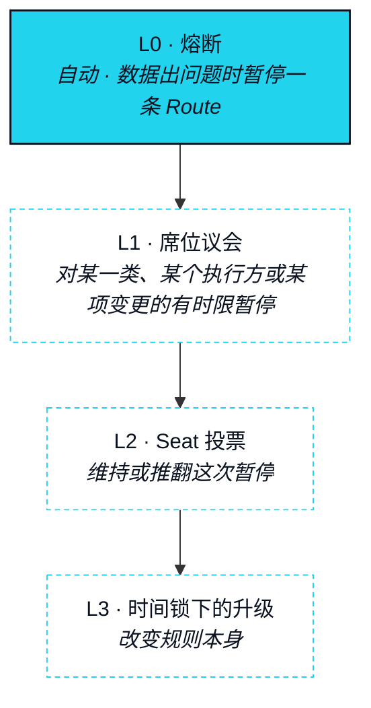

# 治理

> XO 只押不花——它是让你的 Agent 拿到额度、让你拿到投票权与位次的抵押品。

NEXON 的治理靠押注取得，不靠购买取得。做决定的位次来自 Bond 账本，别无其他来源——这意味着它的取得方式与 Agent 的 Capacity 完全相同：押上抵押品，并且让它留在那里。本节说明谁决定、决定什么、通过什么工具、按什么相对时间表。在这一切之前，它先说明今天的实情是什么。


**在本版本中，治理是被设计出来的，不是已经在跑的。** Seat 合约为 `In development`；下面的 Seat 投票与升级阶梯为 `Roadmap`。在 Seat 投票生效之前，治理未来将掌管的那些参数由 NEXON 团队设定，每一次变更都通过官方渠道公布，且每一个这样的参数都连同负责角色列在[待定参数汇总](../open-parameters/README.md)中。向 Seat 持有者的移交是路线图上的一个阶段（见[路线图](../09-roadmap/README.md)），本文没有把它描述为已经发生。


## 谁来决定 <a href="#who-decides" id="who-decides"></a>

### Seat 持有者 <a href="#seat-holders" id="seat-holders"></a>

**状态** · `In development`（合约）· `Roadmap`（投票）

当一个账户的 Capacity 与 Depth 双双达到门槛（[OP-09](../open-parameters/README.md)）时，即取得一个 **Seat（席位）**；单靠任何一项都不够。Seat 持有者是唯一的投票人，而席位是网络中治理权重的唯一来源。「信任与抵押」中的四级身份是通往它的路径：unbonded、bonded、deep、seat。没有任何一级身份是被授予、被购买或被任命的。EXON 不带来其中任何一级，无论花掉了多少。

### 席位议会 <a href="#the-seat-council" id="the-seat-council"></a>

**状态** · `Roadmap`

Seat 持有者从他们中间选出 **Seat Council（席位议会）**：一个只拥有一项有时限权力的小组——暂停。议会可以在全体 Seat 投票审议期间，把某一类 Route、某个 Leg Executor 或某项参数变更暂停一个固定的窗口。它不能修改参数、不能移动余额、也不能延长自己的窗口。它的组成与任期是一个待定项（[OP-20](../open-parameters/README.md)）。

## 决定什么 <a href="#what-is-decided" id="what-is-decided"></a>

治理作用于规则，从不作用于余额。四类决定在范围之内；除此之外没有别的。

| 决定类别 | 例子 | 工具 |
|---|---|---|
| 结算轨参数 | 各类型分段的 Burn Rate（[OP-13](../open-parameters/README.md)）、Rebate 规则（[OP-12](../open-parameters/README.md)）、费用分配（[OP-11](../open-parameters/README.md)） | Seat 投票 + 时间锁 |
| 数据来源 | 预言机提供方集合（[OP-16](../open-parameters/README.md)）、熔断阈值（[OP-17](../open-parameters/README.md)） | Seat 投票 + 时间锁 |
| 准入的分段与 Leg Executor | 哪些类型的分段可以运行，哪些交易场所、持牌方与供应商可以执行它们（[OP-15](../open-parameters/README.md)） | Seat 投票；议会可暂停 |
| 协议升级 | 对 Bond 账本、Route 托管或撤销登记合约的变更 | Seat 投票 + 最长的时间锁 |

不在范围之内的部分，和在范围之内的部分一样固定。治理不触碰任何账户的押注、任何 Route 的托管、任何持有者的额度冻结。它不设定任何奖励、价格或回报。它不能授予一个席位。

## 通过什么工具 <a href="#through-what-instrument" id="through-what-instrument"></a>



### 提案

**状态** · `Roadmap`

任何 Seat 持有者都可以在四类之一中发起提案。一份提案要写明参数、新的取值，以及它对未结束 Route 的影响，并从发起的那一刻起就是公开的。



### 讨论

**状态** · `Roadmap`

随后是一个固定的讨论期，期间提案可由其发起人修改，也可由任何人提出异议。这个时长为 `Design Target`（[OP-19](../open-parameters/README.md)）。



### Seat 投票

**状态** · `Roadmap`

Seat 持有者投票。权重依照 Bond 账本在投票开启时所记录的席位位次；在那一刻之后押注的部分不计入。投票期为 `Design Target`（[OP-19](../open-parameters/README.md)）。



### 时间锁

**状态** · `Roadmap`

通过的提案要等待。合约升级的锁最长，结算轨参数的锁最短，而在锁定期间席位议会可以暂停。各类锁的时长为 `Design Target`（[OP-19](../open-parameters/README.md)）。



### 执行

**状态** · `Roadmap`

变更生效。已经进入「已预留」的 Route 按批准时的参数运行；新的 Route 按新参数运行。



```mermaid
stateDiagram-v2
    [*] --> 已提出 : Seat 持有者发起
    已提出 --> 讨论中 : 讨论期开启
    讨论中 --> 投票中 : 讨论期结束
    讨论中 --> 已撤回 : 发起人撤回
    投票中 --> 锁定中 : 通过
    投票中 --> 已否决 : 未通过
    锁定中 --> 已暂停 : 席位议会暂停
    已暂停 --> 锁定中 : 暂停窗口结束 · 投票维持原议
    已暂停 --> 已否决 : 投票推翻
    锁定中 --> 已执行 : 时间锁结束
    已执行 --> [*]
    已否决 --> [*]
    已撤回 --> [*]
    %% NEXON palette v0 · placeholder until VI locks
    classDef navy  fill:#0B1220,stroke:#22D3EE,stroke-width:1.5px,color:#E6EDF3
    classDef cyan  fill:#22D3EE,stroke:#0B1220,stroke-width:1.5px,color:#0B1220
    classDef light fill:#E6EDF3,stroke:#0B1220,stroke-width:1px,color:#0B1220
    classDef ghost fill:#FFFFFF,stroke:#22D3EE,stroke-width:1px,stroke-dasharray:4 3,color:#0B1220
    class 已提出,讨论中,投票中,锁定中 navy
    class 已执行 cyan
    class 已暂停,已否决,已撤回 light
```

## 升级阶梯 <a href="#the-escalation-ladder" id="the-escalation-ladder"></a>

四级，每一级都比下一级更慢、更宽。一个问题沿着阶梯往上走；它绝不会掉在两级之间。



| 级别 | 谁来行动 | 权力 | 状态 |
|---|---|---|---|
| L0 | 数据与预言机中的熔断 | 在数据过期、偏离、不可达或伪造时暂停单条 Route | `In development` |
| L1 | 席位议会 | 在一个固定窗口内暂停某一类 Route、某个 Leg Executor 或某项待生效的变更 | `Roadmap` |
| L2 | Seat 投票 | 维持或推翻一次 L1 暂停；裁定有争议的「部分退回」Route | `Roadmap` |
| L3 | 最长时间锁下的 Seat 投票 | 升级某个协议合约 | `Roadmap` |

渐进去中心化，就是决定权沿着这道阶梯往上、并从团队手里移出去的过程。它按阶段排期，不按日期排期，而它的完成就是路线图最后一个阶段的收尾事件。

<details>

<summary>为什么治理靠押注，而不靠花费投票</summary>

一个用花费换选票的网络，会把自己的规则交给那一周跑了最多 Route 的人，并诱使每一个执行方为了影响力而选路，而不是为了持有者选路。一个可以买卖选票的网络，会把规则交给最早离场的人。押注两者都不会。位次来自被长期持有的抵押品——同一份抵押品支撑着 Agent 的 Capacity，也在有限的追偿中为一条无法退回的 Route 负责。决定规则的人，就是在这些规则之下有东西可能损失的人，而他们不能不经过那个先让位次衰减的冷却期就一走了之。这就是全部论证，它和「双币，两份工作」是同一个论证。

</details>


**本节口径。** 本节承诺：席位位次是治理权重的唯一来源；四类决定只作用于规则、从不作用于余额；一套五步、带时间锁的工具；一道四级阶梯；以及「本版本中治理尚未运行」这一陈述。本节不承诺：任何时长、门槛或议会组成，也不承诺移交的任何日期。待定项：[OP-09 · OP-19 · OP-20](../open-parameters/README.md)。


*主轴：[译者](../02-the-translator/README.md) · 下一节：[安全与风险](../07-security-and-risk/README.md)*
