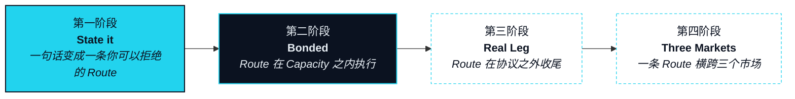

# 路线图

> 我们不会把路线图上的东西说成已经上线的。

这份路线图的顺序，就是五步的顺序。一条 Route（路径），在能被说出、能被拒绝之前，谈不上放心交给它执行；在它的数字腿能在 Bond（押注）之下执行之前，落不进现实世界；在 Real Leg（现实腿）对一个市场跑通之前，横跨不了三个市场。每个阶段都以它让什么成真来命名，并由一个团队之外的人也能核验的事件来收尾——不是日期，也不是一纸公告。

当本页与某项能力所在章节说法不一时，以本页为准，该章节在下一版发布时修正（OP-29）。

## 四个阶段 



### Phase 1 · State it（说出来） 

**状态** · `In development`

一句话变成一个 Intent（意图），一个 Intent 变成一条你看得见、也拒得掉的 Route。这一阶段交付 Circle（圈层）、Intent 捕获与 Route 预览——每一段腿、它的报价、它的有效期，在任何东西动起来之前先摆在你面前。

**完成的标志：** 在 Circle 里敲下的一句话返回一份 Route 预览，每一段腿都有报价、有期限；拒绝它之后，任何地方都没有任何改变。



### Phase 2 · Bonded（押住） 

**状态** · `In development`

抵押之下的执行。这一阶段交付 Bond、Capacity（执行额度）与 Seat（席位）合约，以及 Rebate（抵扣）。它同时交付数字资产腿的执行：EXON 先进入托管（escrow），再逐腿消耗。上线初期，Bond 记录以托管形式存在于 NEX 之内；链上合约是这一阶段的交付物（OP-31）。

**完成的标志：** 一条 Route 只在已押注 XO 的 Capacity 之内被提出。一段数字资产腿从 EXON 托管中执行，它的 Burn Rate（消耗）在链上被消耗掉。一段失败的腿产生一条 Rollback（回滚）记录。一笔 Rebate 被退回，且任何人都能验证。



### Phase 3 · Real Leg（现实腿） 

**状态** · `Roadmap`

一条 Route 在协议之外收尾。这一阶段先交付商城，以及带争议窗口的 Landing Receipt（落地凭证）（`In development`）；再交付经持牌发卡机构的稳定币卡接入，以及经已接入供应商的旅行兑换（`Roadmap`）；四者全部落地，这一阶段才算关闭。

**完成的标志：** 一条 Route 以协议之外的 Leg Executor（腿执行方）出具的 Landing Receipt 关闭，且一次 Land（落地）步骤经由持牌发卡机构交付了一笔卡额度。



### Phase 4 · Three Markets（三个市场） 

**状态** · `Roadmap`

一条 Route 横跨全部三个市场。这一阶段交付由持牌第三方执行的股权挂钩结算——NEXON 不经纪证券——连同 Foresight（前瞻）、Patience（耐心）、完整的 Seat 治理，以及把 Settlement Rail（结算轨）参数逐步移交给 Seat 持有者。

**完成的标志：** 单独一条 Route 结算了一段经持牌第三方的资本市场腿、一段数字资产腿和一段 Real Leg，且所用的 Settlement Rail 参数由 Seat 投票设定、经时间锁执行。



## 各阶段能力 

| 能力 | 阶段 | 状态 |
|---|---|---|
| Circle · Intent 捕获 · Route 预览 | 1 · State it | `In development` |
| Bond · Capacity · Seat 合约 | 2 · Bonded | `In development` |
| 数字资产腿执行 | 2 · Bonded | `In development` |
| Rebate | 2 · Bonded | `In development` |
| 商城 · Landing Receipt | 3 · Real Leg | `In development` |
| 稳定币卡接入 | 3 · Real Leg | `Roadmap` |
| 旅行兑换 | 3 · Real Leg | `Roadmap` |
| 股权挂钩结算（持牌第三方） | 4 · Three Markets | `Roadmap` |
| Foresight · Patience | 4 · Three Markets | `Roadmap` |
| 完整的 Seat 治理 · 渐进去中心化 | 4 · Three Markets | `Roadmap` |


**没有日期。没有交易所名。** 这份路线图只排顺序，不排时间：没有任何阶段带日期，也不会在收尾事件发生之前给出任何日期。本文此处及任何地方都不点名交易所；时间与场所如果存在，只来自官方渠道，别处一概不算。任何与此相反的流传说法，都不是 NEXON 发出的。



**本节口径。** 本节承诺：按此顺序的四个阶段，每一个都有可验证的收尾事件，以及上表徽章即各项能力的 v1 状态。本节不承诺：任何日期、任何交易所、任何合作方或场所，以及任何能力在其收尾事件之前被说成已交付。待定项：[OP-15 · OP-24 · OP-25 · OP-29](../open-parameters/README.md)。


*主轴：[译者](../02-the-translator/README.md) · 下一节：[术语表](../glossary/README.md)*

*把你想要的，变成已经结算的。*
