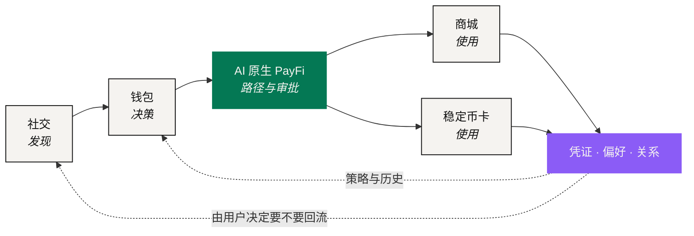

# NEXON 白皮书

> **From Capital to Token. From Digital to Real.**

券商账户里的一笔仓位、钱包里的一枚代币、一次跨境的真实支付，都是价值。但它们从来没有在同一本账上出现过。今天，把第一样东西变成第三样，仍然要经过四个系统、四次身份验证和一个星期——每一步都有一个人在手动把一种价值语言翻译成另一种。

**NEXON = NEX（Nexus，连接）+ ON（开启、在线）。** 这个名字说的就是要解决的事：把那场翻译从人的手里接过来，做成一层可以看见、可以授权、可以追责的产品。

具体到产品，NEXON 是一个**超级金融社交综合体**：AI 原生 PayFi、钱包、商城、稳定币卡与去中心化社交，五个入口共用一套账户与一组双资产。把它们串起来的，是一层**读得懂意图、但动不了资产**的 AI 编排——你陈述结果与边界，它交还一条写明金额、去向、执行方与有效期的路径，由你决定走不走。

要理解它为什么必须这样设计，得先看清三个市场之间到底断在哪里。

## 三个市场，三种语言 

| 市场 | 价值在这里意味着 | 节拍 | 边界 |
|---|---|---|---|
| 资本市场 | 所有权，以及对未来现金流的一份权利 | 季度节奏 · T+2 结算 · 有交易时段 | 到司法辖区为止 |
| 数字金融 | 流动性与可组合性 | 7×24 · 秒级最终性 | 无国界，但几乎碰不到现实资产 |
| 真实消费 | 使用某样东西的权利 | 某个时间、某个地点、能用 | 到供应商的库存为止 |

三种定义，三种时钟，三种边界。没有一种是错的，也没有一种能被另外两种读懂。市场之所以断裂，不是因为没人修桥——桥、稳定币支付、资产代币化都在，而且都解决了真问题。缺的是一种能把「连接」这件事表达出来的共同语言。

**NEXON 要做的就是这层语言。**

## 一个生态，两种资产 



### XO —— 价值锚 

承载质押、参与与长期价值沉淀。

在当前机制里，XO 是质押与奖励层内的**质押本金代币**：质押入金兑换为 XO 即开始计息，每 12 小时结算一次，静态收益、推广奖励、领导奖金一律以 XO 发放。



### EXON —— 流通引擎 

连接交易、支付、兑换与消费。

在当前机制里，EXON 是 NEXON 的**核心价值代币**：私募 0.1 U 是唯一获取渠道，上线 1.0 U，只能卖不能买；入金的 28% 买入存入燃料钱包，提取收益时销毁。



一句话：**NEXON 是生态，XO 承载价值，EXON 驱动流通。**

## 当前已经跑起来的经济基础 

统一账户下有两个各管各的运营层。**NEX 交易所**是现货层：XO 自由交易，EXON 只挂卖单、不挂买单，上线当日起呈现每日释放；**Staking Platform** 负责 XO 质押、每 12 小时结算、期限加成、推广奖励、领导奖金与收益提取。两边共享账户体系和资金后台，但账本、权限与披露各自独立。

一笔质押入金开单即分成两份：

<figure><figcaption>入金 1,000 U：280 枚 EXON 进燃料钱包，其余兑换 XO 开始计息</figcaption></figure>

<table><thead><tr><th width="140">参数</th><th width="220">数值</th><th>说明</th></tr></thead><tbody><tr><td>入金拆分</td><td>28% 燃料 · 其余兑换 XO</td><td>28% 按当时 1 U 等值买入 EXON 存入燃料钱包，只能销毁；其余兑换 XO 进入质押</td></tr><tr><td>静态结算</td><td>每 12 小时 0.3% – 1.0%</td><td>北京时间 08:00 / 20:00，质押 1,000 U 一天 6 – 20 U，收益以 XO 到账</td></tr><tr><td>期限加成</td><td>基础 / +10% / +20% / +30% / +50%</td><td>30 / 90 / 180 / 360 / 540 天，只看期限不看金额；30 天档第 31 天退出窗口</td></tr><tr><td>提取与销毁</td><td>30% / 20% / 10%</td><td>立即 / 30 天 / 60 天到账，从燃料钱包销毁等值 EXON，永久退出流通</td></tr><tr><td>私募与上线</td><td><code>0.1 U → 1.0 U</code></td><td>三档 1,000 / 5,000 / 10,000 U 共 11,500 份，2 亿枚；认购与质押 3:1 配置；只能卖不能买</td></tr><tr><td>线性释放</td><td>1,095 天 · 2,190 次</td><td>上线当日起逐日释放，<code>D = A ÷ 1,095</code></td></tr><tr><td>动态奖励</td><td>20 代 76% · V1 – V12</td><td>按下级每日静态产出计算，等级极差发放，一律以 XO 结算，提取同样销毁</td></tr></tbody></table>

这套机制是当前的经济基线。更大的产品叙事覆盖在它上面，但不改写它的任何一个数字。

## 长期方向：超级金融社交综合体 

五个产品面组成一个闭环：**社交发现 → 钱包决策 → PayFi 路径 → 商城 / 卡消费 → 数据与关系回流**。AI 原生 PayFi 是这条叙事的第二重点，因为它最直接地把一句「我想干什么」翻译成一条可校验、可审批、可执行、可出具凭证的路径。

## 从哪里开始读 

<table data-view="cards"><thead><tr><th></th><th></th><th data-hidden data-card-target data-type="content-ref"></th></tr></thead><tbody><tr><td><strong>先看问题</strong></td><td>三个市场为什么至今仍彼此割裂，以及桥、稳定币支付和代币化各自漏掉了什么。</td><td><a href="01-the-split/README.md">README.md</a></td></tr><tr><td><strong>先看命题</strong></td><td>意图 → 路径 → 策略校验 → 用户审批 → 执行 → 凭证：六段控制路径怎么替代人工翻译。</td><td><a href="02-the-translator/README.md">README.md</a></td></tr><tr><td><strong>先看数字</strong></td><td>每 12 小时 0.3% – 1.0%、期限加成、私募 0.1 U 上线 1.0 U、1,095 天释放、提取销毁与完整演算案例。</td><td><a href="05-tokenomics/README.md">README.md</a></td></tr></tbody></table>

想直接看钱怎么算的，跳到[完整演算案例](05-tokenomics/worked-examples.md)。想知道每个产品由谁负责、失败了找谁，跳到[协议架构](03-architecture/README.md)。

NEXON 是 NEX 交易所的第一个明星项目。

*本文的经济参数与演算取自 2026 年 9 月 10 日定稿的现行机制；法律与风险边界见[法律声明](legal-disclaimer/README.md)。*
