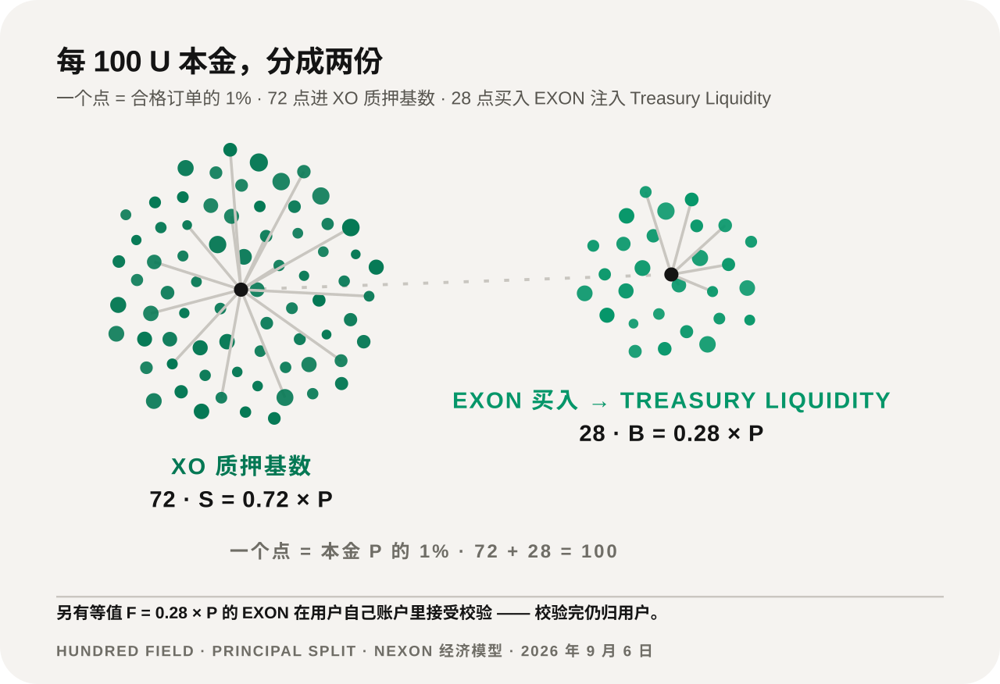
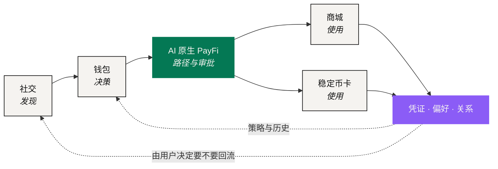

# NEXON 白皮书

> **From Capital to Token. From Digital to Real.**

券商账户里的一笔仓位、钱包里的一枚代币、十月东京的四晚酒店，都是价值。但它们从来没有在同一本账上出现过。今天，把第一样东西变成第三样，仍然要经过四个系统、四次身份验证和一个星期——每一步都有一个人在手动把一种价值语言翻译成另一种。

**NEXON = NEX（Nexus，连接）+ ON（开启、在线）。** 这个名字说的就是要解决的事：把那场翻译从人的手里接过来，做成一层可以看见、可以授权、可以追责的产品。

## 三个市场，三种语言 

| 市场 | 价值在这里意味着 | 节拍 | 边界 |
|---|---|---|---|
| 资本市场 | 所有权，以及对未来现金流的一份权利 | 季度节奏 · T+2 结算 · 有交易时段 | 到司法辖区为止 |
| 数字金融 | 流动性与可组合性 | 7×24 · 秒级最终性 | 无国界，但几乎碰不到现实资产 |
| 真实消费 | 使用某样东西的权利 | 某个时间、某个地点、能用 | 到供应商的库存为止 |

三种定义，三种时钟，三种边界。没有一种是错的，也没有一种能被另外两种读懂。市场之所以断裂，不是因为没人修桥——桥、稳定币支付、资产代币化都在，而且都解决了真问题。缺的是一种能把「连接」这件事表达出来的共同语言。

**NEXON 要做的就是这层语言。**

## 一个生态，两种资产 



### XO —— 价值锚 

承载质押、参与与长期价值沉淀。

在当前机制里，XO 是 Staking Platform 内以 U 计价的**质押本金代币**：每一笔合格订单的 72% 落在这里，成为静态收益与动态奖励的计息基数。



### EXON —— 流通引擎 

连接交易、支付、兑换与消费。

在当前机制里，EXON 是 NEXON 的**核心价值代币**与现货标的：承接程序化买入、余额校验、线性释放与赎回销毁。



一句话：**NEXON 是生态，XO 承载价值，EXON 驱动流通。**

## 当前已经跑起来的经济基础 

统一账户下有两个各管各的运营层。**NEX Main Exchange / CEX** 负责 EXON 现货、IEO 与释放呈现；**Staking Platform** 负责单币质押、期限权重、动态奖励与赎回。两边共享账户体系和资金后台，但账本、权限与披露各自独立。

一笔合格订单按 7228 拆开：

<figure><figcaption>7228：本金的 72% 建立 XO 质押基数，28% 按实时价买入 EXON 注入 Treasury Liquidity</figcaption></figure>

<table><thead><tr><th width="140">参数</th><th width="200">数值</th><th>说明</th></tr></thead><tbody><tr><td>资金拆分</td><td><code>S = 0.72 × P</code> · <code>B = 0.28 × P</code></td><td>S 是计息基数，B 买入 EXON 进 Treasury Liquidity</td></tr><tr><td>燃料校验</td><td><code>F = 0.28 × P</code></td><td>只校验用户账户里的 EXON 余额，不划走、不收费、不销毁</td></tr><tr><td>基础年化</td><td>200%</td><td>乘以期限权重 1.00 / 1.10 / 1.20 / 1.35 / 1.50</td></tr><tr><td>结算周期</td><td>12 小时</td><td>每天两个 Epoch，静态与动态奖励同周期结算</td></tr><tr><td>线性释放</td><td>1,095 天 · 2,190 次</td><td><code>D = A ÷ 1,095</code>，<code>R_epoch = A ÷ 2,190</code></td></tr><tr><td>赎回三档</td><td>T+0 / 30D / 60D</td><td>等值 EXON 永久销毁 30% / 15% / 0%，净到账 70% / 85% / 100%</td></tr></tbody></table>

这套机制是当前的经济基线。更大的产品叙事覆盖在它上面，但不改写它的任何一个数字。

## 长期方向：超级金融社交综合体 

五个产品面组成一个闭环：**社交发现 → 钱包决策 → PayFi 路径 → 商城 / 卡消费 → 数据与关系回流**。AI 原生 PayFi 是这条叙事的第二重点，因为它最直接地把一句「我想干什么」翻译成一条可校验、可审批、可执行、可出具凭证的路径。

## 从哪里开始读 

<table data-view="cards"><thead><tr><th></th><th></th><th data-hidden data-card-target data-type="content-ref"></th></tr></thead><tbody><tr><td><strong>先看问题</strong></td><td>三个市场为什么至今仍彼此割裂，以及桥、稳定币支付和代币化各自漏掉了什么。</td><td><a href="01-the-split/README.md">README.md</a></td></tr><tr><td><strong>先看命题</strong></td><td>意图 → 路径 → 策略校验 → 用户审批 → 执行 → 凭证：六段控制路径怎么替代人工翻译。</td><td><a href="02-the-translator/README.md">README.md</a></td></tr><tr><td><strong>先看数字</strong></td><td>7228、200% 基础年化、期限权重、1,095 天释放、赎回销毁与完整演算案例。</td><td><a href="05-tokenomics/README.md">README.md</a></td></tr></tbody></table>

想直接看钱怎么算的，跳到[完整演算案例](05-tokenomics/worked-examples.md)。想知道每个产品由谁负责、失败了找谁，跳到[协议架构](03-architecture/README.md)。

NEXON 是基于 NEX 生态、由社区发起的独立项目，不是 NEX 官方产品。

*本文的经济参数与演算取自项目方 2026 年 9 月 6 日定稿的 Tokenomics。所有收益演算都写明了它所依赖的价格假设；完整的法律与风险说明见[法律声明](legal-disclaimer/README.md)。*
