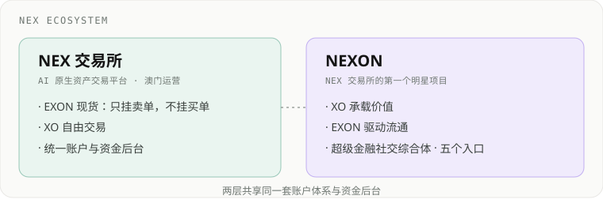
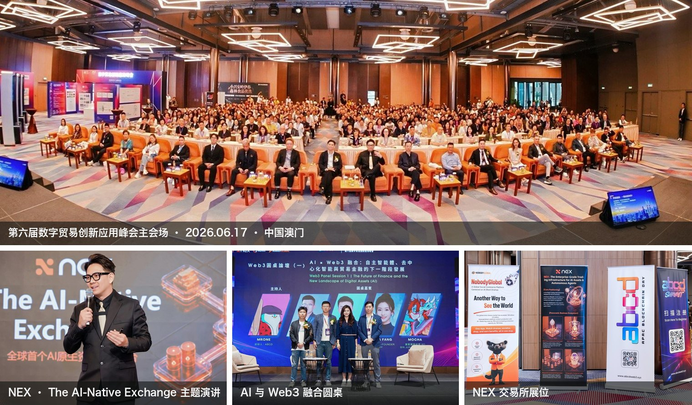
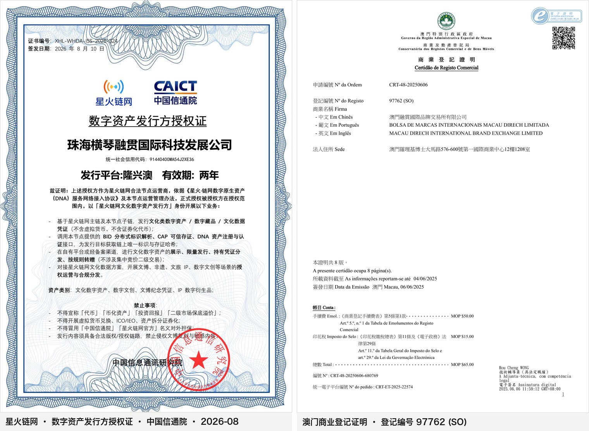
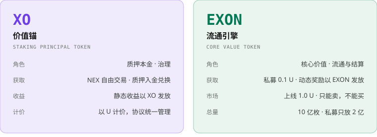
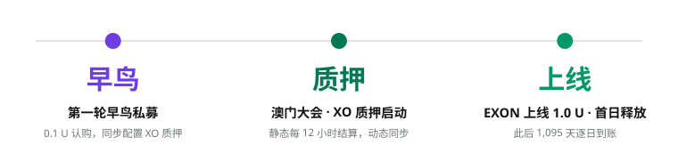

# 一页读懂 NEXON


**9/15 第一轮 EXON 私募开始。** 认购价 0.1 U，上线价 1.0 U，10 倍开盘；质押 XO 每 12 小时结算一次，一天两次；EXON 只能卖、不能买，提取一次烧一次。全文计价单位 **U**，锚定稳定币 USDT。


## 一、NEX 交易所的第一个明星项目 

NEX 是 AI 原生资产交易平台，在澳门运营，七大全球战略据点各司其职：中国澳门是亚太运营与合规行政中心，中国大陆承接内地业务，澳大利亚承担全球资本市场，马来西亚落地国家级 AI 算力，迪拜对接海湾资本，非洲布局新兴市场，欧美设立外汇清算与衍生品据点。

一个交易所，两层结构：现货层完成 XO 与 EXON 的交易，质押平台承载 NEXON 的收益模型，两层共用同一套账户与资金后台，一次开户、两层切换。

### 峰会：NEX 联合主办 

2026 年 6 月 17–18 日，中国澳门。第六届数字贸易创新应用峰会由 abcd Summit（APAC Blockchain Day）与澳门质量品牌国际认证联盟联合举办，NEX 作为联合主办方登台，400 余人到场。

### 核心团队 

NEX 核心团队，峰会主舞台合影：

|  | 职务 |
| :-- | :-- |
| 拿督 Winsman | 联合创办人 · 首席执行官 CEO |
| 拿督 Joseph | 联合创办人 · 首席运营官 COO |
| Nick | 首席市场总监 CMO |
| Batter | 全球商学院院长 |
| Robart | 欧美市场拓展总监 |

### 两个奖项，两位政要同台 

澳门质量品牌国际认证联盟（MQBICL）向 NEXON 颁发「最具创新潜力奖」与「年度最佳设计奖」；澳门立法会议员何敬麟、伊春市人民政府副市长高见同场发表演讲。

### 牌照与登记 

四项资质，横跨中国内地、澳门、美国与迪拜：

| 资质 / 登记 | 颁发或登记机关 | 状态 |
| :-- | :-- | --: |
| 数字资产发行方授权证（星火链网） | 中国信息通信研究院（CAICT） | 2026-08 签发 · 有效期两年 |
| 商业登记（注册编号 97762） | 澳门融贯国际品牌交易所有限公司 | 已完成 |
| MSB 货币服务业务牌照 | 美国金融犯罪执法局（FinCEN） | 已获得 |
| 虚拟资产合规服务商资质对接 | 阿联酋迪拜虚拟资产监管局（VARA） | 推进中 |

**NEXON 是 NEX 交易所的第一个明星项目**，依托 NEX 的账户体系、现货市场与生态资源上线。交易所、牌照、团队都已到位。架在这之上的，是一套让钱替你工作、让供给只减不增的经济机制：质押 XO 拿**时间复利**，私募 EXON 拿 10 倍开盘，每一次提取都在销毁，推着 EXON **单边上涨**。

## 二、NEXON 是生态，XO 承载价值，EXON 驱动流通 

|  | XO · 价值锚 | EXON · 流通引擎 |
| :-- | :-- | :-- |
| 角色 | 质押本金代币；治理是它的功能之一 | 核心价值代币；全生态的流通与结算通证 |
| 获取 | NEX 二级市场自由交易；质押入金即兑换 | 私募认购 0.1 U；做动态，奖励以 EXON 发放 |
| 市场 | NEX 自由买卖 | 上线 1.0 U；只挂卖单，不挂买单 |
| 在机制里 | 静态收益以 XO 发放 | 动态奖励以 EXON 发放；入金的 28% 买入存为燃料，提取静态时销毁；V3 起以 EXON 兑换贡献值 |
| 总量 | 10 亿枚 | 10 亿枚，私募只放 2 亿枚 |

产品侧，NEXON 是一个**超级金融社交综合体**：AI 原生 PayFi 已上线；钱包、商城、去中心化社交处于开发中期；U 卡列入规划。五个入口共用一套账户与这组双资产 —— 今天就在运转的是质押燃料、提取销毁、NEX 现货与 PayFi 结算；随入口开放的是交易、支付与兑换。每一次流通，都走 EXON。

## 三、一笔入金，两条收益线 

以入金 10,000 U 为例，开单即分成两份，系统自动完成：

- **28% 买入 EXON。** 按当时 1 U 等值买入 2,800 枚，存为燃料。燃料只进不出：不能提现、不能转出，只能在提取静态收益时销毁。
- **其余兑换 XO，进入质押。** 每 12 小时结算一次，一天 40 – 120 U，静态收益以 XO 到账，随时可提取。

两条线同时开跑：质押那条线每 12 小时到账一次 XO；燃料那条线在每一次提取时销毁 EXON。质押越多，买入越多；提取越多，烧得越多。

## 四、时间复利：每 12 小时结算一次 

单次 0.2% – 0.6%，每 12 小时结算一次，一天两次。**质押 10,000 U，一天 40 – 120 U。**

期限越长，加成越高，只看期限、不看金额。540 天档一律 +50%，质押 10,000 U 一天 60 – 180 U：

| 期限 | 加成 | 质押 10,000 U · 每天 | 质押 10,000 U · 每月 |
| :-- | --: | --: | --: |
| 30 天 | 基础 | 40 – 120 U | 1,200 – 3,600 U |
| 90 天 | +10% | 44 – 132 U | 1,320 – 3,960 U |
| 180 天 | +20% | 48 – 144 U | 1,440 – 4,320 U |
| 360 天 | +30% | 52 – 156 U | 1,560 – 4,680 U |
| 540 天 | +50% | 60 – 180 U | 1,800 – 5,400 U |

静态收益以 XO 到账，随时可提取；到账即可复投，本金越滚越大 —— 时间站在质押者这一边。

退出方式，你来选：

- **30 天档**：期满可取回本金加 30 天收益，不收违约金。不取回则自动续期，90 → 180 → 360 → 540 天逐级往上。
- **540 天档**：一步到位，加成 +50% —— 五档里加成最高，期满本金与收益一并取回。
- 最低开单 100 U。

### 质押 10,000 U，期满拿多少 

只算原订单的收益：

| 期限 | 期限加成 | 加成后每天产出 | 期满累计收益 | 期满本金 + 收益 | 为本金的倍数 |
| :-- | --: | --: | --: | --: | --: |
| 30 天 | 无 | 40 – 120 U | 1,200 – 3,600 U | 11,200 – 13,600 U | 1.1 – 1.4 倍 |
| 90 天 | +10% | 44 – 132 U | 3,960 – 11,880 U | 13,960 – 21,880 U | 1.4 – 2.2 倍 |
| 360 天 | +30% | 52 – 156 U | 18,720 – 56,160 U | 28,720 – 66,160 U | 2.9 – 6.6 倍 |
| 540 天 | +50% | 60 – 180 U | 32,400 – 97,200 U | 42,400 – 107,200 U | 4.2 – 10.7 倍 |

### 复投复利，越滚越快 

收益到账即复投：复投订单沿用原订单的期限加成，同样每 12 小时结算，复投的收益继续复投，一直算到原订单期满。期满总额 = 本金 + 原订单收益 + 复投收益。按单次 0.2% 计：

| 期限 | 原订单收益 | 复投收益 | 期满本金 + 总收益 | 为本金的倍数 | 对比：只算原订单 |
| :-- | --: | --: | --: | --: | --: |
| 30 天 | 1,200 U | 68.2 U | **11,268 U** | **1.1 倍** | 1.1 倍 |
| 90 天 | 3,960 U | 871 U | **14,831 U** | **1.5 倍** | 1.4 倍 |
| 360 天 | 18,720 U | 35,945 U | **64,665 U** | **6.5 倍** | 2.9 倍 |
| 540 天 | 32,400 U | 211,006 U | **253,406 U** | **25.3 倍** | 4.2 倍 |

期限越长，滚得越多：540 天档期满 **253,406 U，是本金的 25.3 倍**；只算原订单是 4.2 倍。

## 五、收益推演：0.1 U 认购，1.0 U 开盘 

EXON 总量 10 亿枚，私募只放 2 亿枚，占总量 20%，限额 11,500 份，售完即止。认购与质押按 3:1 配置：**认购拿释放，质押拿结算，两条收益线同时开跑。**

| 认购档位 | 配置 XO 质押 | 合计投入 | 获得 EXON | 每日释放 | 按 1.0 U 计 · 每月 | 限额 |
| :-- | --: | --: | --: | --: | --: | --: |
| 1,000 U | 333 U | 1,333 U | 10,000 枚 | 9.13 枚 | 273.97 U | 10,000 份 |
| 5,000 U | 1,666 U | 6,666 U | 50,000 枚 | 45.66 枚 | 1,369.86 U | 1,000 份 |
| 10,000 U | 3,333 U | 13,333 U | 100,000 枚 | 91.32 枚 | 2,739.73 U | 500 份 |
| **合计** |  |  | **2 亿枚** |  |  | **11,500 份** |

EXON 上线当日起 1,095 天逐日释放，每 12 小时到账一次，共 2,190 次。每一天都在到账，到账即可在 NEX 卖出。

**认购 30,000 U → 300,000 枚 EXON → 每日 273.97 枚。** 按 1.0 U 计，每月 8,219.18 U，3.7 个月收回认购款；按 2.0 U 计，每月 16,438.36 U。释放表固定，价格每涨一倍，每月到账翻一倍。

## 六、单边上涨：市场上买不到，只能认购或赚取 


**拿到 EXON 只有两条路：私募认购，或做动态赚取。杜绝快进快出的热钱投机，只有单边上涨。**


- NEX 二级市场只挂卖单、不挂买单，也不上去中心化交易所 —— 市场上不存在「买入 EXON」这条路。
- EXON 只在三个地方：私募参与者的账户、做动态的领导的账户，和质押者的燃料。燃料里的 EXON 只能烧。
- 卖出手续费 5%。
- 私募只放 2 亿枚，上线后 1,095 天逐日释放，每天 18.26 万枚，供给节奏完全可预期。

## 七、销毁增值飞轮效应 

每一笔入金都在买入，每一次提取都在销毁。

提取收益，三种到账方式，你来选 —— 到账越快，烧得越多：

| 到账方式 | 销毁比例 | 提取 10,000 U 销毁的 EXON（按 1.0 U 计） |
| :-- | --: | --: |
| 立即到账 | 30% | 3,000 枚 |
| 30 天到账 | 20% | 2,000 枚 |
| 60 天到账 | 10% | 1,000 枚 |

燃料够就立即到账；不够就选更慢的到账方式。静态收益提取一次烧一次，烧掉的永久退出流通；推广奖励与领导奖金以 EXON 发放，提取不烧燃料。

**一天烧多少？** 静态收益全部提取并立即到账，EXON 按 1.0 U 计：

| 质押总额 | 每天产出 | 每天销毁（立即到账） | 一年销毁 |
| :-- | --: | --: | --: |
| 1,000 万 U | 4 万 – 12 万 U | 1.2 万 – 3.6 万枚 | 438 万 – 1,314 万枚 |
| 5,000 万 U | 20 万 – 60 万 U | 6 万 – 18 万枚 | 2,190 万 – 6,570 万枚 |
| 1 亿 U | 40 万 – 120 万 U | 12 万 – 36 万枚 | 4,380 万 – 1.31 亿枚 |
| **对照：早鸟释放** |  | **18.26 万枚** | **6,666.67 万枚** |

质押总额到 1 亿 U，一年烧掉的接近两年的释放量；一天最多烧 36 万枚，是日释放的 2.0 倍。推广奖励与领导奖金提取时同样销毁，上表还没算这一部分。

买入不停，销毁不停，释放表固定，流通盘只会越来越小 —— 这就是 EXON 的上涨引擎。

## 八、指数奇迹：20 代推广奖励，V1 – V12 领导奖金 

推广奖励按下级每日静态产出计算，最多 20 代，合计 76%，与静态收益同一个周期、一律以 EXON 发放 —— 拿到的是会涨的币。

| 代数 | 比例 |
| :-- | --: |
| 第 1 代 | 15% |
| 第 2–3 代 | 10% |
| 第 4–8 代 | 5% |
| 第 9–12 代 | 2% |
| 第 13–20 代 | 1% |

解锁条件，两个数：本人质押多少，直推多少人。

| 解锁代数 | 本人质押 | 直推人数（累计） | 直推单笔 |
| :-- | --: | --: | --: |
| 1–4 代 | 100 U | 4 人 | ≥ 100 U |
| 5–8 代 | 500 U | 8 人 | ≥ 500 U |
| 9–12 代 | 1,000 U | 12 人 | ≥ 1,000 U |
| 13–16 代 | 2,000 U | 16 人 | ≥ 1,000 U |
| 17–20 代 | 5,000 U | 20 人 | ≥ 1,000 U |

**演算：** 直推 5 人各质押 10,000 U，每人再直推 5 人，三代下来 5 / 25 / 125 人。第 1 代每天 30 – 90 U，第 2 代 100 – 300 U，第 3 代 500 – 1,500 U，**三代合计每天 630 – 1,890 U** —— 本人质押 100 U、直推满 4 人，1 – 4 代即已解锁。

领导奖金 V1 – V12，按级差发放（本人比例减去下级比例）；考核按入金累计，达标后永不降级：

| 等级 | 本人质押 | 最大区业绩 | 其余小区合计 | 比例 |
| :-- | --: | --: | --: | --: |
| V1 | 500 U | 2 万 U | 1 万 U | 1% – 15% |
| V2 | 1,000 U | 3 万 U | 2 万 U | 16% – 25% |
| V3 | 2,000 U | 10 万 U | 5 万 U | 26% – 35% |
| V4 | 3,000 U | 20 万 U | 10 万 U | 36% – 45% |
| V5 | 5,000 U | 50 万 U | 20 万 U | 46% – 55% |
| V6 | 6,000 U | 200 万 U | 2 个 V5 团队 | 56% – 65% |
| V7 | 7,000 U | 500 万 U | 2 个 V6 团队 | 66% – 75% |
| V8 | 8,000 U | 800 万 U | 2 个 V7 团队 | 76% – 85% |
| V9 | 9,000 U | 1,000 万 U | 2 个 V8 团队 | 86% – 100% |
| V10 | 13,000 U | 2,000 万 U | 2 个 V9 团队 | 全球池 20% |
| V11 | 17,000 U | 3,000 万 U | 2 个 V10 团队 | 全球池 30% |
| V12 | 20,000 U | 5,000 万 U | 2 个 V11 团队 | 全球池 50% |

V10 – V12 分享全球 XO 入金 3% 的奖金池，按 20 / 30 / 50 权重、同级平分。

### 贡献值（X Points）：完成当日消耗，领取当日奖励 

V3 起，每日需完成对应等级的贡献值消耗，方可领取当日平台奖励。贡献值用 EXON 兑换，**1 点 = 价值 10 美元的 EXON**，按兑换时币价折算，固定计价。贡献值只关系动态收益，静态收益与本金按各自规则，不受影响。

| 等级 | V1 | V2 | V3 | V4 | V5 | V6 | V7 | V8 | V9 | V10 | V11 | V12 |
| :-- | --: | --: | --: | --: | --: | --: | --: | --: | --: | --: | --: | --: |
| 每日消耗（点） | 0 | 0 | 1 | 2 | 3 | 5 | 7 | 10 | 15 | 20 | 25 | 30 |

**贡献值消耗机制**

- 系统每 24 小时自动更新一次贡献值消耗参数
- 用户需完成对应等级的每日贡献值消耗，方可领取当日平台奖励
- 当日未完成贡献值消耗，则当日奖励不可领取

**晋级加成规则**

- 每晋升 1 个等级，系统自动赠送 30 点贡献值
- 新晋级用户享有 3 个月贡献值减免期
- 减免期内，贡献值消耗仅为同等级正常标准的 50%
- 晋级满 3 个月后，恢复该等级 100% 标准消耗

**举例：V8 晋升 V9。** 晋级即赠 30 点，与原余额累加；前 3 个月每天消耗 7.5 点（V9 标准的 50%），满 3 个月后恢复每天 15 点。

## 九、两个月，三个节点 

- **9 / 15**　第一轮私募开始：按 0.1 U 认购，三档 1,000 / 5,000 / 10,000 U，同步配置 XO 质押。
- **10 / 14**　澳门新濠影汇大会，XO 质押启动：静态收益每 12 小时结算，推广奖励与领导奖金同步结算，提取即销毁 EXON。
- **11 / 14**　EXON 上线 1.0 U，首日释放：此后连续 1,095 天逐日到账，可持有或在 NEX 卖出。

## 十、核心参数速查 

| 参数 | 取值 |
| :-- | :-- |
| 私募价 → 上线价 | 0.1 U → 1.0 U（10 倍） |
| 私募档位 / 限额 | 1,000 / 5,000 / 10,000 U；10,000 / 1,000 / 500 份，共 11,500 份 |
| 认购 : 质押配置 | 3:1（质押金额取整数）；上线后 1:1 |
| EXON 总量 / 私募放量 | 10 亿枚 / 2 亿枚（20%） |
| 线性释放 | 上线当日起 1,095 天，每 12 小时一次，共 2,190 次 |
| EXON 二级市场 | 只能卖，不能买 |
| 静态结算 | 每 12 小时一次，单次 0.2% – 0.6% |
| 期限加成 | 基础 / +10% / +20% / +30% / +50% |
| 最低开单 | 100 U |
| 燃料 | 入金的 28% 按当时 1 U 等值买入 EXON；只能在提取静态时销毁 |
| 提取销毁 | 立即到账 30% / 30 天到账 20% / 60 天到账 10% |
| 推广奖励 | 20 代，合计 76%，按下级每日静态产出计 |
| 领导奖金 | V1 – V12 级差；V10 – V12 分享全球 XO 入金 3% 奖金池 |
| 动态发放 | 一律以 EXON 发放，与静态同一个 12 小时周期结算；提取不烧燃料 |
| 贡献值 | 各等级每日按标准消耗（V1、V2 为 0），完成当日消耗方可领取当日奖励；1 点 = 价值 10 美元的 EXON，晋级赠 30 点、3 个月减免期按 50% |

NEXON 要做的，是把资本、数字资产与真实消费接进同一套账户；XO 承载这套账户的价值，EXON 驱动它的每一次流通。

**参与私募，三步完成：** 联系介绍人完成 NEX 开户，选择认购档位，完成认购与配套质押。

**海报、一页图、PDF 与 Logo 下载：** [项目资料库](https://docbay.nexon.markets/)
